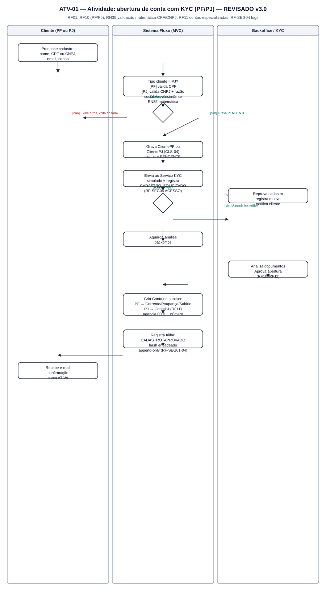
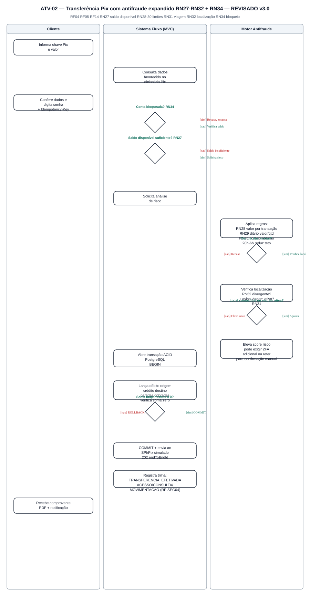
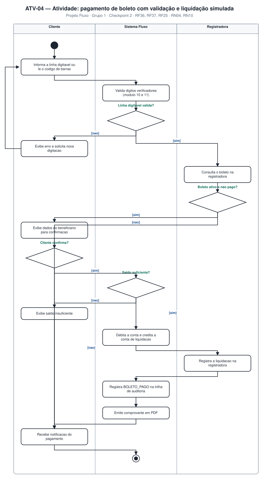

# 4.3 — Diagramas de Atividades (UML)

**Projeto:** Fluxo — Sistema Bancário Digital
**Grupo:** 1 · **Checkpoint 2** — apresentação em 17/09
**Repositório:** https://github.com/AlfredoVentura/Fluxo

> **Revisão desta versão:** nada foi removido do conteúdo anterior. ATV-02 detalhado com a verificação de **saldo disponível** antes da análise de risco e com o **antifraude expandido** (limite de valor/horário/quantidade, localização, aviso de viagem). Os demais 4 diagramas permanecem cobrindo os módulos do escopo; a geração de QR Code (RF15) e a especialização de cartões (RF12) não exigiram novo diagrama de atividades, por serem fluxos lineares já refletidos nos casos de uso e na sequência (SEQ-08).

---

## 1. Sumário

| ID | Diagrama | Raias | Requisitos | Imagem |
|---|---|---|---|---|
| ATV-01 | Abertura de conta com KYC | Cliente · Sistema · Backoffice | RF01, RF10 | `diagramas/atv-01-abertura-conta.svg` |
| ATV-02 | Transferência Pix com análise de risco | Cliente · Sistema · Motor Antifraude | RF04, RF05, RN27–RN32 | `diagramas/atv-02-transferencia-pix.svg` |
| ATV-03 | Retirada (saque) com 2FA | Cliente · Sistema · Serviço 2FA · Conta/Caixa | RF07 | `diagramas/atv-03-retirada-2fa.svg` |
| ATV-04 | Pagamento de boleto | Cliente · Sistema · Registradora | RF08 | `diagramas/atv-04-pagamento-boleto.svg` |
| ATV-05 | Ciclo da assinatura e retirada de itens | Cliente · Sistema · Cobrança | RN21–RN25 | `diagramas/atv-05-assinatura.svg` |

---

## 2. ATV-01 — Abertura de conta com KYC

| Decisão | `[nao]` | `[sim]` |
|---|---|---|
| Tipo de cliente = PJ? *(revisão)* | Valida CPF (RF10) | Valida CNPJ + razão social/representante legal (RF10) |
| Dados válidos? | Exibe erros, devolve ao formulário | Grava `PENDENTE`, envia ao KYC |
| Score ≥ 60? | Reprova e notifica | Aguarda análise do backoffice |

**Regras:** RN01 (ativação só após aprovação) · RF02 (CPF/CNPJ e unicidade antes de gravar) · RF10 (especialização PF/PJ) · senha com bcrypt custo 12.

---

## 3. ATV-02 — Transferência Pix *(detalhado)*

| Decisão | `[nao]` | `[sim]` |
|---|---|---|
| Conta bloqueada pelo cliente? *(novo, RN34)* | Segue para verificação de saldo | Recusa a operação e encerra |
| Saldo disponível suficiente? *(novo, RN27)* | Recusa, notifica "saldo insuficiente" | Segue para o Motor Antifraude |
| Dentro dos limites (valor, diário, quantidade, horário)? *(detalhado, RN28–RN30)* | Recusa, registra motivo, notifica | Verifica localização |
| Localização compatível ou aviso de viagem ativo? *(novo, RN31/RN32)* | Eleva risco — pode exigir 2FA adicional ou reter para confirmação | Abre transação ACID e lança débito/crédito |
| Soma dos lançamentos = 0? | `ROLLBACK` + notificação de falha | `COMMIT`, envio ao SPI/Pix, auditoria, comprovante |

**Regras:** RN02/RN03 (partidas dobradas) · RN27 (saldo disponível) · RN28–RN30 (limites de valor/diário/horário) · RN31/RN32 (viagem/localização) · RN34 (bloqueio de conta) · ACID e idempotência.

---

## 4. ATV-03 — Retirada com 2FA

| Decisão | `[nao]` | `[sim]` |
|---|---|---|
| RN18 exige 2FA? | Vai direto ao débito | Gera e envia código de 6 dígitos |
| Código válido e não expirado? | Verifica tentativas | Debita, credita o caixa, gera código de retirada |
| Tentativas < 3? | Solicita novo código | Bloqueia e registra `RETIRADA_2FA_FALHOU` |

**Regras:** RN18 (gatilhos do 2FA) · RN19 (limite diário) · RN20 (código único, 30 min) · RN26 (3 min, 3 tentativas) · RN34 (conta bloqueada impede a retirada).

---

## 5. ATV-04 — Pagamento de boleto

| Decisão | `[nao]` | `[sim]` |
|---|---|---|
| Linha digitável válida? | Erro, solicita nova digitação | Consulta a registradora |
| Boleto ativo e não pago? | Exibe situação, encerra | Mostra dados para confirmação |
| Cliente confirma? | Encerra sem cobrança | Verifica saldo |
| Saldo suficiente? | "Saldo insuficiente", encerra (RN04) | Debita, credita liquidação, registra |

**Regras:** RF08 (módulo 10/11 antes da consulta externa) · RN04 (sem saldo negativo) · RN10 (correção por estorno, nunca exclusão).

---

## 6. ATV-05 — Ciclo da assinatura e retirada de itens

| Decisão | `[nao]` | `[sim]` |
|---|---|---|
| Confirma a contratação? | Encerra sem cobrança | Cria assinatura `ATIVA`, registra itens |
| Incluir ou retirar item? | Segue para troca de plano | Registra movimentação (data + motivo), recalcula cobrança (realimentação) |
| Trocar de plano? | Segue para pagamento | Upgrade/downgrade com efeito no próximo ciclo |
| Pagamento em dia? | Suspende após 5 dias, cliente regulariza | Segue para cancelamento/renovação |
| Cancelar? | Renova no vencimento | Cancela ao fim do ciclo pago |

**Regras — o coração da "retirada de coisas":**
- **RN22** — retirada de item não apaga o registro: preenche `dataExclusao`/`motivoExclusao`.
- **RN23** — cobrança proporcional aos itens ativos na data do vencimento.
- **RN21** — um único plano ativo por vez; troca cria nova vigência.
- **RN24** — cancelamento vale a partir do fim do ciclo pago.
- **RN25** — atraso > 5 dias suspende a assinatura.

---

## 7. Rastreabilidade atividade × requisito

| Requisito | ATV-01 | ATV-02 | ATV-03 | ATV-04 | ATV-05 |
|---|:--:|:--:|:--:|:--:|:--:|
| RF01, RF10 (cadastro/KYC, PF/PJ) | ✅ | | | | |
| RF04, RF05 (Pix) | | ✅ | | | |
| RF07 (retirada) | | | ✅ | | |
| RF08 (boleto) | | | | ✅ | |
| Módulo de Assinaturas | | | | | ✅ |
| RN01 | ✅ | | | | |
| RN02–RN04 | | ✅ | ✅ | ✅ | |
| RN27–RN32 (antifraude Pix) | | ✅ | | | |
| RN34 (bloqueio de conta) | | ✅ | ✅ | | |
| RN18–RN20 (retirada) | | | ✅ | | |
| RN21–RN25 (assinatura) | | | | | ✅ |

**Registro de alterações**

| Versão | Data | Alteração |
|---|---|---|
| 1.0 | 31/08/2026 | Versão inicial com 5 diagramas |
| 2.0 | 10/09/2026 | Texto condensado; sem novos diagramas |
| 3.0 | 10/09/2026 | ATV-01 detalhado com PF/PJ; ATV-02 detalhado com saldo disponível, bloqueio de conta e antifraude expandido (RN27–RN32) |
