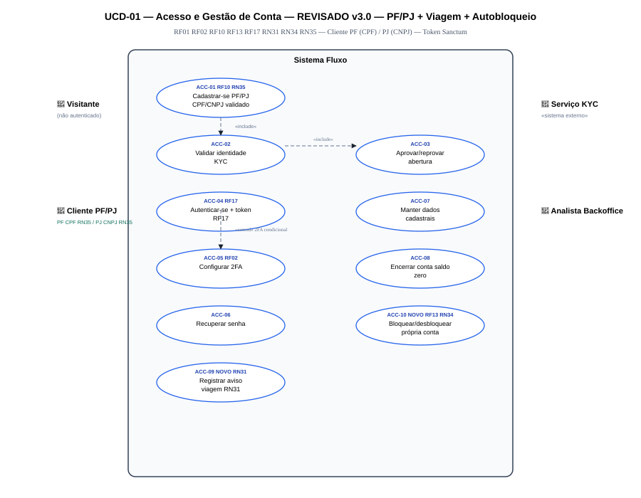
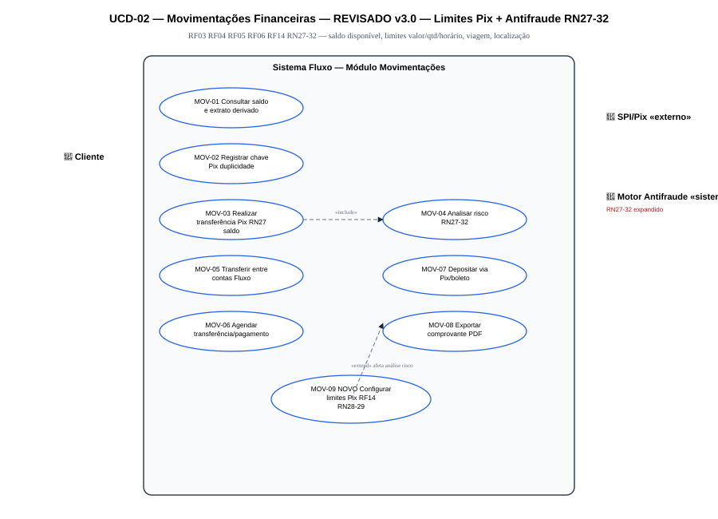
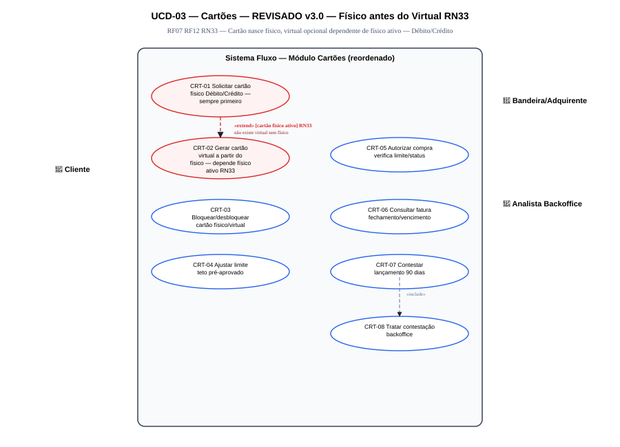
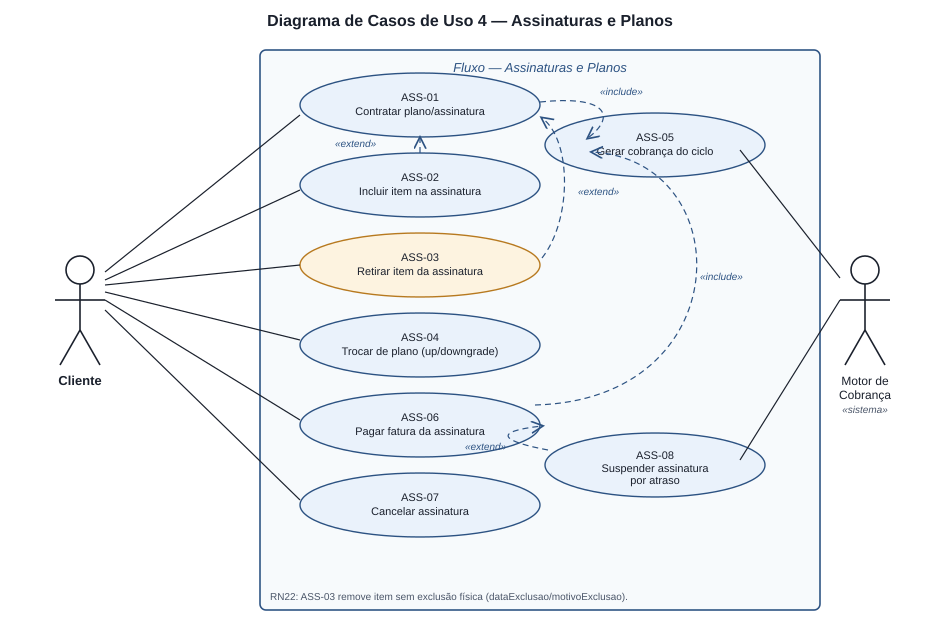
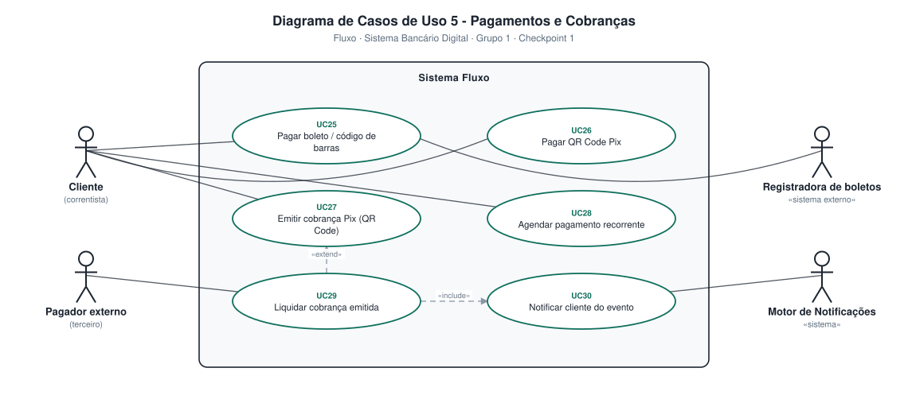

# 4.3 — Diagrama de Casos de Uso (UML)

**Projeto:** Fluxo — Sistema Bancário Digital
**Grupo:** 1 · **Checkpoint 2** — apresentação em 17/09
**Repositório:** https://github.com/AlfredoVentura/Fluxo

> **Revisão desta versão:** resolvido o conflito de merge do arquivo anterior (mantida a versão em que a abertura de conta é **aprovada pelo backoffice**, conforme o Escopo — item 4.1); adicionado o **Diagrama 4 — Assinaturas e Planos**, módulo previsto no escopo (`Contratação e gerenciamento de planos/assinaturas`) que não tinha caso de uso próprio; IDs passaram a usar prefixo por módulo em vez de numeração sequencial única, para facilitar inclusão futura de casos de uso sem renumerar os demais.

---

## 1. Notação

| Elemento | Representação |
|---|---|
| Ator | Figura humana (ou estereótipo `«sistema»` / `«sistema externo»` para atores automatizados) |
| Caso de uso | Elipse |
| Fronteira do sistema | Retângulo |
| `«include»` | Seta tracejada do caso base **para** o incluído — execução obrigatória |
| `«extend»` | Seta tracejada do estensor **para** o caso base — execução condicional |

---

## 2. Visão geral

| Diagrama | Módulo | Atores principais | Imagem |
|:---:|---|---|---|
| 1 | Acesso e Gestão de Conta | Visitante, Cliente, Serviço KYC, Analista de Backoffice | `diagramas/ucd-01-acesso-e-conta.svg` |
| 2 | Movimentações Financeiras | Cliente, SPI/Pix, Motor Antifraude | `diagramas/ucd-02-movimentacoes.svg` |
| 3 | Cartões | Cliente, Bandeira/Adquirente, Analista de Backoffice | `diagramas/ucd-03-cartoes.svg` |
| 4 | **Assinaturas e Planos** *(novo)* | Cliente, Motor de Cobrança | `diagramas/ucd-04-assinaturas.svg` |
| 5 | Pagamentos e Cobranças | Cliente, Pagador externo, Registradora, Motor de Notificações | `diagramas/ucd-05-pagamentos.svg` |
| 6 | Administração, Segurança e Suporte | Administrador, Analista de Suporte, Auditor, Cliente | `diagramas/ucd-06-administracao.svg` |

---

## 3. Atores do sistema

| Ator | Tipo | Descrição |
|---|---|---|
| Visitante | Humano | Pessoa não autenticada que se cadastra ou recupera acesso |
| Cliente | Humano | Correntista titular de conta Fluxo — ator principal do sistema |
| Analista de Backoffice | Humano | Aprova abertura de conta (KYC) e trata contestações de cartão |
| Analista de Suporte | Humano | Responde chamados e libera contas bloqueadas por acesso |
| Administrador | Humano | Gerencia usuários, perfis, tarifas e limites |
| Auditor | Humano | Consulta a trilha de auditoria — acesso somente leitura |
| Pagador externo | Humano | Terceiro que liquida uma cobrança emitida por um cliente |
| Serviço KYC | `«sistema externo»` | Verificação de identidade simulada |
| SPI / Pix | `«sistema externo»` | Liquidação de transferências instantâneas simuladas |
| Bandeira / Adquirente | `«sistema externo»` | Autorização de compras no cartão, simulada |
| Registradora de boletos | `«sistema externo»` | Consulta e liquidação de boletos, simulada |
| Motor Antifraude | `«sistema»` | Análise de risco por regras (RN05–RN09) |
| Motor de Notificações | `«sistema»` | Disparo de e-mail/push |
| Motor de Cobrança | `«sistema»` | Geração automática de faturas de assinatura no ciclo |

---

## 4. Diagrama 1 — Acesso e Gestão de Conta

| ID | Caso de uso | Ator principal | Resumo |
|---|---|---|---|
| ACC-01 | Cadastrar-se na plataforma | Visitante | Informa dados e senha; CPF validado matematicamente |
| ACC-02 | Validar identidade (KYC) | Serviço KYC | Verificação simulada dos dados do solicitante |
| ACC-03 | Aprovar/reprovar abertura de conta | Analista de Backoffice | Decide com base no score do KYC; ativa a conta |
| ACC-04 | Autenticar-se no sistema | Cliente | Login com bloqueio após 5 falhas em 15 min |
| ACC-05 | Configurar 2FA | Cliente | Ativa/desativa segundo fator por e-mail, SMS ou push |
| ACC-06 | Recuperar senha | Visitante | Redefine senha por token de uso único |
| ACC-07 | Manter dados cadastrais | Cliente | Altera telefone, e-mail e endereço |
| ACC-08 | Encerrar conta | Cliente | Só permitido com saldo zerado; aplica anonimização (LGPD) |

**Relações:** ACC-01 `«include»` ACC-02 · ACC-02 `«include»` ACC-03 · ACC-05 `«extend»` ACC-04 (2FA só entra se habilitado)

---

## 5. Diagrama 2 — Movimentações Financeiras

| ID | Caso de uso | Ator principal | Resumo |
|---|---|---|---|
| MOV-01 | Consultar saldo e extrato | Cliente | Saldo derivado da soma dos lançamentos |
| MOV-02 | Registrar chave Pix | Cliente | CPF, e-mail, telefone ou aleatória, com checagem de duplicidade |
| MOV-03 | Realizar transferência Pix | Cliente | Informa chave e valor; confirmação prévia dos dados do favorecido |
| MOV-04 | Analisar risco da transação | Motor Antifraude | Aplica RN05–RN09 antes da efetivação |
| MOV-05 | Transferir entre contas Fluxo | Cliente | Transferência interna com liquidação imediata |
| MOV-06 | Agendar transferência/pagamento | Cliente | Programa execução futura; gera comprovante ao rodar |
| MOV-07 | Depositar via Pix/boleto | Cliente | Depósito simulado creditado na conta |
| MOV-08 | Exportar comprovante (PDF) | Cliente | Comprovante com identificador único |

**Relações:** MOV-03 `«include»` MOV-04 · MOV-06 `«extend»` MOV-03/MOV-08 (agendamento não é imediato)

---

## 6. Diagrama 3 — Cartões

| ID | Caso de uso | Ator principal | Resumo |
|---|---|---|---|
| CRT-01 | Solicitar cartão virtual | Cliente | Emissão imediata (número, validade, CVV) |
| CRT-02 | Solicitar cartão físico | Cliente | Acompanha status de produção e entrega |
| CRT-03 | Bloquear/desbloquear cartão | Cliente | Temporário ou definitivo |
| CRT-04 | Ajustar limite do cartão | Cliente | Respeita o teto pré-aprovado |
| CRT-05 | Autorizar compra | Bandeira/Adquirente | Verifica limite e status do cartão |
| CRT-06 | Consultar fatura | Cliente | Lançamentos, fechamento e vencimento |
| CRT-07 | Contestar lançamento | Cliente | Abre contestação com motivo, prazo de 90 dias |
| CRT-08 | Tratar contestação | Analista de Backoffice | Defere/indefere com justificativa |

**Relações:** CRT-07 `«include»` CRT-08 · CRT-07 `«extend»` CRT-06

---

## 7. Diagrama 4 — Assinaturas e Planos *(novo — cobre RF do módulo de Cartões e Assinaturas ainda sem caso de uso)*

| ID | Caso de uso | Ator principal | Resumo |
|---|---|---|---|
| ASS-01 | Contratar plano/assinatura | Cliente | Escolhe um plano do catálogo; assinatura nasce `ATIVA` |
| ASS-02 | Incluir item na assinatura | Cliente | Adiciona benefício/item contratável ao plano vigente |
| ASS-03 | **Retirar item da assinatura** | Cliente | Remove item sem exclusão física — grava `dataExclusao` e motivo (RN22) |
| ASS-04 | Trocar de plano (upgrade/downgrade) | Cliente | Efeito no próximo ciclo de cobrança |
| ASS-05 | Gerar cobrança do ciclo | Motor de Cobrança | Valor proporcional aos itens ativos na competência (RN23) |
| ASS-06 | Pagar fatura da assinatura | Cliente | Débito automático na conta corrente |
| ASS-07 | Cancelar assinatura | Cliente | Efeito ao fim do ciclo já pago (RN24) |
| ASS-08 | Suspender assinatura por atraso | *(sistema)* | Acionado após 5 dias de atraso (RN25) |

**Relações:** ASS-01 `«include»` ASS-05 · ASS-06 `«include»` ASS-05 · ASS-08 `«extend»` ASS-06 (guarda: `[atraso > 5 dias]`) · ASS-02/ASS-03 `«extend»` ASS-01 (movimentação de itens ocorre durante a vigência)

---

## 8. Diagrama 5 — Pagamentos e Cobranças

| ID | Caso de uso | Ator principal | Resumo |
|---|---|---|---|
| PAG-01 | Pagar boleto/código de barras | Cliente | Valida módulo 10/11 antes de consultar a registradora |
| PAG-02 | Pagar QR Code Pix | Cliente | Leitura ou colagem do payload EMV |
| PAG-03 | Emitir cobrança Pix (QR Code) | Cliente | Gera cobrança com valor, descrição e validade |
| PAG-04 | Agendar pagamento recorrente | Cliente | Periodicidade definida pelo cliente |
| PAG-05 | Liquidar cobrança emitida | Pagador externo | Terceiro paga cobrança gerada por um cliente |
| PAG-06 | Notificar evento financeiro | Motor de Notificações | E-mail/push a cada evento relevante |

**Relações:** PAG-05 `«include»` PAG-06 · PAG-05 `«extend»` PAG-03

---

## 9. Diagrama 6 — Administração, Segurança e Suporte

| ID | Caso de uso | Ator principal | Resumo |
|---|---|---|---|
| ADM-01 | Gerenciar usuários e perfis (RBAC) | Administrador | Cria, edita e desativa usuários internos |
| ADM-02 | Registrar log de operação | *(sistema)* | Grava a operação sensível na trilha imutável (RF-SEG02) |
| ADM-03 | Bloquear/desbloquear conta | Administrador / Analista de Suporte | Fraude (Admin) ou liberação após bloqueio de login (Suporte) |
| ADM-04 | Consultar trilha de auditoria | Auditor | Filtros por autor, período e tipo — leitura auditada (RN17) |
| ADM-05 | Parametrizar tarifas e limites | Administrador | Define limites operacionais e tetos de segurança |
| ADM-06 | Emitir relatórios gerenciais | Administrador / Auditor | Volume transacionado, contas ativas, chamados |
| ADM-07 | Abrir chamado de suporte | Cliente | Assunto, descrição e anexo |
| ADM-08 | Responder chamado de suporte | Analista de Suporte | Responde e altera status do chamado |

**Relações:** ADM-01/ADM-03 `«include»` ADM-02 (toda alteração sensível é auditada) · ADM-08 `«extend»` ADM-07

---

## 10. Rastreabilidade caso de uso × requisito

| Diagrama | Casos de uso | Requisitos |
|:---:|---|---|
| 1 — Acesso e Conta | ACC-01 a ACC-08 | RF01, RF02 |
| 2 — Movimentações | MOV-01 a MOV-08 | RF03, RF04, RF05, RF06 |
| 3 — Cartões | CRT-01 a CRT-08 | RF07 |
| 4 — Assinaturas | ASS-01 a ASS-08 | Módulo de Cartões e Assinaturas (Escopo 4.1) |
| 5 — Pagamentos | PAG-01 a PAG-06 | RF08 |
| 6 — Administração | ADM-01 a ADM-08 | RF09, RF-SEG01, RF-SEG02, RF-SEG03 |

---

## 11. Como este diagrama deve ser produzido

Manter o padrão adotado nos demais artefatos: geração por script a partir da descrição de atores/casos de uso, garantindo estilo consistente e regeneração automática quando um requisito mudar.

**Registro de alterações**

| Versão | Data | Alteração |
|---|---|---|
| 1.0 | 31/08/2026 | Versão inicial (5 diagramas, numeração 1/3/4/5/7) |
| 2.0 | 10/09/2026 | Conflito de merge resolvido; diagramas renumerados 1–6; **Diagrama 4 — Assinaturas e Planos** adicionado; IDs passaram a usar prefixo por módulo |
