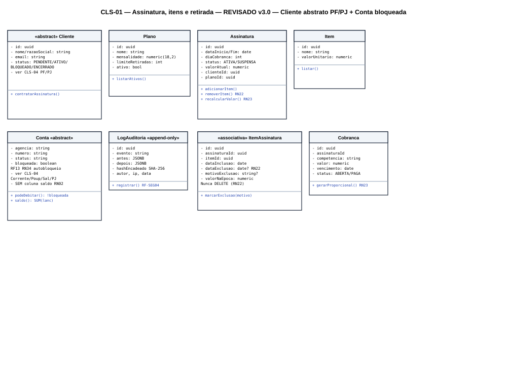
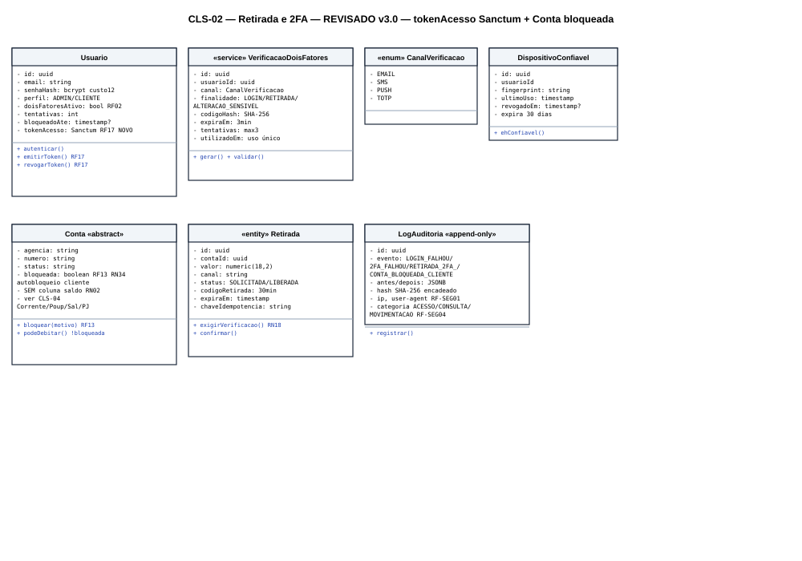
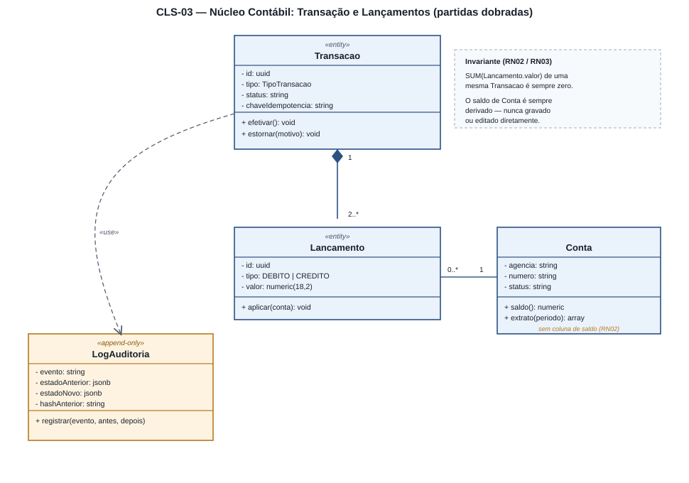

# 4.3 — Diagrama de Classes (UML)

**Projeto:** Fluxo — Sistema Bancário Digital
**Grupo:** 1 · **Checkpoint 2** — apresentação em 17/09
**Repositório:** https://github.com/AlfredoVentura/Fluxo

> **Revisão desta versão:** conteúdo condensado; adicionado **CLS-03 — Núcleo Contábil (partidas dobradas)**. O escopo (4.1) descreve o core bancário como construído "sob o princípio de partidas dobradas" e os diagramas de sequência/atividades já citam `Transacao` e `Lancamento`, mas nenhuma classe própria os detalhava — apenas `Conta` aparecia no CLS-02.

---

## 1. Convenções

| Elemento | Notação |
|---|---|
| Atributo | `- nome: tipo` (privado) |
| Método | `+ nome(param): retorno` (público) |
| Composição / Agregação | Losango preenchido / vazio na ponta do todo |
| Dependência | Linha tracejada `«use»` |
| Estereótipos | `«entity»`, `«service»`, `«enum»`, `«associativa»`, `«append-only»` |

---

## 2. CLS-01 — Assinatura, itens contratados e retirada de itens



| Classe | Papel |
|---|---|
| `Cliente` | `id`, `nome`, `cpf`, `email`, `status` (`PENDENTE`/`ATIVO`/`BLOQUEADO`/`ENCERRADO`) |
| `Plano` | Catálogo: `mensalidade`, `limiteRetiradas`, `ativo` |
| `Assinatura` | Vínculo cliente↔plano: `dataInicio/Fim`, `diaCobranca`, `status`, `valorAtual` |
| `Item` | Catálogo de itens contratáveis (`valorUnitario`) |
| `ItemAssinatura` `«associativa»` | **Onde a retirada de item acontece** — `dataExclusao`/`motivoExclusao` preenchidos, nunca `DELETE` (RN22) |
| `Cobranca` | Ciclo de faturamento: `competencia`, `valor`, `vencimento`, `status` |
| `LogAuditoria` `«append-only»` | Registra toda inclusão/retirada/troca/suspensão/cancelamento |

**Multiplicidades-chave:** `Cliente 1—0..*Assinatura` · `Assinatura 1◆—0..*ItemAssinatura` (composição) · `Assinatura 1—0..*Cobranca`

**RN22 (Laravel):**
```php
public function removerItem(Item $item, string $motivo): void
{
    $vinculo = $this->itensAtivos()->where('item_id', $item->id)->firstOrFail();
    $vinculo->update(['data_exclusao' => now()->toDateString(), 'motivo_exclusao' => $motivo]);
    $this->recalcularValor();
    $this->registrarAuditoria('ITEM_RETIRADO', $vinculo, $motivo);
}
```

---

## 3. CLS-02 — Retirada (saque) e Verificação em Dois Fatores



| Classe | Papel |
|---|---|
| `Usuario` | `senhaHash` (bcrypt custo 12), `perfil`, `doisFatoresAtivo`, `tentativas`/`bloqueadoAte` |
| `VerificacaoDoisFatores` `«service»` | Modela o desafio: `canal`, `finalidade` (`LOGIN`/`RETIRADA`/`ALTERACAO_SENSIVEL`), `codigoHash`, `expiraEm`, `tentativas`, `utilizadoEm` |
| `CanalVerificacao` `«enum»` | `EMAIL`, `SMS`, `PUSH`, `TOTP` |
| `DispositivoConfiavel` | Dispensa 2FA por 30 dias — `fingerprint`, `ultimoUso`, `revogadoEm` |
| `Conta` | `agencia`, `numero`, `tipo`, `status` — **sem coluna de saldo** (RN02) |
| `Retirada` `«entity»` | `valor`, `canal`, `status`, `codigoRetirada`, `expiraEm`, `chaveIdempotencia` |
| `LogAuditoria` `«append-only»` | Solicitação, desafio, falha, liberação, uso, cancelamento, estorno |

**Regra central RN18:**
```php
public function exigirVerificacao(): bool
{
    $teto = now()->between('20:00', '06:00') ? 500.00 : $this->conta->limite_retirada_diaria;
    return $this->valor > ($teto * 0.30)
        || $this->canalEhInedito()
        || ! $this->dispositivoEhConfiavel()
        || now()->between('20:00', '06:00');
}
```

---

## 4. CLS-03 — Núcleo Contábil: Transação e Lançamentos (partidas dobradas) *(novo)*



O escopo define o core bancário como construído sob **partidas dobradas** (RF03, RN02, RN03) e o SEQ-03/ATV-02 já descrevem esse fluxo — faltava, porém, modelar as classes que sustentam essa regra.

| Classe | Papel |
|---|---|
| `Transacao` `«entity»` | Cabeçalho de uma operação financeira: `tipo` (`PIX`, `TED_INTERNA`, `BOLETO`, `RETIRADA`, `ASSINATURA`), `status`, `chaveIdempotencia`, `criadoEm` |
| `Lancamento` `«entity»` | Uma linha de débito **ou** crédito ligada a uma `Transacao` e a uma `Conta`: `tipo` (`DEBITO`/`CREDITO`), `valor` `numeric(18,2)` |
| `Conta` | Mesma classe do CLS-02 — o saldo é `SUM(lancamentos.valor)` filtrado pela conta |
| `LogAuditoria` `«append-only»` | Estado antes/depois de cada `Transacao` |

**Multiplicidades:** `Transacao 1◆—2..*Lancamento` (composição — lançamentos não existem sem a transação) · `Conta 1—0..*Lancamento`

**Invariante central (RN02/RN03):** a soma dos `Lancamento.valor` de uma `Transacao` é sempre zero; nenhum saldo é gravado ou editado diretamente.

```php
// app/Models/Transacao.php
public function efetivar(): void
{
    \DB::transaction(function () {
        $soma = $this->lancamentos()->sum('valor');
        if ($soma !== 0.0) {
            throw new PartidaDobradaInvalidaException(); // RN03
        }
        $this->update(['status' => 'EFETIVADA']);
        $this->registrarAuditoria('TRANSACAO_EFETIVADA');
    });
}
```

---

## 5. Mapeamento classes → tabelas

| Classe | Tabela | Observação |
|---|---|---|
| `Cliente` / `Usuario` | `clientes` / `usuarios` | 1:1 |
| `Conta` | `contas` | Sem coluna de saldo |
| `Transacao` / `Lancamento` | `transacoes` / `lancamentos` | Núcleo de partidas dobradas |
| `Retirada` | `retiradas` | FK para `contas` e `transacoes` |
| `VerificacaoDoisFatores` | `codigos_verificacao` | Hash + expiração + tentativas |
| `DispositivoConfiavel` | `dispositivos_confiaveis` | 0..* por usuário |
| `Plano` / `Assinatura` / `Item` / `ItemAssinatura` / `Cobranca` | `planos`, `assinaturas`, `itens`, `itens_assinatura`, `cobrancas` | `itens_assinatura` sem exclusão física |
| `LogAuditoria` | `logs_auditoria` | Append-only, com trigger de proteção |

---

## 6. Rastreabilidade

| Requisito | Classe / diagrama |
|---|---|
| RF02 (2FA) | `VerificacaoDoisFatores`, `CanalVerificacao`, `DispositivoConfiavel` (CLS-02) |
| RF07 (retirada) | `Retirada`, `Conta` (CLS-02) |
| Módulo de Assinaturas (Escopo 4.1) | `Assinatura`, `Plano`, `Item`, `ItemAssinatura`, `Cobranca` (CLS-01) |
| RF03, RN02, RN03 (partidas dobradas) | `Transacao`, `Lancamento` (CLS-03) |
| RN18–RN20 | `Retirada::exigirVerificacao()`, `Retirada::confirmar()` |
| RN21–RN25 | `Assinatura`, `ItemAssinatura`, `Cobranca` |
| RF-SEG01–03 | `LogAuditoria` (CLS-01, CLS-02, CLS-03) |

**Registro de alterações**

| Versão | Data | Alteração |
|---|---|---|
| 1.0 | 31/08/2026 | Versão inicial: CLS-01 e CLS-02 |
| 2.0 | 10/09/2026 | Texto condensado; **CLS-03 — Núcleo Contábil** adicionado |
