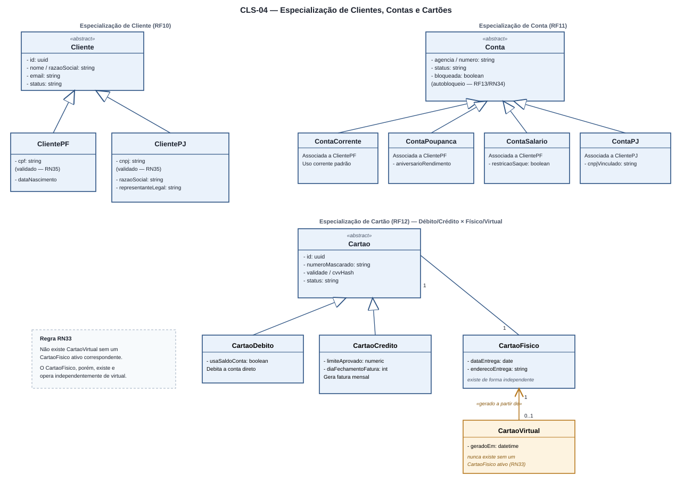

# 4.3 — Diagrama de Classes (UML)

## 1. Convenções

| Elemento | Notação |
|---|---|
| Atributo | `- nome: tipo` (privado) |
| Método | `+ nome(param): retorno` (público) |
| Composição / Agregação | Losango preenchido / vazio na ponta do todo |
| Generalização / Especialização | Seta com ponta triangular vazada, da subclasse para a superclasse |
| Dependência | Linha tracejada `«use»` |
| Estereótipos | `«entity»`, `«service»`, `«enum»`, `«abstract»`, `«associativa»`, `«append-only»` |

---

## 2. CLS-01 — Assinatura, itens contratados e retirada de itens


| Classe | Papel |
|---|---|
| `Cliente` `«abstract»` | `id`, `nome`, `email`, `status` (`PENDENTE`/`ATIVO`/`BLOQUEADO`/`ENCERRADO`) — **especializado em `ClientePF`/`ClientePJ`, ver CLS-04** *(revisão)* |
| `Plano` | Catálogo: `mensalidade`, `limiteRetiradas`, `ativo` |
| `Assinatura` | Vínculo cliente↔plano: `dataInicio/Fim`, `diaCobranca`, `status`, `valorAtual` |
| `Item` | Catálogo de itens contratáveis (`valorUnitario`) |
| `ItemAssinatura` `«associativa»` | **Onde a retirada de item acontece** — `dataExclusao`/`motivoExclusao` preenchidos, nunca `DELETE` (RN22) |
| `Cobranca` | Ciclo de faturamento: `competencia`, `valor`, `vencimento`, `status` |
| `LogAuditoria` `«append-only»` | Registra toda inclusão/retirada/troca/suspensão/cancelamento |

**Multiplicidades-chave:** `Cliente 1—0..*Assinatura` · `Assinatura 1◆—0..*ItemAssinatura` (composição) · `Assinatura 1—0..*Cobranca`

**RN22 (Laravel):**
```php
public function removerItem(Item $item, string $motivo): void
{
    $vinculo = $this->itensAtivos()->where('item_id', $item->id)->firstOrFail();
    $vinculo->update(['data_exclusao' => now()->toDateString(), 'motivo_exclusao' => $motivo]);
    $this->recalcularValor();
    $this->registrarAuditoria('ITEM_RETIRADO', $vinculo, $motivo);
}
```

---

## 3. CLS-02 — Retirada (saque) e Verificação em Dois Fatores


| Classe | Papel |
|---|---|
| `Usuario` | `senhaHash` (bcrypt custo 12), `perfil`, `doisFatoresAtivo`, `tentativas`/`bloqueadoAte`, `tokenAcesso` (Sanctum) *(revisão — RF17)* |
| `VerificacaoDoisFatores` `«service»` | Modela o desafio: `canal`, `finalidade` (`LOGIN`/`RETIRADA`/`ALTERACAO_SENSIVEL`), `codigoHash`, `expiraEm`, `tentativas`, `utilizadoEm` |
| `CanalVerificacao` `«enum»` | `EMAIL`, `SMS`, `PUSH`, `TOTP` |
| `DispositivoConfiavel` | Dispensa 2FA por 30 dias — `fingerprint`, `ultimoUso`, `revogadoEm` |
| `Conta` `«abstract»` | `agencia`, `numero`, `status`, **`bloqueada: boolean`** (autobloqueio do cliente, RF13) — **sem coluna de saldo** (RN02) — **especializada em `ContaCorrente`/`ContaPoupanca`/`ContaSalario`/`ContaPJ`, ver CLS-04** *(revisão)* |
| `Retirada` `«entity»` | `valor`, `canal`, `status`, `codigoRetirada`, `expiraEm`, `chaveIdempotencia` |
| `LogAuditoria` `«append-only»` | Solicitação, desafio, falha, liberação, uso, cancelamento, estorno |

**Regra central RN18:**
```php
public function exigirVerificacao(): bool
{
    $teto = now()->between('20:00', '06:00') ? 500.00 : $this->conta->limite_retirada_diaria;
    return $this->valor > ($teto * 0.30)
        || $this->canalEhInedito()
        || ! $this->dispositivoEhConfiavel()
        || now()->between('20:00', '06:00');
}
```

**Bloqueio de conta pelo cliente (RN34, novo):**
```php
public function bloquear(string $motivo): void
{
    $this->update(['bloqueada' => true]);
    $this->registrarAuditoria('CONTA_BLOQUEADA_CLIENTE', $motivo);
}

public function podeDebitar(): bool
{
    return ! $this->bloqueada; // nenhum débito passa enquanto bloqueada
}
```

---

## 4. CLS-03 — Núcleo Contábil: Transação e Lançamentos (partidas dobradas)


O escopo define o core bancário como construído sob **partidas dobradas** (RF03, RN02, RN03) e o SEQ-03/ATV-02 já descrevem esse fluxo.

| Classe | Papel |
|---|---|
| `Transacao` `«entity»` | Cabeçalho de uma operação financeira: `tipo` (`PIX`, `TED_INTERNA`, `BOLETO`, `RETIRADA`, `ASSINATURA`), `status`, `chaveIdempotencia`, `criadoEm` |
| `Lancamento` `«entity»` | Uma linha de débito **ou** crédito ligada a uma `Transacao` e a uma `Conta`: `tipo` (`DEBITO`/`CREDITO`), `valor` `numeric(18,2)` |
| `Conta` `«abstract»` | Mesma classe do CLS-02 — o saldo é `SUM(lancamentos.valor)` filtrado pela conta; qualquer subtipo (CLS-04) participa igualmente |
| `LogAuditoria` `«append-only»` | Estado antes/depois de cada `Transacao` |

**Multiplicidades:** `Transacao 1◆—2..*Lancamento` (composição — lançamentos não existem sem a transação) · `Conta 1—0..*Lancamento`

**Invariante central (RN02/RN03):** a soma dos `Lancamento.valor` de uma `Transacao` é sempre zero; nenhum saldo é gravado ou editado diretamente.

```php
// app/Models/Transacao.php
public function efetivar(): void
{
    \DB::transaction(function () {
        $soma = $this->lancamentos()->sum('valor');
        if ($soma !== 0.0) {
            throw new PartidaDobradaInvalidaException(); // RN03
        }
        // RN27: valida saldo disponível antes de efetivar débitos
        $this->update(['status' => 'EFETIVADA']);
        $this->registrarAuditoria('TRANSACAO_EFETIVADA');
    });
}
```

---

## 5. CLS-04 — Especialização de Clientes, Contas e Cartões *(novo)*



Conforme definido na apresentação, três hierarquias de especialização foram detalhadas: **Cliente** (PF/PJ), **Conta** (Corrente/Poupança/Salário/PJ) e **Cartão** (Débito/Crédito, cada um com forma Física obrigatória e Virtual opcional e dependente).

### 5.1 Especialização de `Cliente` (RF10)

| Classe | Papel |
|---|---|
| `Cliente` `«abstract»` | Atributos comuns: `id`, `nome`/`razaoSocial`, `email`, `status` |
| `ClientePF` | `cpf: string` (validado matematicamente, RN35), `dataNascimento` |
| `ClientePJ` | `cnpj: string` (validado matematicamente, RN35), `razaoSocial: string`, `representanteLegal: string` |

### 5.2 Especialização de `Conta` (RF11)

| Classe | Papel |
|---|---|
| `Conta` `«abstract»` | Atributos comuns (ver CLS-02/03): `agencia`, `numero`, `status`, `bloqueada: boolean` |
| `ContaCorrente` | Associada a `ClientePF`; conta padrão de movimentação |
| `ContaPoupanca` | Associada a `ClientePF`; `aniversarioRendimento: date` |
| `ContaSalario` | Associada a `ClientePF`; `restricaoSaque: boolean` |
| `ContaPJ` | Associada a `ClientePJ`; `cnpjVinculado: string` |

### 5.3 Especialização de `Cartao` (RF12, RN33)

| Classe | Papel |
|---|---|
| `Cartao` `«abstract»` | Atributos comuns: `id`, `numeroMascarado`, `validade`, `cvvHash`, `status` |
| `CartaoDebito` | Extends `Cartao` — usa o saldo da conta diretamente |
| `CartaoCredito` | Extends `Cartao` — `limiteAprovado: numeric`, `diaFechamentoFatura: int` |
| `CartaoFisico` | Forma física de um `CartaoDebito`/`CartaoCredito` — `dataEntrega`, `enderecoEntrega`; **existe de forma independente** |
| `CartaoVirtual` | Forma virtual — `geradoEm: datetime`; **associação obrigatória (1) com um `CartaoFisico` ativo — nunca existe sozinho** (RN33) |

**Multiplicidades:** `Cartao 1—1 CartaoFisico` (todo cartão nasce físico) · `CartaoFisico 1—0..1 CartaoVirtual` (o virtual é opcional e dependente)

**RN33 (Laravel):**
```php
// app/Models/CartaoVirtual.php
public static function gerarAPartirDoFisico(CartaoFisico $fisico): self
{
    if ($fisico->status !== 'ATIVO') {
        throw new CartaoFisicoInativoException(); // RN33: sem físico ativo, não há virtual
    }

    return self::create([
        'cartao_fisico_id' => $fisico->id,
        'gerado_em'        => now(),
    ]);
}
```

---

## 6. Mapeamento classes → tabelas

| Classe | Tabela | Observação |
|---|---|---|
| `Cliente` / `ClientePF` / `ClientePJ` | `clientes` (com `tipo` discriminador) | Single Table Inheritance *(revisão)* |
| `Usuario` | `usuarios` | 1:1 com `Cliente` |
| `Conta` / `ContaCorrente` / `ContaPoupanca` / `ContaSalario` / `ContaPJ` | `contas` (com `tipo` discriminador) | Sem coluna de saldo; `bloqueada: boolean` *(revisão)* |
| `Transacao` / `Lancamento` | `transacoes` / `lancamentos` | Núcleo de partidas dobradas |
| `Retirada` | `retiradas` | FK para `contas` e `transacoes` |
| `VerificacaoDoisFatores` | `codigos_verificacao` | Hash + expiração + tentativas |
| `DispositivoConfiavel` | `dispositivos_confiaveis` | 0..* por usuário |
| `Cartao` / `CartaoDebito` / `CartaoCredito` | `cartoes` (com `modalidade` discriminador) | *(novo)* |
| `CartaoFisico` / `CartaoVirtual` | `cartoes_fisicos` / `cartoes_virtuais` | `cartoes_virtuais.cartao_fisico_id` obrigatório (RN33) *(novo)* |
| `Plano` / `Assinatura` / `Item` / `ItemAssinatura` / `Cobranca` | `planos`, `assinaturas`, `itens`, `itens_assinatura`, `cobrancas` | `itens_assinatura` sem exclusão física |
| `LogAuditoria` | `logs_auditoria` | Append-only, com trigger de proteção |

---

## 7. Rastreabilidade

| Requisito | Classe / diagrama |
|---|---|
| RF02, RF17 (2FA, token) | `VerificacaoDoisFatores`, `CanalVerificacao`, `DispositivoConfiavel`, `Usuario.tokenAcesso` (CLS-02) |
| RF07 (retirada) | `Retirada`, `Conta` (CLS-02) |
| Módulo de Assinaturas (Escopo 4.1) | `Assinatura`, `Plano`, `Item`, `ItemAssinatura`, `Cobranca` (CLS-01) |
| RF03, RN02, RN03 (partidas dobradas) | `Transacao`, `Lancamento` (CLS-03) |
| RN18–RN20 | `Retirada::exigirVerificacao()`, `Retirada::confirmar()` |
| RN21–RN25 | `Assinatura`, `ItemAssinatura`, `Cobranca` |
| RF10, RN35 (clientes PF/PJ) | `Cliente`, `ClientePF`, `ClientePJ` (CLS-04) |
| RF11 (contas especializadas) | `Conta`, `ContaCorrente`, `ContaPoupanca`, `ContaSalario`, `ContaPJ` (CLS-04) |
| RF12, RN33 (cartões especializados) | `Cartao`, `CartaoDebito`, `CartaoCredito`, `CartaoFisico`, `CartaoVirtual` (CLS-04) |
| RF13, RN34 (bloqueio de conta) | `Conta::bloquear()`, `Conta::podeDebitar()` (CLS-02) |
| RF-SEG01–04 | `LogAuditoria` (CLS-01, CLS-02, CLS-03) |

**Registro de alterações**

| Versão | Data | Alteração |
|---|---|---|
| 1.0 | 31/08/2026 | Versão inicial: CLS-01 e CLS-02 |
| 2.0 | 10/09/2026 | Texto condensado; CLS-03 — Núcleo Contábil adicionado |
| 3.0 | 10/09/2026 | **CLS-04 — Especialização de Clientes, Contas e Cartões** adicionado; CLS-01/02 ajustados para apontar à nova especialização; `Conta.bloqueada` e `Usuario.tokenAcesso` adicionados |
