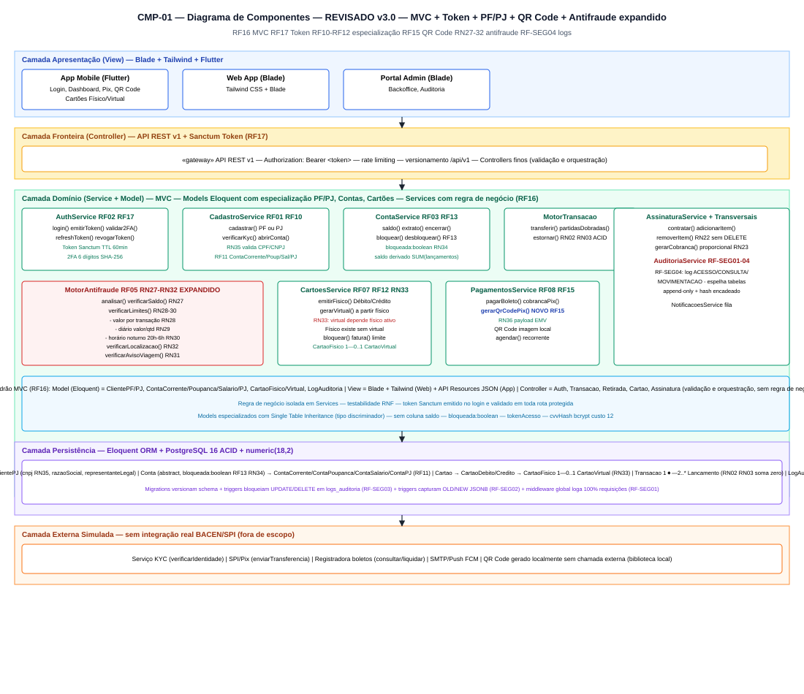
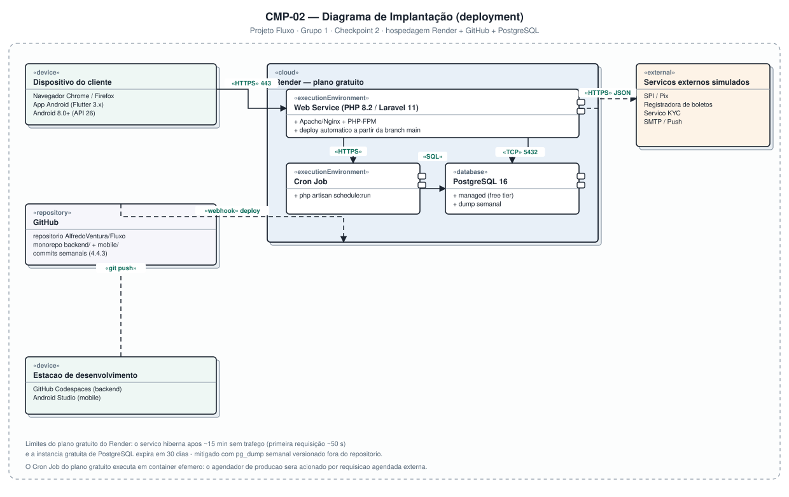

# 4.3 — Diagramas de Componentes e de Implantação (UML)

**Projeto:** Fluxo — Sistema Bancário Digital
**Grupo:** 1 · **Checkpoint 2** — apresentação em 17/09
**Repositório:** https://github.com/AlfredoVentura/Fluxo

> **Revisão desta versão:** conteúdo condensado; adicionado o componente **`AssinaturaService`**, que faltava apesar de o "Módulo de Cartões e Assinaturas" constar no escopo (item 4.1) e de já existirem classes de assinatura (CLS-01) e a atividade ATV-05.

---

## 1. CMP-01 — Diagrama de Componentes (visão lógica)



### 1.1 Camadas

| Camada | Componentes | Responsabilidade |
|---|---|---|
| Apresentação | App Mobile (Flutter), Web App (Blade), Portal Admin (Blade) | Interface com o usuário |
| Fronteira | `API REST v1` `«gateway»` | Autenticação Sanctum, versionamento, rate limiting, validação |
| Domínio | 10 serviços de negócio | Regras do banco; cada serviço é substituível |
| Persistência | Eloquent ORM, Migrations/Seeders, PostgreSQL 16 | Mapeamento objeto-relacional e armazenamento |
| Externa | Serviço KYC, SPI/Pix, Registradora, SMTP/Push | Integrações **simuladas** |

### 1.2 Componentes de domínio

| Componente | Interfaces principais | Requisitos |
|---|---|---|
| `AuthService` | `login()`, `validar2FA()`, `refreshToken()` | RF02 |
| `CadastroService` | `cadastrar()`, `verificarKyc()`, `abrirConta()` | RF01 |
| `ContaService` | `saldo()`, `extrato()`, `encerrar()` | RF03 |
| `MotorTransacao` | `transferir()`, `partidasDobradas()`, `estornar()` | RF04, RN02, RN03 |
| `MotorAntifraude` | `analisar()`, `classificar()` | RF05, RN05–RN09 |
| `CartoesService` | `emitirVirtual()`, `bloquear()`, `fatura()` | RF07 |
| **`AssinaturaService`** *(novo)* | `contratar()`, `adicionarItem()`, `removerItem()`, `trocarPlano()`, `gerarCobranca()` | Módulo de Assinaturas (Escopo 4.1), RN22–RN25 |
| `PagamentosService` | `pagarBoleto()`, `cobrancaPix()`, `agendar()` | RF08 |
| `NotificacoesService` | `email()`, `push()`, `fila` | — |
| `AuditoriaService` | `registrar()`, `consultar()`, `relatorio()` | RF09, RF-SEG01–03 |

### 1.3 Interfaces oferecidas e requeridas

| Interface | De | Para |
|---|---|---|
| `IApiV1` (bola) | API REST v1 | App Mobile, Web App, Portal Admin |
| `IKyc` (soquete) | CadastroService | Serviço KYC |
| `INotificacao` (soquete) | NotificacoesService | SMTP / Push |

`CadastroService`, `MotorTransacao`, `PagamentosService`, `NotificacoesService` e `AssinaturaService` (cobrança recorrente) dependem de componentes externos por `«use»` tracejado — trocar o simulador por um serviço real não altera o contrato interno.

### 1.4 Decisões arquiteturais

1. Uma única API `/api/v1` serve app e web, evitando duplicidade de regra de negócio.
2. Controllers apenas validam e delegam; a regra vive no serviço (testabilidade).
3. `AuditoriaService` é transversal — todo serviço de domínio, incluindo o novo `AssinaturaService`, depende dele.
4. Nenhum serviço escreve SQL direto; migrations versionam o esquema.
5. Notificações e cobrança de assinatura rodam por fila, preservando o tempo de resposta de escrita.

---

## 2. CMP-02 — Diagrama de Implantação



### 2.1 Nós

| Nó | Estereótipo | Conteúdo |
|---|---|---|
| Dispositivo do cliente | `«device»` | Navegador e app Android (Flutter 3.x, Android 8.0+) |
| Estação de desenvolvimento | `«device»` | GitHub Codespaces (backend), Android Studio (mobile) |
| GitHub | `«repository»` | Monorepo `backend/` + `mobile/` |
| Render | `«cloud»` | Web Service PHP 8.2/Laravel 11, Cron Job, PostgreSQL 16 gerenciado |
| Serviços externos simulados | `«external»` | SPI/Pix, registradora, KYC, SMTP/Push |

### 2.2 Conexões

| De | Para | Protocolo | Observação |
|---|---|---|---|
| Dispositivo do cliente | Web Service | `«HTTPS»` 443 | TLS 1.2+ |
| Web Service | PostgreSQL | `«TCP»` 5432 | Interno ao datacenter do Render |
| Web Service | Cron Job | `«HTTPS»` | Aciona a expiração de retiradas/cobranças e a geração de faturas de assinatura |
| GitHub | Render | `«webhook»` | Push em `main` dispara build/deploy |

### 2.3 Limitações do plano gratuito do Render e mitigação

| Limitação | Mitigação |
|---|---|
| Hiberna após ~15 min sem tráfego | "Aquecer" a URL antes da apresentação; vídeo de contingência |
| Banco expira em 30 dias | `pg_dump` semanal + migrations/seeders como fonte de verdade |
| Cron roda em container efêmero | Agendador acionado por requisição HTTP externa; sem estado local |
| Sem disco persistente | Anexos gravados no banco (`bytea`) ou storage externo |
| Build com limite de tempo | APK gerado no Android Studio, publicado como release no GitHub |

---

## 3. Organização do repositório (monorepo)

```
Fluxo/
├── backend/                    # Laravel 11 (PHP 8.2+)
│   ├── app/Http/Controllers/   # Auth, Transacao, Retirada, Assinatura...
│   ├── app/Models/             # Cliente, Conta, Assinatura, LogAuditoria...
│   ├── app/Services/           # MotorTransacao, AssinaturaService, AuditoriaService...
│   ├── app/Policies/           # RBAC (RF09)
│   ├── database/migrations/
│   ├── resources/views/        # Blade + Tailwind
│   ├── routes/api.php
│   └── tests/
└── mobile/                     # Flutter (Dart)
    ├── lib/screens/            # Login, Dashboard, Extrato, Pix, Retirada, Assinatura
    ├── lib/services/
    └── test/
```

---

## 4. Rastreabilidade

| Requisito | Evidência |
|---|---|
| Segurança em trânsito | CMP-02 — `«HTTPS»` em todas as conexões externas |
| Deploy automático | CMP-02 — webhook GitHub → Render |
| Stack técnica (Escopo 4.1) | CMP-01 (Laravel, Blade, Flutter) e CMP-02 (Render, PostgreSQL) |
| Auditoria transversal (RF09) | CMP-01 — `AuditoriaService` dependido por todo o domínio |
| Módulo de Assinaturas (Escopo 4.1) | CMP-01 — `AssinaturaService` |
| Backup semanal | CMP-02 — mitigação do free tier |

**Registro de alterações**

| Versão | Data | Alteração |
|---|---|---|
| 1.0 | 31/08/2026 | Versão inicial: CMP-01 e CMP-02 |
| 2.0 | 10/09/2026 | Texto condensado; **`AssinaturaService`** adicionado ao domínio |
