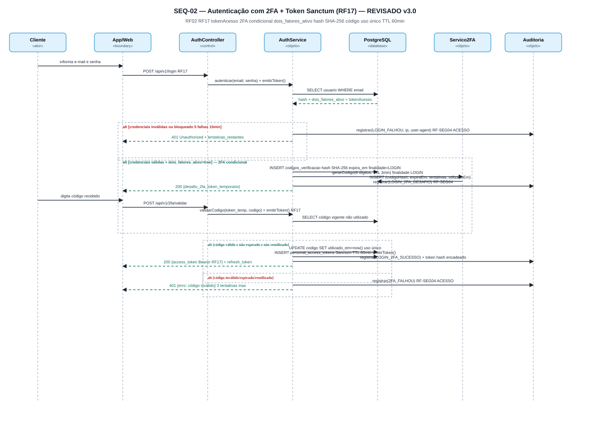
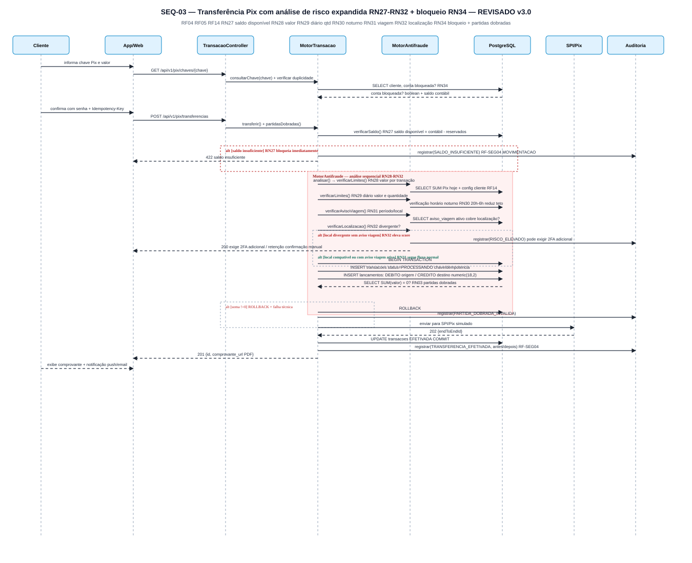
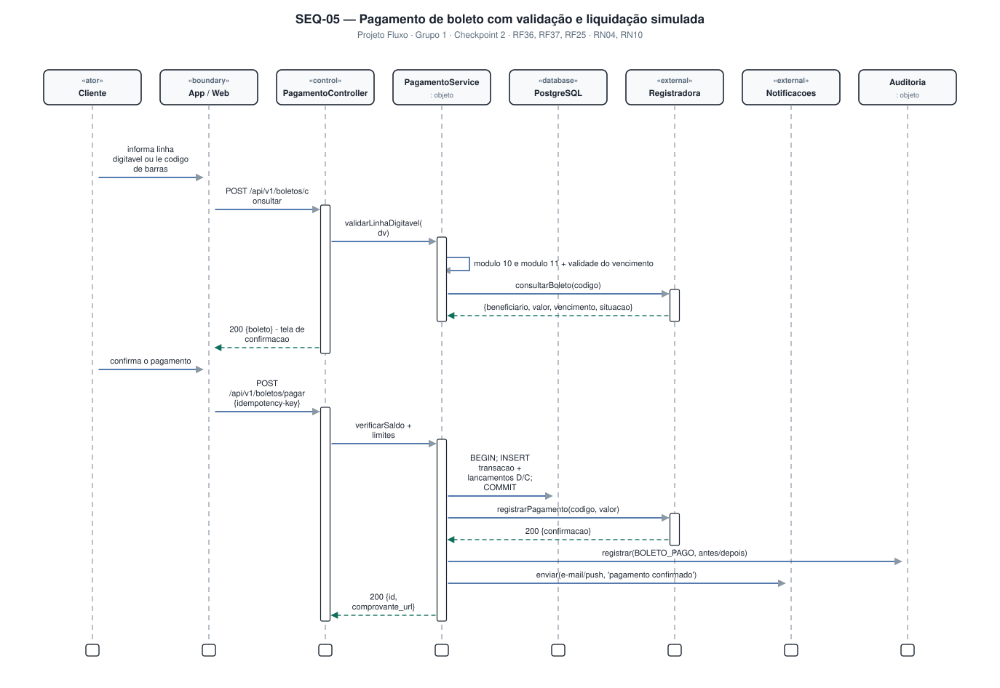
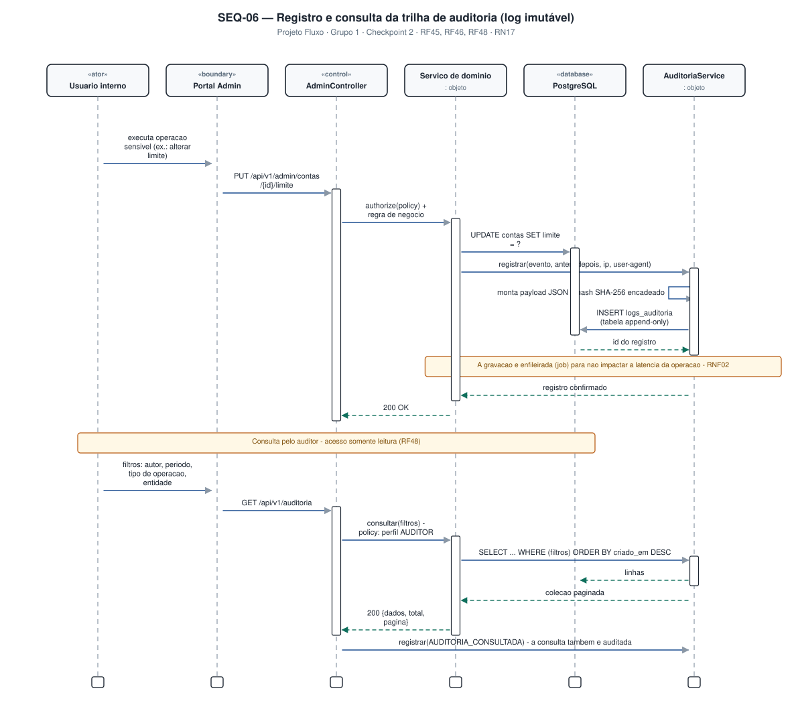
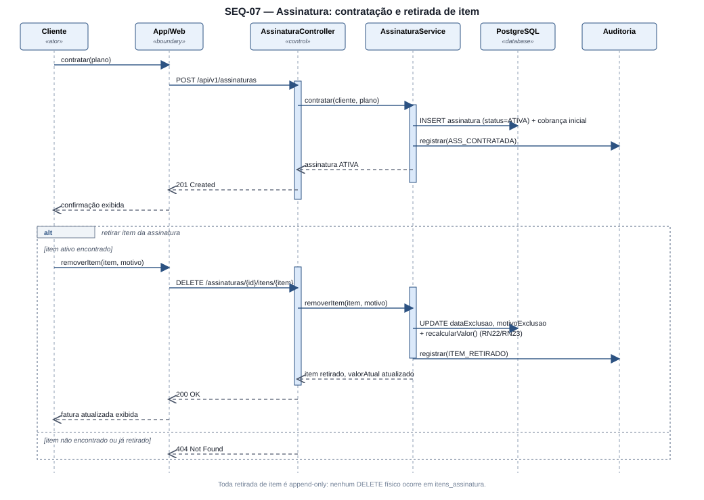
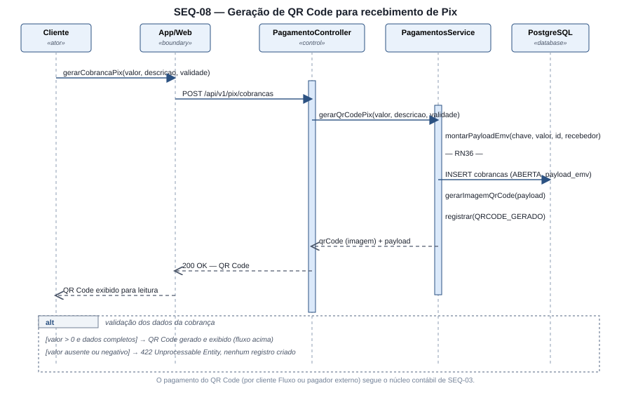

# 4.3 — Diagramas de Sequência (UML)

**Projeto:** Fluxo — Sistema Bancário Digital
**Grupo:** 1 · **Checkpoint 2** — apresentação em 17/09
**Repositório:** https://github.com/AlfredoVentura/Fluxo

> **Revisão desta versão:** nada foi removido do conteúdo anterior. SEQ-03 (Pix) detalhado com verificação de saldo disponível e antifraude expandido (limites de valor/horário/quantidade, localização, aviso de viagem). Adicionado **SEQ-08 — Geração de QR Code para recebimento de Pix**, funcionalidade definida na apresentação que ainda não tinha diagrama próprio.

---

## 1. Convenções

| Elemento | Notação |
|---|---|
| Ator | `«ator»` | Boundary | `«boundary»` (App Flutter / Web Blade) |
| Control | `«control»` (Controller da API) | Database | `«database»` (PostgreSQL) |
| External | `«external»` (sistema simulado) | Síncrona / Retorno | Seta fechada cheia / seta aberta tracejada |
| Fragmento | Retângulo `alt`/`loop` com guarda entre colchetes |

Foram modelados **8 diagramas**, cobrindo os fluxos de maior risco (dinheiro, identidade, segurança), o ciclo de assinatura e a geração de QR Code.

| ID | Diagrama | Fluxo | Requisitos | Imagem |
|---|---|---|---|---|
| SEQ-01 | Cadastro, KYC e abertura de conta | Visitante → aprovação do backoffice | RF01, RN01 | `diagramas/seq-01-cadastro-kyc.svg` |
| SEQ-02 | Autenticação com 2FA | Login → desafio → token | RF02, RF17 | `diagramas/seq-02-login-2fa.svg` |
| SEQ-03 | Transferência Pix | Saldo → risco → partidas dobradas | RF04, RF05, RN27–RN32 | `diagramas/seq-03-pix-transferencia.svg` |
| SEQ-04 | Retirada com 2FA obrigatório | Solicitação → desafio → liberação | RF07 | `diagramas/seq-04-retirada-2fa.svg` |
| SEQ-05 | Pagamento de boleto | Validação de DV → liquidação simulada | RF08 | `diagramas/seq-05-pagamento-boleto.svg` |
| SEQ-06 | Trilha de auditoria | Registro (escrita) → consulta (leitura) | RF-SEG01–04, RF09 | `diagramas/seq-06-trilha-auditoria.svg` |
| SEQ-07 | Assinatura — contratação e retirada de item | Contratação → inclusão/retirada → cobrança | RN22, RN23 | `diagramas/seq-07-assinatura.svg` |
| SEQ-08 | **Geração de QR Code Pix** *(novo)* | Cliente emite cobrança → payload EMV → imagem QR | RF15, RN36 | `diagramas/seq-08-qrcode-pix.svg` |

---

## 2. SEQ-01 — Cadastro, KYC e abertura de conta

**Participantes:** Visitante · App/Web · CadastroController · CadastroService · PostgreSQL · ServicoKYC · Notificacoes · Auditoria

**Pontos-chave:**
1. CPF (ou CNPJ, se PJ) validado localmente; unicidade checada no banco antes de qualquer `INSERT`.
2. Senha gravada apenas com hash bcrypt (custo 12).
3. Conta nasce com `status = PENDENTE`; só é ativada pela aprovação do backoffice.
4. Aprovação e criação da conta (agência + número, no subtipo correspondente) ocorrem na mesma transação.
5. Auditoria em dois momentos: `CADASTRO_SOLICITADO` e `CADASTRO_APROVADO`.

---

## 3. SEQ-02 — Autenticação com 2FA

**Participantes:** Cliente · App/Web · AuthController · AuthService · PostgreSQL · Servico2FA · Notificacoes · Auditoria

**Pontos-chave:**
1. 5 falhas em 15 min bloqueiam o acesso; cada falha gera `LOGIN_FALHOU`.
2. 2FA é condicional a `dois_fatores_ativo = true`.
3. Apenas o hash SHA-256 do código é gravado, com `expira_em` e tentativas.
4. Código é de uso único (`utilizado_em`); **token de acesso Sanctum emitido ao final**, TTL 60 min (RF17).

**Fragmentos `alt`:** credenciais inválidas → `401` + auditoria · código válido → token + `LOGIN_2FA_SUCESSO` · código inválido/expirado/reutilizado → `2FA_FALHOU` + `401`.

---

## 4. SEQ-03 — Transferência Pix com análise de risco *(detalhado)*

**Participantes:** Cliente · App/Web · TransacaoController · MotorTransacao · MotorAntifraude · PostgreSQL · SPI/Pix (simulado) · Auditoria

**Pontos-chave:**
1. Confirmação com senha antes da efetivação; `Idempotency-Key` evita duplicidade.
2. **Verificação de saldo disponível** (RN27) ocorre antes de acionar o `MotorAntifraude` — saldo insuficiente encerra o fluxo imediatamente.
3. `MotorAntifraude` avalia, em sequência: limite de valor por transação (RN28), limite diário de valor **e quantidade** (RN29), redução noturna do teto entre 20h–6h (RN30), localização divergente do padrão do cliente (RN32) e se há **aviso de viagem** ativo cobrindo a localização atual (RN31).
4. Transação ACID: `BEGIN` → `INSERT transacoes` → `INSERT lancamentos` (débito/crédito) → verificação de soma zero → `COMMIT`/`ROLLBACK`.
5. Saldo é sempre derivado, nunca editado diretamente.

**Fragmento `alt` (novo):** localização divergente **sem** aviso de viagem → eleva score de risco, pode exigir 2FA adicional · localização divergente **com** aviso de viagem ativo → segue fluxo normal (RN31).

---

## 5. SEQ-04 — Retirada (saque) com 2FA obrigatório

**Participantes:** Cliente · App/Web · RetiradaController · RetiradaService · PostgreSQL · Servico2FA · Notificacoes · Auditoria

**Regra central (RN18):** 2FA exigido se valor > 30% do limite diário, canal inédito, dispositivo não confiável, ou operação entre 20h–6h.

**Pontos-chave:**
1. Desafio com `finalidade = RETIRADA` (não reaproveita código de login); expira em 3 min, máx. 3 tentativas.
2. Após 3 falhas, retirada é bloqueada e registrada (`RETIRADA_2FA_FALHOU`).
3. Efetivação em transação com `ROLLBACK` automático se saldo insuficiente ou conta bloqueada pelo cliente (RN34).
4. Código de retirada de uso único, válido por 30 min; job de expiração estorna se não utilizado.

---

## 6. SEQ-05 — Pagamento de boleto

**Participantes:** Cliente · App/Web · PagamentoController · PagamentoService · PostgreSQL · Registradora (simulada) · Notificacoes · Auditoria

**Pontos-chave:**
1. Módulo 10/11 validados localmente antes de qualquer consulta externa.
2. Registradora consultada duas vezes: dados do boleto e registro da liquidação.
3. Débito só após confirmação e verificação de saldo; operação idempotente com comprovante em PDF.
4. Evento `BOLETO_PAGO` gravado com payload antes/depois.

---

## 7. SEQ-06 — Registro e consulta da trilha de auditoria

**Participantes:** Usuário interno · Portal Admin · AdminController · Serviço de domínio · PostgreSQL · AuditoriaService

**Pontos-chave:**
1. Escrita desacoplada: gravação feita por job em fila (não penaliza a operação de negócio).
2. **Todo tipo de operação é registrado** — `ACESSO` (login/logout), `CONSULTA` (leitura) e `MOVIMENTACAO` (RF-SEG04) — não só escritas financeiras.
3. Hash encadeado (SHA-256 do registro anterior) detecta remoção/adulteração.
4. Trigger no PostgreSQL bloqueia `UPDATE`/`DELETE` (append-only).
5. A própria consulta é auditada (`AUDITORIA_CONSULTADA`); acesso restrito a `AUDITOR`/`ADMINISTRADOR`.

---

## 8. SEQ-07 — Assinatura: contratação e retirada de item

**Participantes:** Cliente · App/Web · AssinaturaController · AssinaturaService · PostgreSQL · Auditoria

**Pontos-chave:**
1. Contratação cria `Assinatura` com `status = ATIVA` e gera a primeira `Cobranca` (`ASS_CONTRATADA`).
2. **Retirada de item (RN22):** o registro em `ItemAssinatura` **não é apagado** — o serviço preenche `dataExclusao` e `motivoExclusao` e recalcula `valorAtual` (`ITEM_RETIRADO`).
3. Cobrança do ciclo é gerada com valor proporcional aos itens ativos na competência (RN23).
4. Toda inclusão, retirada, troca de plano, suspensão e cancelamento gera evento de auditoria com estado antes/depois.

**Fragmento `alt`:** item pertence a uma assinatura ativa → retirada efetivada · item não encontrado/já retirado → `404` sem alteração.

---

## 9. SEQ-08 — Geração de QR Code para recebimento de Pix *(novo)*

**Participantes:** Cliente · App/Web · PagamentoController · PagamentosService · PostgreSQL · Auditoria

**Pontos-chave:**
1. Cliente informa valor, descrição e validade da cobrança; `PagamentosService` monta o **payload EMV** (chave Pix, valor, identificador da cobrança, dados do recebedor) — RN36.
2. O payload é persistido na tabela de cobranças (`status = ABERTA`) e usado para gerar a **imagem do QR Code** (biblioteca de geração local, sem chamada externa).
3. Evento `QRCODE_GERADO` registrado na trilha de auditoria.
4. Quando um pagador (cliente Fluxo ou externo) lê e paga o QR Code, o fluxo segue o mesmo núcleo contábil do SEQ-03 (partidas dobradas), atualizando o `status` da cobrança para `PAGA`.

**Fragmento `alt`:** dados da cobrança válidos → QR Code gerado e exibido · valor ausente/negativo → erro de validação, nenhum registro criado.

---

## 10. Rastreabilidade requisito × diagrama de sequência

| Requisito | SEQ-01 | SEQ-02 | SEQ-03 | SEQ-04 | SEQ-05 | SEQ-06 | SEQ-07 | SEQ-08 |
|---|:--:|:--:|:--:|:--:|:--:|:--:|:--:|:--:|
| RF01 (cadastro/KYC) | ✅ | | | | | | | |
| RF02, RF17 (login/2FA/token) | | ✅ | | ✅ | | | | |
| RF04, RF05 (Pix) | | | ✅ | | | | | |
| RF07 (retirada) | | | | ✅ | | | | |
| RF08 (boleto) | | | | | ✅ | | | |
| RF09, RF-SEG01–04 (auditoria) | ✅ | ✅ | ✅ | ✅ | ✅ | ✅ | ✅ | ✅ |
| RN22, RN23 (assinatura) | | | | | | | ✅ | |
| RN27–RN32 (antifraude Pix) | | | ✅ | | | | | |
| RF15, RN36 (QR Code) | | | | | | | | ✅ |
| RNF ACID / idempotência | | | ✅ | ✅ | ✅ | | ✅ | ✅ |

---

## 11. Como estes diagramas são produzidos

Gerados por script (`scripts/gen_seq.py`) a partir da descrição de participantes e mensagens — layout recalculado a cada alteração de requisito, mantendo estilo consistente entre todos os diagramas do projeto.

**Registro de alterações**

| Versão | Data | Alteração |
|---|---|---|
| 1.0 | 31/08/2026 | Versão inicial com 6 diagramas |
| 2.0 | 10/09/2026 | Texto condensado; SEQ-07 — Assinatura adicionado |
| 3.0 | 10/09/2026 | SEQ-03 detalhado com saldo e antifraude expandido (RN27–RN32); **SEQ-08 — Geração de QR Code Pix** adicionado; SEQ-02 e SEQ-06 ajustados (token, log de todo tipo de operação) |
