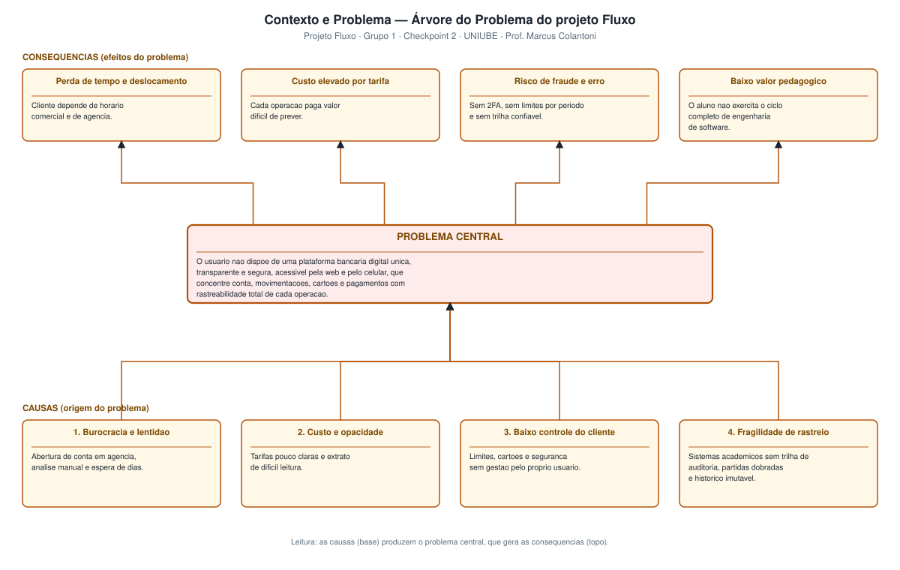
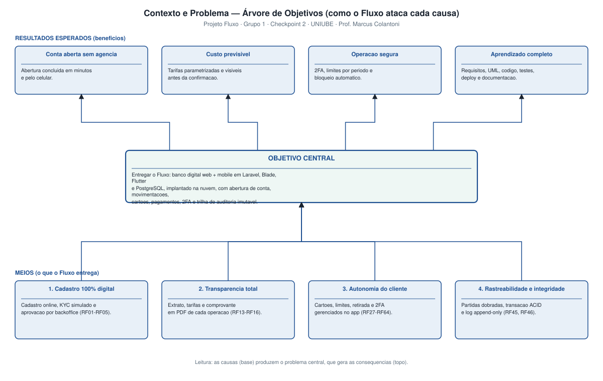

# Contexto e Problema

**Projeto:** Fluxo — Sistema Bancário Digital
**Disciplina:** Projetos de Software II — Prof. Marcus Colantoni (UNIUBE)
**Grupo:** 1 · **Checkpoint 2** — apresentação em 17/09
**Repositório:** https://github.com/AlfredoVentura/Fluxo
**Versão:** 1.0

---

## 1. Identificação do documento

| Item | Conteúdo |
|---|---|
| **Nome do produto** | Fluxo |
| **Categoria** | Banco digital / sistema bancário digital |
| **Problema abordado** | Ausência de uma plataforma bancária digital única, transparente e segura, acessível pela web e pelo celular, com rastreabilidade de todas as operações |
| **Público-alvo** | Correntistas pessoas físicas (18–45 anos), mobile-first; usuários internos (backoffice, suporte, administrador e auditoria) |
| **Equipe** | Grupo 1 — Gabriel Henrique (líder), João Alfredo (arquiteto/backend), Harttur Pimenta (banco de dados), Eduardo Henrique (infraestrutura), Marcus Vinicius (frontend/UX) |
| **Prazo** | 23/02/2026 a 03/12/2026 |

---

## 2. Contexto

### 2.1 Cenário externo

A última década transformou o sistema financeiro brasileiro:

- O **Pix**, lançado em 2020, tornou a transferência instantânea e gratuita um serviço esperado por qualquer cidadão — em 2024 foi responsável pela maior parte das transações do país.
- O **Open Finance** reduziu a barreira de entrada para novas instituições e acostumou o cliente a comparar produtos e tarifas.
- Bancos digitais (Nubank, Inter, C6) provaram que é possível abrir conta em minutos, sem agência, com tarifas transparentes e atendimento pelo aplicativo.
- A consequência cultural é clara: **a experiência digital deixou de ser diferencial e passou a ser requisito básico**.

### 2.2 Cenário acadêmico

Paralelamente, a formação em Engenharia de Software exige que o aluno percorra o ciclo completo — levantamento de requisitos, modelagem UML, implementação, testes, implantação em nuvem, gestão de projeto e documentação — em um objeto de estudo que seja **suficientemente complexo para ser realista** e **suficientemente delimitado para ser entregue em um semestre**.

Um sistema bancário satisfaz os dois critérios: possui regras de negócio ricas (partidas dobradas, limites, análise de risco, conciliação), requisitos não funcionais exigentes (segurança, integridade, auditoria, LGPD) e uma interface que qualquer avaliador conhece.

### 2.3 Situação atual (como o problema é resolvido hoje)

| Situação | Como o usuário resolve hoje | Limitação |
|---|---|---|
| Abrir conta | Comparecimento à agência ou app com espera de dias por análise manual | Lento, depende de horário comercial |
| Acompanhar gastos | Extrato em PDF ou aplicativo com categorização limitada | Pouca clareza sobre tarifas e lançamentos futuros |
| Controlar segurança | Ligações para a central, bloqueio por telefone | Baixa autonomia, sem 2FA visível ao cliente |
| Contestação de lançamento | Formulários e protocolo por telefone | Sem histórico auditável acessível ao cliente |
| Aprender engenharia de software | Exercícios isolados, sem integração entre modelagem, código, testes e deploy | Baixa transferência para a prática profissional |

---

## 3. Declaração do problema

> **O usuário brasileiro não dispõe de uma plataforma bancária digital única, transparente e segura, acessível pela web e pelo celular, que concentre abertura de conta, movimentações, cartões e pagamentos com rastreabilidade completa de cada operação — e a equipe de desenvolvimento não dispõe de um objeto de estudo que permita exercitar o ciclo completo de engenharia de software em um domínio de regras ricas.**

### 3.1 Quadro 5W2H do problema

| Dimensão | Descrição |
|---|---|
| **What (o quê)** | Falta de plataforma bancária digital integrada, transparente e auditável |
| **Who (quem)** | Correntista pessoa física mobile-first; usuários internos de backoffice, suporte e auditoria; estudantes de Engenharia de Software |
| **Where (onde)** | Qualquer lugar com acesso à internet — o atendimento presencial é o gargalo |
| **When (quando)** | No momento de abrir conta, movimentar dinheiro, contestar lançamentos e auditar operações |
| **Why (por quê)** | Processos manuais, sistemas sem trilha de auditoria e sem verificação forte de identidade |
| **How (como se manifesta)** | Espera por análise manual, tarifas opacas, extrato confuso, ausência de 2FA e de histórico imutável |
| **How much (impacto)** | Tempo perdido, custo por tarifa, risco de fraude e de erro contábil, baixo valor pedagógico |

---

## 4. Árvore do problema

### 4.1 Causas

| # | Causa | Evidência / justificativa |
|---|---|---|
| 1 | **Burocracia e lentidão** na abertura de conta | Cadastro presencial e análise manual alongam a abertura por dias |
| 2 | **Custo e opacidade** das tarifas | O cliente descobre o custo depois de contratar, não antes |
| 3 | **Baixo controle do cliente** sobre limites, cartões e segurança | Bloqueio e ajustes dependem de central telefônica |
| 4 | **Fragilidade de rastreio** nos sistemas acadêmicos | Projetos sem partidas dobradas, sem transação ACID e sem log imutável divergem saldo do extrato |

### 4.2 Consequências

| # | Consequência | Métrica que evidencia |
|---|---|---|
| 1 | Perda de tempo e deslocamento | Tempo entre início do cadastro e conta ativa |
| 2 | Custo elevado por tarifa | Valor pago em tarifas por mês |
| 3 | Risco de fraude e de erro contábil | Operações sem 2FA, sem limite por período e sem trilha confiável |
| 4 | Baixo valor pedagógico | Ausência de integração entre modelagem, código, testes, deploy e gestão |

---

## 5. Stakeholders impactados

| Stakeholder | Interesse | Impacto do problema |
|---|---|---|
| **Cliente (correntista)** | Abrir conta rápido, pagar pouco, ter controle | Alto — é o usuário final |
| **Favorecido / pagador** | Receber transferências e pagar cobranças | Médio |
| **Backoffice** | Aprovar cadastros e tratar contestações | Médio — retrabalho manual |
| **Suporte** | Atender chamados | Médio — volume de dúvidas sobre taxas e extrato |
| **Administrador** | Parametrizar tarifas e limites | Baixo |
| **Auditoria / conformidade** | Garantir rastreabilidade e integridade | Alto — sem trilha não há auditoria |
| **Equipe do projeto (Grupo 1)** | Aplicar o ciclo completo de engenharia de software | Alto |
| **Professor / avaliador** | Verificar requisitos, modelagem, código e implantação | Alto |

---

## 6. Árvore de objetivos (como o Fluxo ataca cada causa)

| Causa | Meio (o que o Fluxo entrega) | Requisito | Resultado esperado |
|---|---|---|---|
| 1. Burocracia | Cadastro 100% digital + KYC simulado + aprovação por backoffice | RF01–RF05, RN01 | Conta aberta sem ir à agência |
| 2. Opacidade | Extrato detalhado, tarifas parametrizadas e tela de confirmação antes de cada operação | RF13–RF16, RF49, RNF22 | Custo previsível |
| 3. Baixo controle | Gestão de cartões, limites, retirada e 2FA pelo próprio app | RF27–RF35, RF53–RF64 | Operação segura e autônoma |
| 4. Fragilidade de rastreio | Partidas dobradas, transação ACID, trilha de auditoria imutável com hash encadeado | RF45, RF46, RF48, RN02, RN03, RN27 | Saldo sempre igual ao extrato; auditoria possível |

---

## 7. Solução proposta

**Fluxo** — banco digital com duas interfaces (web e mobile), backend próprio, banco relacional e implantação em nuvem.

| Bloco | Tecnologia | Papel na solução |
|---|---|---|
| App mobile | **Flutter (Dart)** | Operações do cliente no celular: saldo, extrato, Pix, cartões, retirada, 2FA |
| Web | **Blade (Laravel) + Tailwind CSS** | Portal do cliente e portal administrativo (backoffice, suporte, auditoria) |
| Backend | **Laravel 11 (PHP 8.2+)** | Autenticação, regras de negócio, motor transacional, API REST v1, trilha de auditoria |
| Banco de dados | **PostgreSQL 16** | Razão contábil por partidas dobradas, valores em `numeric(18,2)`, transações ACID |
| Implantação | **Render (plano gratuito)** | Deploy automático a partir da branch `main` do GitHub |
| Gestão | **LibreProject** | Cronograma, WBS e Gantt atualizados semanalmente |

### 7.1 Decisões de projeto que respondem diretamente ao problema

1. **Partidas dobradas.** Toda movimentação gera lançamentos de débito e crédito cuja soma é zero; o saldo é calculado, nunca editado. Isso elimina a divergência entre saldo e extrato (causa 4).
2. **Verificação em dois fatores obrigatória em operações de risco.** Login, retirada acima do teto, canal novo e dispositivo não confiável exigem código de uso único (causa 3).
3. **Trilha de auditoria append-only com hash encadeado.** Nenhum registro pode ser alterado ou excluído; correções entram como novo lançamento (causa 4).
4. **Tarifas e limites parametrizados e exibidos antes da confirmação.** O cliente vê o custo antes de contratar (causa 2).
5. **Abertura de conta digital com KYC simulado e fila de aprovação.** Reduz o tempo de abertura de dias para minutos (causa 1).

---

## 8. Critérios de sucesso

| # | Critério | Meta | Como medir |
|---|---|---|---|
| 1 | Tempo de abertura de conta | Cadastro submetido em < 5 min; aprovação em até 1 dia útil | Registro de data/hora no banco |
| 2 | Convergência saldo × extrato | 0 divergências em 100% das operações | Teste automatizado sobre a soma dos lançamentos |
| 3 | Cobertura da auditoria | 100% das operações sensíveis registradas | Consulta na trilha após bateria de testes |
| 4 | Imutabilidade da trilha | 0 registros alterados ou excluídos | Trigger + teste de violação |
| 5 | Efetividade do 2FA | 100% das retiradas acima do teto exigem código | Teste de fluxo + trilha |
| 6 | Satisfação do usuário | Usuário novo conclui transferência em ≤ 3 min sem treinamento | Teste com 5 usuários |
| 7 | Implantação | Sistema acessível por URL pública no Render | Acesso do professor |
| 8 | Processo | Commits semanais de todos os integrantes e cronograma atualizado | Histórico do GitHub e arquivo do LibreProject |

---

## 9. Restrições, riscos e viabilidade

### 9.1 Restrições

| Tipo | Restrição |
|---|---|
| Acadêmica | Nenhuma operação financeira real; o sistema é uma simulação |
| Regulatória | O Fluxo não é instituição autorizada pelo BACEN; Pix, SPI, registradora de boletos e KYC são **simulados** |
| Tecnológica | Stack fixada: Laravel + Blade/Tailwind + Flutter + PostgreSQL + Render |
| Orçamentária | Plano gratuito do Render: serviço hiberna após ~15 min sem tráfego; PostgreSQL gratuito expira em 30 dias |
| Legal | Adequação à LGPD: minimização, finalidade, mascaramento e direito de exclusão |

### 9.2 Riscos

| Risco | Probabilidade | Impacto | Mitigação |
|---|---|---|---|
| Hibernate do Render prejudicar a demonstração | Alta | Médio | "Aquecer" o serviço antes da apresentação; ter vídeo de contingência |
| Expiração da instância gratuita do PostgreSQL | Alta | Alto | `pg_dump` semanal versionado; migrations e seeders como fonte de verdade |
| Divergência entre saldo e extrato | Média | Alto | Partidas dobradas + teste automatizado de consistência |
| Atraso do cronograma por sobreposição com outras disciplinas | Média | Médio | Cronograma de 32 h semanais no LibreProject, com folga antes de cada checkpoint |
| Dificuldade de integração Flutter × API | Média | Médio | Contrato de API definido primeiro; monorepo mantém backend e mobile no mesmo PR |

### 9.3 Viabilidade

| Dimensão | Análise | Conclusão |
|---|---|---|
| **Técnica** | Stack madura, documentada e já dominada parcialmente pela equipe; Laravel oferece ORM, filas, agendador e autenticação prontos | Viável |
| **Operacional** | 6 integrantes, ~32 h semanais somadas, cronograma de 95 tarefas até 03/12 | Viável |
| **Econômica** | Custo zero: Render free tier, PostgreSQL gerenciado gratuito, GitHub, VS Code/Codespaces e Android Studio gratuitos | Viável |
| **Legal** | Dados fictícios, LGPD aplicada por mascaramento e minimização; sem licenças pagas | Viável |

---

## 10. Rastreabilidade

| Item deste documento | Artefato relacionado |
|---|---|
| Causas 1 e 2 | [`Escopo.md`](Escopo.md) · [`Requisitos.md`](Requisitos.md) (RF01–RF16) |
| Causa 3 | [`DiagramaClasses.md`](DiagramaClasses.md) · [`DiagramaAtividades.md`](DiagramaAtividades.md) · RF53–RF64 |
| Causa 4 | [`LogAuditoria.md`](LogAuditoria.md) · RF45, RF46, RF48, RN27 |
| Solução proposta | [`DiagramaComponentes.md`](DiagramaComponentes.md) · [`DiagramaSequencia.md`](DiagramaSequencia.md) |
| Cronograma e gestão | [`QuadroDeGestao.md`](QuadroDeGestao.md) · [`libreproject/`](../libreproject/) |

---

**Registro de alterações**

| Versão | Data | Alteração |
|---|---|---|
| 1.0 | 31/08/2026 | Versão inicial: contexto, problema, árvore do problema, árvore de objetivos e critérios de sucesso |
