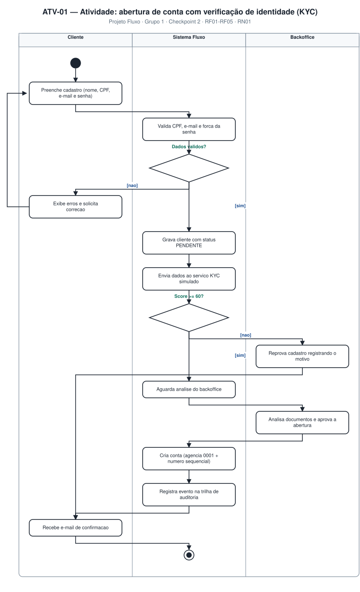
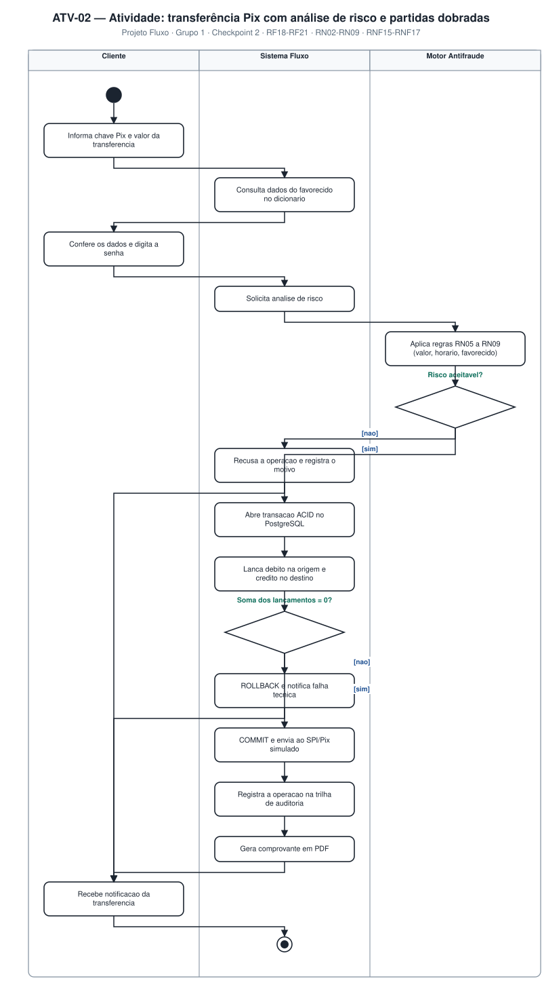
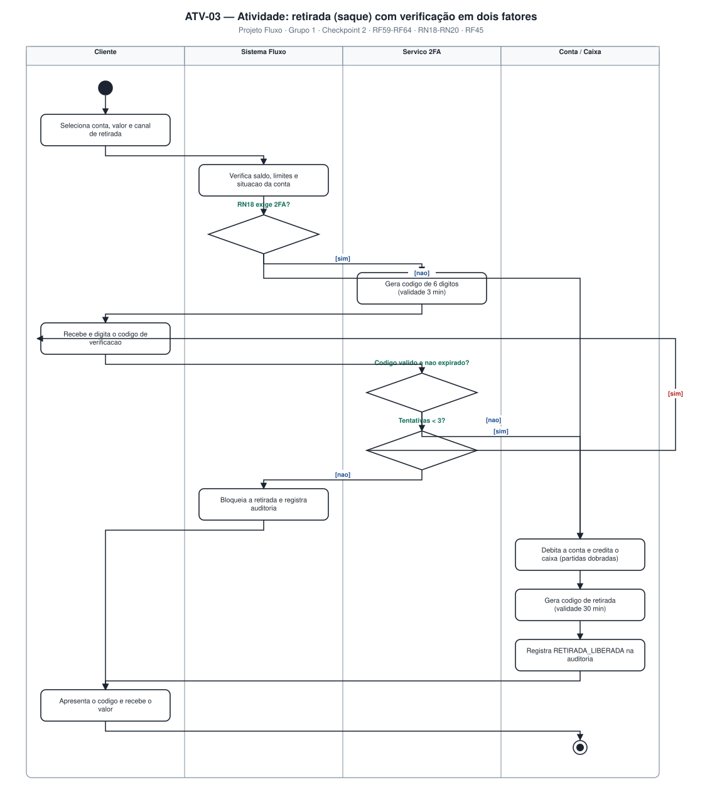
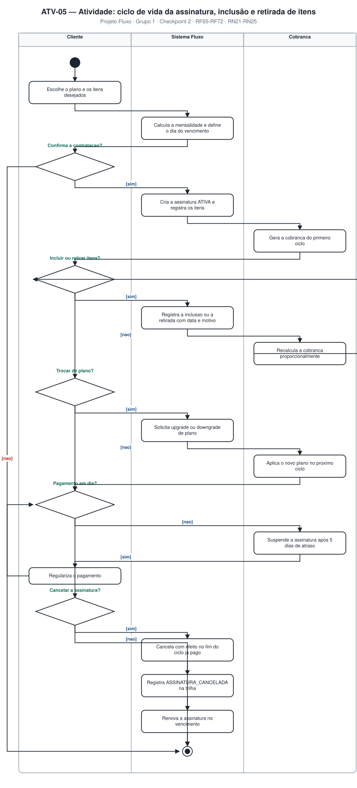

# 4.3 — Diagramas de Atividades (UML)

**Projeto:** Fluxo — Sistema Bancário Digital
**Grupo:** 1 · **Checkpoint 2** — apresentação em 17/09
**Repositório:** https://github.com/AlfredoVentura/Fluxo

---

## 1. Convenções

| Elemento | Notação |
|---|---|
| Nó inicial | Círculo preenchido |
| Ação | Retângulo de cantos arredondados |
| Decisão | Losango, com o enunciado acima e as guardas entre colchetes (`[sim]`, `[nao]`) |
| Nó final | Círculo com anel interno preenchido |
| Raia (swimlane) | Coluna com o nome do responsável pela ação |
| Fluxo de retorno | Linha contornando a lateral (realimentação) |

Foram modelados **5 diagramas**, um para cada fluxo de maior risco ou maior complexidade de regra.

| ID | Diagrama | Raias | Requisitos |
|---|---|---|---|
| ATV-01 | Abertura de conta com KYC | Cliente · Sistema Fluxo · Backoffice | RF01–RF05, RN01 |
| ATV-02 | Transferência Pix com análise de risco | Cliente · Sistema Fluxo · Motor Antifraude | RF18–RF21, RN02–RN09 |
| ATV-03 | Retirada (saque) com 2FA | Cliente · Sistema Fluxo · Serviço 2FA · Conta/Caixa | RF59–RF64, RN18–RN20 |
| ATV-04 | Pagamento de boleto | Cliente · Sistema Fluxo · Registradora | RF36, RF37, RF25 |
| ATV-05 | Ciclo da assinatura e retirada de itens | Cliente · Sistema Fluxo · Cobrança | RF65–RF72, RN21–RN25 |

---

## 2. ATV-01 — Abertura de conta com verificação de identidade (KYC)

### Decisões

| Decisão | Guarda | Caminho |
|---|---|---|
| Dados válidos? | `[nao]` | O sistema exibe os erros e devolve o cliente ao formulário (realimentação) |
| | `[sim]` | Grava o cliente com `status = PENDENTE` e envia ao KYC |
| Score ≥ 60? | `[nao]` | Reprova o cadastro registrando o motivo e notifica o cliente |
| | `[sim]` | Aguarda a análise humana do backoffice |

### Regras exercitadas
- **RN01** — a conta só é ativada após aprovação do backoffice.
- **RF02** — dígito verificador do CPF e unicidade conferidos antes de gravar.
- **RNF07** — senha com hash bcrypt, custo 12.

---

## 3. ATV-02 — Transferência Pix com análise de risco e partidas dobradas

### Decisões

| Decisão | Guarda | Caminho |
|---|---|---|
| Risco aceitável? | `[nao]` | Recusa a operação, registra o motivo e notifica o cliente |
| | `[sim]` | Abre transação ACID e lança débito/crédito |
| Soma dos lançamentos = 0? | `[nao]` | `ROLLBACK` e notificação de falha técnica |
| | `[sim]` | `COMMIT`, envio ao SPI/Pix simulado, auditoria, comprovante e notificação |

### Regras exercitadas
- **RN02 / RN03** — saldo é derivado dos lançamentos; toda transação tem soma zero.
- **RN05–RN09** — valor por operação, horário noturno, limite diário, favorecido novo e favorecido cadastrado há menos de 24 h.
- **RNF15–RNF17** — transação ACID, verificação de consistência e idempotência.

---

## 4. ATV-03 — Retirada (saque) com verificação em dois fatores

### Decisões

| Decisão | Guarda | Caminho |
|---|---|---|
| RN18 exige 2FA? | `[nao]` | Vai direto para o débito (valores baixos, canal conhecido, dispositivo confiável, horário comercial) |
| | `[sim]` | Gera e envia o código de 6 dígitos |
| Código válido e não expirado? | `[nao]` | Verifica as tentativas |
| | `[sim]` | Debita a conta, credita o caixa e gera o código de retirada |
| Tentativas < 3? | `[sim]` | Solicita novo código (realimentação) |
| | `[nao]` | Bloqueia a retirada e registra `RETIRADA_2FA_FALHOU` |

### Regras exercitadas
- **RN18** — condições que tornam o 2FA obrigatório (30% do limite diário, canal inédito, dispositivo não confiável, período noturno).
- **RN19** — limite diário de R$ 2.000,00 (R$ 500,00 entre 20h e 6h).
- **RN20** — código de retirada de uso único, válido por 30 minutos; ao expirar, estorno automático.
- **RN26** — código de verificação com uso único, 3 minutos para retirada, no máximo 3 tentativas.

---

## 5. ATV-04 — Pagamento de boleto

### Decisões

| Decisão | Guarda | Caminho |
|---|---|---|
| Linha digitável válida? | `[nao]` | Exibe o erro e solicita nova digitação (realimentação) |
| | `[sim]` | Consulta o boleto na registradora |
| Boleto ativo e não pago? | `[nao]` | Exibe a situação ao cliente e encerra |
| | `[sim]` | Mostra beneficiário, valor e vencimento para confirmação |
| Cliente confirma? | `[nao]` | Encerra sem cobrança |
| | `[sim]` | Verifica o saldo |
| Saldo suficiente? | `[nao]` | Exibe "saldo insuficiente" e encerra (RN04 — não há cheque especial) |
| | `[sim]` | Debita a conta, credita a conta de liquidação e registra a liquidação |

### Regras exercitadas
- **RF37** — validação dos dígitos verificadores (módulo 10 e módulo 11) antes de qualquer consulta externa.
- **RN04** — não é permitido saldo negativo.
- **RN10** — transações efetivadas não são excluídas; correções ocorrem por estorno.

---

## 6. ATV-05 — Ciclo de vida da assinatura, inclusão e retirada de itens

### Decisões

| Decisão | Guarda | Caminho |
|---|---|---|
| Confirma a contratação? | `[nao]` | Encerra sem gerar cobrança |
| | `[sim]` | Cria a assinatura ATIVA e registra os itens |
| Incluir ou retirar itens? | `[sim]` | Registra a movimentação com data e motivo e recalcula a cobrança (realimentação) |
| | `[nao]` | Segue para a troca de plano |
| Trocar de plano? | `[sim]` | Solicita upgrade/downgrade, com efeito no próximo ciclo |
| | `[nao]` | Segue para a verificação de pagamento |
| Pagamento em dia? | `[nao]` | Suspende após 5 dias de atraso; o cliente regulariza e o ciclo é reavaliado |
| | `[sim]` | Segue para o cancelamento/renovação |
| Cancelar a assinatura? | `[sim]` | Cancela com efeito no fim do ciclo pago e registra na trilha |
| | `[nao]` | Renova a assinatura no vencimento |

### Regras exercitadas — o coração do item "retirada de coisas"

- **RN22** — a **retirada de item** não apaga o registro: preenche `dataExclusao` e `motivoExclusao`, preservando o histórico e o valor da fatura do ciclo.
- **RN23** — a cobrança é gerada com base nos itens ativos na data do vencimento; inclusões e retiradas no meio do ciclo geram cobrança **proporcional**.
- **RN21** — só existe um plano ativo por vez; a troca cria nova vigência preservando a anterior.
- **RN24** — o cancelamento vale a partir do fim do ciclo já pago (sem reembolso proporcional nesta versão).
- **RN25** — atraso superior a 5 dias suspende a assinatura e bloqueia os itens.

---

## 7. Rastreabilidade atividade × requisito

| Requisito | ATV-01 | ATV-02 | ATV-03 | ATV-04 | ATV-05 |
|---|:--:|:--:|:--:|:--:|:--:|
| RF01–RF05 (cadastro/KYC) | ✅ | | | | |
| RF18–RF21 (Pix) | | ✅ | | | |
| RF25 (comprovante PDF) | | ✅ | | ✅ | |
| RF36, RF37 (boleto) | | | | ✅ | |
| RF53–RF58 (2FA) | | | ✅ | | |
| RF59–RF64 (retirada) | | | ✅ | | |
| RF65–RF72 (assinatura) | | | | | ✅ |
| RN01 | ✅ | | | | |
| RN02, RN03 (partidas dobradas) | | ✅ | ✅ | ✅ | |
| RN04 (sem saldo negativo) | | ✅ | ✅ | ✅ | |
| RN05–RN09 (risco) | | ✅ | | | |
| RN18–RN20 (retirada) | | | ✅ | | |
| RN21–RN25 (assinatura) | | | | | ✅ |

**Registro de alterações**

| Versão | Data | Alteração |
|---|---|---|
| 1.0 | 31/08/2026 | Versão inicial com 5 diagramas de atividades |
