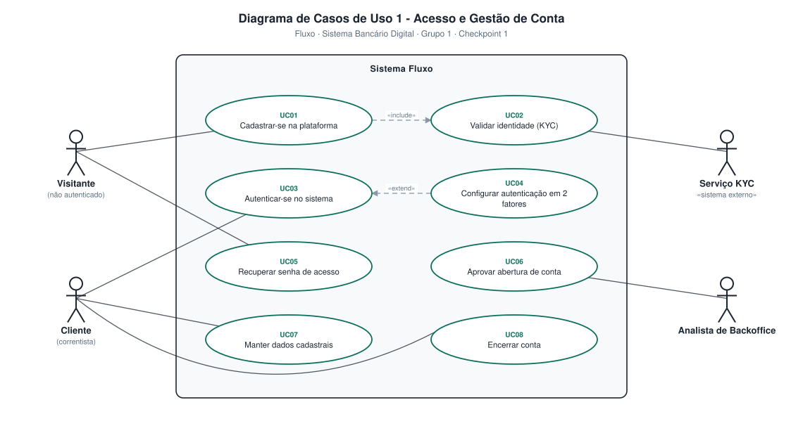
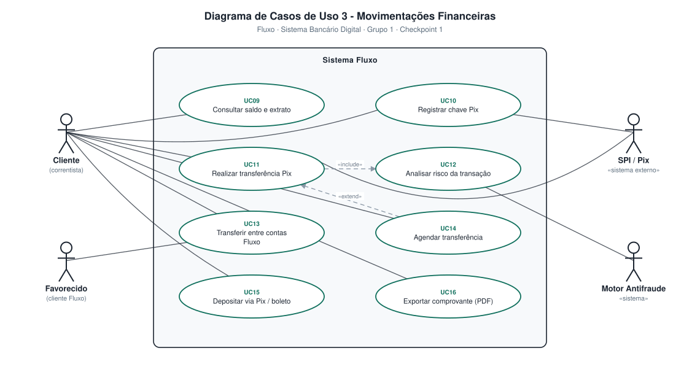
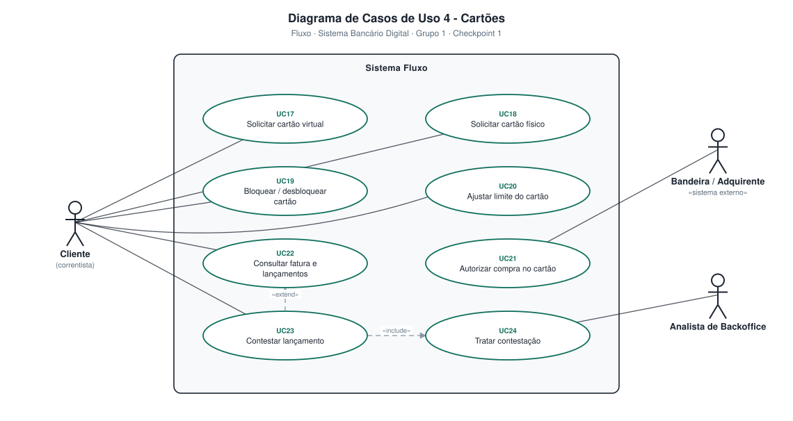
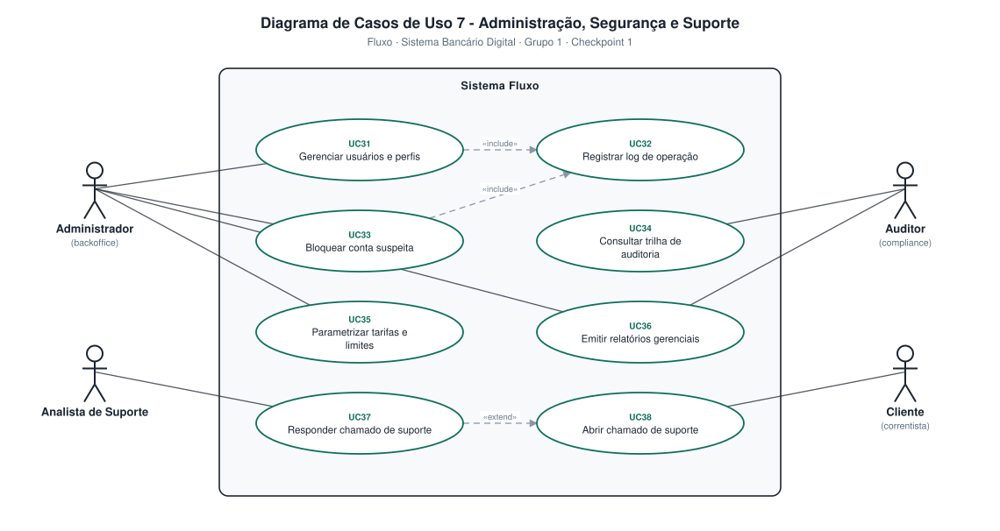

# 4.3 — Diagramas de Casos de Uso

**Projeto:** Fluxo — Sistema Bancário Digital
**Disciplina:** Projetos de Software II — UNIUBE · Prof. Marcus Colantoni
**Grupo:** 1 · **Checkpoint 1** — apresentação em 03/09/2026
**Notação:** UML 2.5

---

## Sumário

- [Notação utilizada](#notação-utilizada)
- [Visão geral](#visão-geral)
- [Atores do sistema](#atores-do-sistema)
- [Diagrama 1 — Acesso e Gestão de Conta](#diagrama-1--acesso-e-gestão-de-conta)
- [Diagrama 3 — Movimentações Financeiras](#diagrama-3--movimentações-financeiras)
- [Diagrama 4 — Cartões](#diagrama-4--cartões)
- [Diagrama 5 — Pagamentos e Cobranças](#diagrama-5--pagamentos-e-cobranças)
- [Diagrama 7 — Administração, Segurança e Suporte](#diagrama-7--administração-segurança-e-suporte)
- [Catálogo completo de casos de uso](#catálogo-completo-de-casos-de-uso)
- [Rastreabilidade](#rastreabilidade-caso-de-uso--requisito)

---

## Notação utilizada

| Elemento | Representação | Significado |
|---|---|---|
| **Ator** | Figura humana | Papel que interage com o sistema. Atores-sistema levam o estereótipo «sistema» ou «sistema externo». |
| **Caso de uso** | Elipse | Funcionalidade completa que entrega valor a um ator. |
| **Fronteira do sistema** | Retângulo | Delimita o que está dentro do escopo do Fluxo. |
| **Associação** | Linha cheia | Ator participa do caso de uso. |
| **«include»** | Seta tracejada | O caso de uso base **sempre** executa o incluído. Relação obrigatória. |
| **«extend»** | Seta tracejada | O caso de uso estensor executa **condicionalmente** sobre o base. Relação opcional. |

> **Sentido das setas:** em `«include»`, a seta aponta do caso base **para** o incluído. Em `«extend»`, aponta do estensor **para** o caso base. Essa direção é frequentemente cobrada em avaliação.

---

## Visão geral

| Métrica | Valor |
|---|---|
| Diagramas construídos | **5** (numerados 1, 3, 4, 5 e 7) |
| Casos de uso mapeados | **38** (UC01 – UC38) |
| Atores distintos | **13** |
| Relações «include» | 6 |
| Relações «extend» | 5 |

**Distribuição por diagrama:**

| Diagrama | Módulo | Casos de uso | Qtd. | Arquivo |
|:---:|---|:---:|:---:|---|
| 1 | Acesso e Gestão de Conta | UC01 – UC08 | 8 | [`ucd-01-acesso-e-conta.svg`](diagramas/ucd-01-acesso-e-conta.svg) |
| 3 | Movimentações Financeiras | UC09 – UC16 | 8 | [`ucd-03-movimentacoes.svg`](diagramas/ucd-03-movimentacoes.svg) |
| 4 | Cartões | UC17 – UC24 | 8 | [`ucd-04-cartoes.svg`](diagramas/ucd-04-cartoes.svg) |
| 5 | Pagamentos e Cobranças | UC25 – UC30 | 6 | [`ucd-05-pagamentos.svg`](diagramas/ucd-05-pagamentos.svg) |
| 7 | Administração, Segurança e Suporte | UC31 – UC38 | 8 | [`ucd-07-administracao.svg`](diagramas/ucd-07-administracao.svg) |

---

## Atores do sistema

### Atores humanos

| Ator | Descrição | Diagramas |
|---|---|:---:|
| **Visitante** | Pessoa não autenticada que se cadastra ou recupera o acesso. | 1 |
| **Cliente** | Correntista titular de uma conta Fluxo. Ator principal do sistema. | 1, 3, 4, 7 |
| **Favorecido** | Destinatário de uma transferência; pode ser cliente do Fluxo. | 3 |
| **Pagador externo** | Terceiro que liquida uma cobrança emitida por um cliente. | 5 |
| **Analista de Backoffice** | Trata e analisa contestações de cartão e movimentações. | 4 |
| **Analista de Suporte** | Responde chamados e realiza liberação de contas bloqueadas por acesso. | 7 |
| **Administrador** | Gerencia usuários, bloqueios de fraude, tarifas e limites operacionais. | 7 |
| **Auditor** | Consulta a trilha de auditoria e relatórios. Acesso somente leitura. | 7 |

### Atores-sistema

| Ator | Estereótipo | Papel | Diagramas |
|---|---|---|:---:|
| **Serviço KYC / Aprovação** | «sistema» | Simula validação de identidade e aprova contas automaticamente. | 1 |
| **SPI / Pix** | «sistema externo» | Liquida transferências instantâneas. *Simulado.* | 3 |
| **Motor Antifraude** | «sistema» | Componente interno de análise de risco por regras. | 3 |
| **Bandeira / Adquirente** | «sistema externo» | Autoriza compras no cartão. *Simulado.* | 4 |
| **Registradora de boletos** | «sistema externo» | Consulta e liquida boletos. *Simulado.* | 5 |
| **Motor de Notificações** | «sistema» | Componente interno de envio de e-mail e push em eventos. | 5 |

---

## Diagrama 1 — Acesso e Gestão de Conta

**Escopo:** ciclo de vida da conta, do cadastro do visitante até o encerramento, passando pela verificação de identidade e aprovação automatizada.

**Atores:** Visitante · Cliente · Serviço KYC / Aprovação «sistema»

| ID | Caso de uso | Ator principal | Descrição resumida |
|:---:|---|---|---|
| UC01 | Cadastrar-se na plataforma | Visitante | Informa nome, CPF, nascimento, e-mail, telefone e senha. |
| UC02 | Validar identidade (KYC) | Serviço KYC | Verificação simulada automatizada dos dados do solicitante. |
| UC03 | Autenticar-se no sistema | Cliente | Login por e-mail e senha, sujeito a bloqueio após 5 erros. |
| UC04 | Configurar autenticação em 2 fatores | Cliente | Ativa o segundo fator por código enviado ao e-mail. |
| UC05 | Recuperar senha de acesso | Visitante | Redefine a senha por token de uso único. |
| UC06 | Aprovar abertura de conta | Serviço KYC | Avalia automaticamente o cadastro e cria a conta corrente se deferido. |
| UC07 | Manter dados cadastrais | Cliente | Consulta e altera telefone, e-mail e endereço. |
| UC08 | Encerrar conta | Cliente | Encerra a conta se o saldo for zero e não houver pendências. |

**Relações:**

| Origem | Tipo | Destino | Justificativa |
|---|:---:|---|---|
| UC01 | «include» | UC02 | Todo cadastro passa obrigatoriamente pela validação de identidade automatizada. |
| UC04 | «extend» | UC03 | O 2FA só entra no fluxo de login quando o cliente o habilitou. |

---

## Diagrama 3 — Movimentações Financeiras

**Escopo:** núcleo transacional do sistema. Toda operação aqui gera lançamentos no razão contábil por partidas dobradas.

**Atores:** Cliente · Favorecido · SPI / Pix «sistema externo» · Motor Antifraude «sistema»

| ID | Caso de uso | Ator principal | Descrição resumida |
|:---:|---|---|---|
| UC09 | Consultar saldo e extrato | Cliente | Saldo calculado a partir dos lançamentos, com extrato filtrável. |
| UC10 | Registrar chave Pix | Cliente | Cadastra chave Pix com bloqueio estrito de duplicidades. |
| UC11 | Realizar transferência Pix | Cliente | Transfere informando a chave do favorecido e o valor. |
| UC12 | Analisar risco da transação | Motor Antifraude | Aplica regras de limite, horário e favorecido recente. |
| UC13 | Transferir entre contas Fluxo | Cliente | Transferência interna com liquidação imediata. |
| UC14 | Agendar transferência | Cliente | Programa data futura, com débito e validação estrita no dia da execução. |
| UC15 | Depositar via Pix / boleto | Cliente | Depósito simulado creditado na conta. |
| UC16 | Exportar comprovante (PDF) | Cliente | Gera comprovante com identificador único. |

**Relações:**

| Origem | Tipo | Destino | Justificativa |
|---|:---:|---|---|
| UC11 | «include» | UC12 | Nenhuma transferência é efetivada sem passar pela análise de risco. |
| UC14 | «extend» | UC11 | O agendamento só se aplica quando a execução não é imediata. |

---

## Diagrama 4 — Cartões

**Escopo:** emissão e gestão de cartões virtuais e físicos, controle de limites, faturas e contestação de lançamentos.

**Atores:** Cliente · Bandeira / Adquirente «sistema externo» · Analista de Backoffice

| ID | Caso de uso | Ator principal | Descrição resumida |
|:---:|---|---|---|
| UC17 | Solicitar cartão virtual | Cliente | Emissão imediata com número, validade e CVV gerados. |
| UC18 | Solicitar cartão físico | Cliente | Solicita e acompanha o status de produção e entrega. |
| UC19 | Bloquear / desbloquear cartão | Cliente | Bloqueio temporário ou definitivo. |
| UC20 | Ajustar limite do cartão | Cliente | Altera o limite respeitando o teto aprovado. |
| UC21 | Autorizar compra no cartão | Bandeira / Adquirente | Autorização simulada, verificando limite e status. |
| UC22 | Consultar fatura e lançamentos | Cliente | Fatura com lançamentos, fechamento e vencimento. |
| UC23 | Contestar lançamento | Cliente | Abre contestação informando o motivo (prazo de 90 dias). |
| UC24 | Tratar contestação | Analista de Backoffice | Defere ou indefere com justificativa. |

**Relações:**

| Origem | Tipo | Destino | Justificativa |
|---|:---:|---|---|
| UC23 | «include» | UC24 | Toda contestação aberta gera obrigatoriamente uma análise humana. |
| UC23 | «extend» | UC22 | A contestação é acionada opcionalmente a partir da fatura. |

---

## Diagrama 5 — Pagamentos e Cobranças

**Escopo:** pagamento de boletos e QR Codes Pix, emissão de cobranças pelo cliente e notificação dos eventos financeiros.

**Atores:** Cliente · Pagador externo · Registradora de boletos «sistema externo» · Motor de Notificações «sistema»

| ID | Caso de uso | Ator principal | Descrição resumida |
|:---:|---|---|---|
| UC25 | Pagar boleto / código de barras | Cliente | Pagamento por linha digitável, com validação do dígito verificador. |
| UC26 | Pagar QR Code Pix | Cliente | Leitura ou colagem do payload EMV. |
| UC27 | Emitir cobrança Pix (QR Code) | Cliente | Gera cobrança com valor, descrição e validade. |
| UC28 | Agendar pagamento recorrente | Cliente | Programa pagamentos com periodicidade definida. |
| UC29 | Liquidar cobrança emitida | Pagador externo | Terceiro paga a cobrança gerada pelo cliente. |
| UC30 | Notificar cliente do evento | Motor de Notificações | Dispara e-mail/push para transações aprovadas e agendamentos falhos. |

**Relações:**

| Origem | Tipo | Destino | Justificativa |
|---|:---:|---|---|
| UC29 | «include» | UC30 | A liquidação sempre dispara a notificação ao emissor. |
| UC29 | «extend» | UC27 | A liquidação é o desdobramento eventual de uma cobrança emitida. |

---

## Diagrama 7 — Administração, Segurança e Suporte

**Escopo:** área interna do banco — gestão de usuários e perfis, trilha de auditoria, parametrizações, relatórios e central de chamados (incluindo desbloqueio de acessos).

**Atores:** Administrador · Analista de Suporte · Auditor · Cliente

| ID | Caso de uso | Ator principal | Descrição resumida |
|:---:|---|---|---|
| UC31 | Gerenciar usuários e perfis | Administrador | Cria, edita e desativa usuários internos (RBAC). |
| UC32 | Registrar log de operação | *(sistema)* | Grava a operação sensível na trilha imutável. |
| UC33 | Bloquear / desbloquear conta | Administrador / Analista | Bloqueio por fraude (Admin) ou liberação após 5 tentativas de login (Suporte). |
| UC34 | Consultar trilha de auditoria | Auditor | Consulta com filtros por autor, período e tipo. |
| UC35 | Parametrizar tarifas e limites | Administrador | Define limites operacionais e o teto máximo de segurança. |
| UC36 | Emitir relatórios gerenciais | Administrador · Auditor | Volume transacionado, contas ativas e chamados. |
| UC37 | Responder chamado de suporte | Analista de Suporte | Responde e altera o status do chamado do cliente. |
| UC38 | Abrir chamado de suporte | Cliente | Solicita atendimento geral ou desbloqueio de acesso. |

**Relações:**

| Origem | Tipo | Destino | Justificativa |
|---|:---:|---|---|
| UC31 | «include» | UC32 | Toda alteração de usuário é registrada na auditoria. |
| UC33 | «include» | UC32 | Toda alteração no status da conta é registrada na auditoria. |
| UC37 | «extend» | UC38 | A resposta e a liberação de conta estendem o chamado aberto. |

---

## Catálogo completo de casos de uso

| ID | Caso de uso | Módulo | Ator principal |
|:---:|---|---|---|
| UC01 | Cadastrar-se na plataforma | Acesso e Conta | Visitante |
| UC02 | Validar identidade (KYC) | Acesso e Conta | Serviço KYC |
| UC03 | Autenticar-se no sistema | Acesso e Conta | Cliente |
| UC04 | Configurar autenticação em 2 fatores | Acesso e Conta | Cliente |
| UC05 | Recuperar senha de acesso | Acesso e Conta | Visitante |
| UC06 | Aprovar abertura de conta | Acesso e Conta | Serviço KYC / Aprovação |
| UC07 | Manter dados cadastrais | Acesso e Conta | Cliente |
| UC08 | Encerrar conta | Acesso e Conta | Cliente |
| UC09 | Consultar saldo e extrato | Movimentações | Cliente |
| UC10 | Registrar chave Pix | Movimentações | Cliente |
| UC11 | Realizar transferência Pix | Movimentações | Cliente |
| UC12 | Analisar risco da transação | Movimentações | Motor Antifraude |
| UC13 | Transferir entre contas Fluxo | Movimentações | Cliente |
| UC14 | Agendar transferência | Movimentações | Cliente |
| UC15 | Depositar via Pix / boleto | Movimentações | Cliente |
| UC16 | Exportar comprovante (PDF) | Movimentações | Cliente |
| UC17 | Solicitar cartão virtual | Cartões | Cliente |
| UC18 | Solicitar cartão físico | Cartões | Cliente |
| UC19 | Bloquear / desbloquear cartão | Cartões | Cliente |
| UC20 | Ajustar limite do cartão | Cartões | Cliente |
| UC21 | Autorizar compra no cartão | Cartões | Bandeira / Adquirente |
| UC22 | Consultar fatura e lançamentos | Cartões | Cliente |
| UC23 | Contestar lançamento | Cartões | Cliente |
| UC24 | Tratar contestação | Cartões | Analista de Backoffice |
| UC25 | Pagar boleto / código de barras | Pagamentos | Cliente |
| UC26 | Pagar QR Code Pix | Pagamentos | Cliente |
| UC27 | Emitir cobrança Pix (QR Code) | Pagamentos | Cliente |
| UC28 | Agendar pagamento recorrente | Pagamentos | Cliente |
| UC29 | Liquidar cobrança emitida | Pagamentos | Pagador externo |
| UC30 | Notificar cliente do evento | Pagamentos | Motor de Notificações |
| UC31 | Gerenciar usuários e perfis | Administração | Administrador |
| UC32 | Registrar log de operação | Administração | *(sistema)* |
| UC33 | Bloquear / desbloquear conta | Administração | Administrador / Analista |
| UC34 | Consultar trilha de auditoria | Administração | Auditor |
| UC35 | Parametrizar tarifas e limites | Administração | Administrador |
| UC36 | Emitir relatórios gerenciais | Administração | Administrador · Auditor |
| UC37 | Responder chamado de suporte | Administração | Analista de Suporte |
| UC38 | Abrir chamado de suporte | Administração | Cliente |

---

## Rastreabilidade Caso de Uso × Requisito

| Diagrama | Casos de uso | Requisitos funcionais |
|:---:|:---:|:---:|
| 1 — Acesso e Gestão de Conta | UC01 – UC08 | RF01 – RF12 |
| 3 — Movimentações Financeiras | UC09 – UC16 | RF13 – RF26 |
| 4 — Cartões | UC17 – UC24 | RF27 – RF35 |
| 5 — Pagamentos e Cobranças | UC25 – UC30 | RF36 – RF42 |
| 7 — Administração, Segurança e Suporte | UC31 – UC38 | RF43 – RF53 |

---

## Responsáveis pela elaboração

| Integrante | Função | Contribuição neste artefato |
|---|---|---|
| **Gabriel Henrique** | Líder / Gerente de projeto | Consolidação e revisão dos diagramas |
| **João Alfredo** | Arquiteto / Backend | Modelagem dos fluxos transacionais e regras |
| **Harttur Oliveira Pimenta** | BDA — Banco de Dados | Aderência dos casos de uso ao modelo de dados |
| **Eduardo Henrique** | Infraestrutura | Mapeamento dos atores-sistema e integrações |
| **Marcus Vinicius** | Frontend / UX UI | Fluxos de interação do cliente |

---

> **Versionamento:** diagramas do levantamento **inicial** consolidados, entregues no Checkpoint 1. Os **documentos detalhados de casos de uso** (item 4.6), com fluxo principal, fluxos alternativos, pré-condições e pós-condições de cada UC, serão entregues no **Checkpoint 2 (17/09/2026)**.
