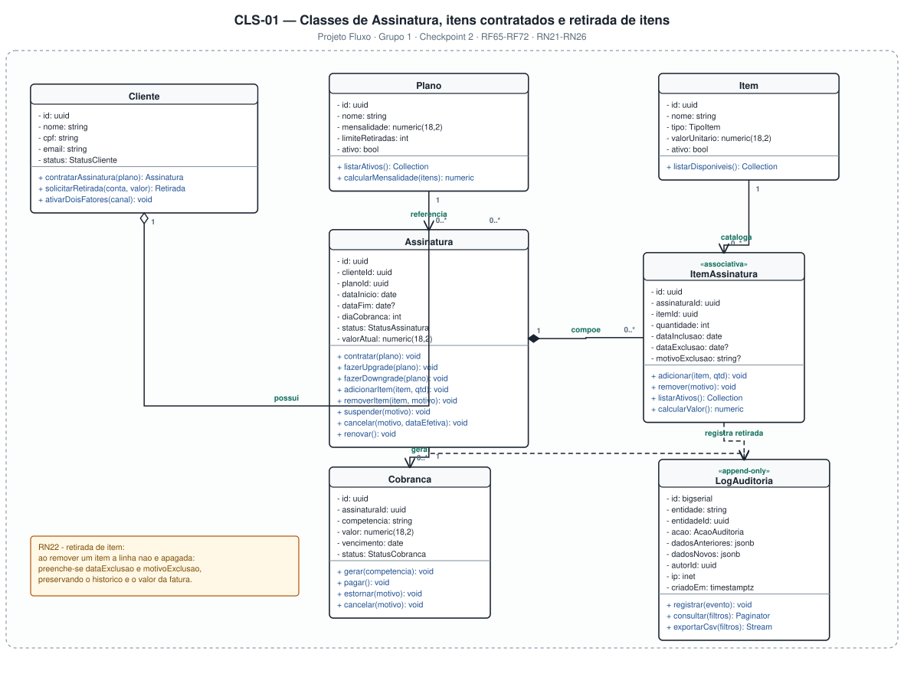
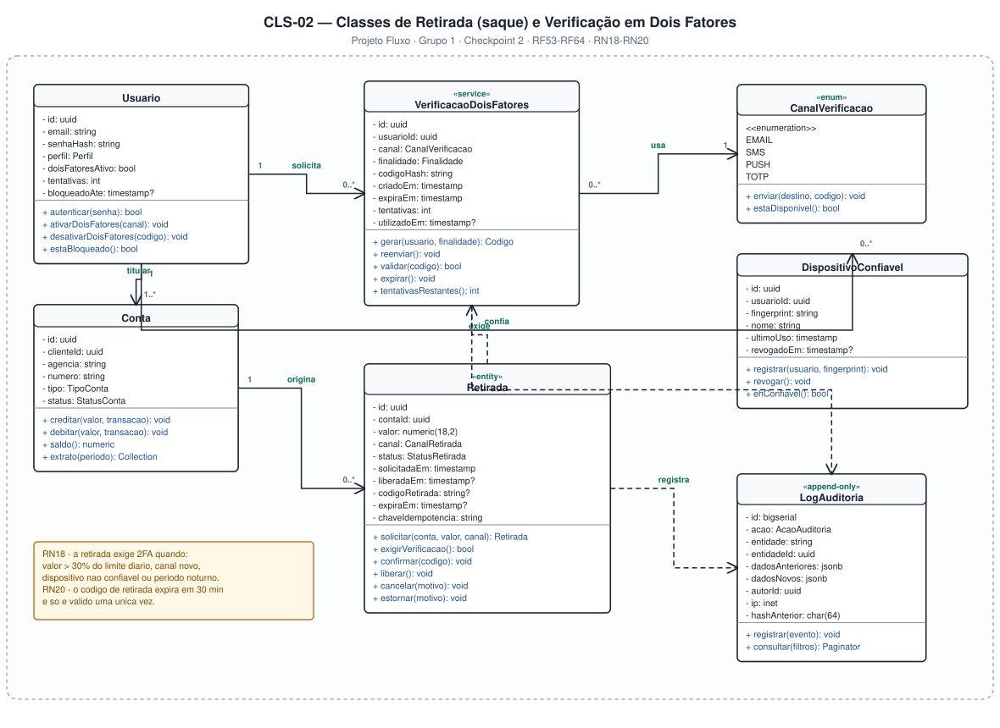

# 4.3 — Diagrama de Classes (UML)

**Projeto:** Fluxo — Sistema Bancário Digital
**Grupo:** 1 · **Checkpoint 2** — apresentação em 17/09
**Repositório:** https://github.com/AlfredoVentura/Fluxo

---

## 0. Nota sobre o recorte deste diagrama

O item pedido em aula foi a **classe de assinatura**, tomando como exemplo um modelo de planos em que o cliente pode **retirar coisas** (itens, benefícios) daquilo que contratou. No Fluxo o mesmo raciocínio aparece em **dois** lugares, e por isso os dois foram modelados:

| Diagrama | Onde está a "retirada" | O que modela |
|---|---|---|
| **CLS-01** | **Retirada de itens da assinatura** (plano/benefícios contratados) | `Cliente`, `Plano`, `Assinatura`, `Item`, `ItemAssinatura`, `Cobranca`, `LogAuditoria` |
| **CLS-02** | **Retirada de dinheiro (saque)** — que no Fluxo exige **verificação em dois fatores** | `Usuario`, `VerificacaoDoisFatores`, `CanalVerificacao`, `DispositivoConfiavel`, `Conta`, `Retirada`, `LogAuditoria` |

> Ou seja: o **caso da assinatura** (retirada de item) está no CLS-01 e o **caso do banco** (retirada de valor, com 2FA) está no CLS-02. Os dois compartilham o mesmo padrão de projeto: **nada é excluído fisicamente** — a retirada é registrada com data e motivo, preservando histórico e auditoria.

---

## 1. Convenções

| Elemento | Notação |
|---|---|
| Classe | Retângulo com três compartimentos: estereótipo/nome, atributos, métodos |
| Atributo | `- nome: tipo` (privado) |
| Método | `+ nome(param): retorno` (público) |
| Associação | Linha cheia com seta aberta e multiplicidades nas pontas |
| Composição | Losango **preenchido** na ponta do todo (ciclo de vida dependente) |
| Agregação | Losango **vazio** na ponta do todo |
| Dependência | Linha tracejada com seta aberta (`«use»`) |
| Estereótipos usados | `«entity»`, `«service»`, `«enum»`, `«associativa»`, `«append-only»` |

---

## 2. CLS-01 — Assinatura, itens contratados e retirada de itens



### 2.1 Descrição das classes

#### `Cliente`
| Atributo | Tipo | Observação |
|---|---|---|
| `id` | uuid | Chave primária |
| `nome` | string | Nome completo |
| `cpf` | string | Único, validado por dígito verificador |
| `email` | string | Único, usado como login |
| `status` | StatusCliente | `PENDENTE`, `ATIVO`, `BLOQUEADO`, `ENCERRADO` |

**Métodos:** `contratarAssinatura(plano)`, `solicitarRetirada(conta, valor)`, `ativarDoisFatores(canal)`.

#### `Plano`
Catálogo de planos ofertados. Guarda `mensalidade` (valor base), `limiteRetiradas` (quantas retiradas o plano libera por mês sem tarifa) e o flag `ativo`.

**Métodos:** `listarAtivos()`, `calcularMensalidade(itens)`.

#### `Assinatura`
Classe central do diagrama. É o vínculo entre um cliente e um plano, com vigência e regras de ciclo.

| Atributo | Observação |
|---|---|
| `dataInicio` / `dataFim` | Vigência; `dataFim` nulo significa assinatura em curso |
| `diaCobranca` | Dia do mês em que a cobrança é gerada |
| `status` | `ATIVA`, `SUSPENSA`, `CANCELADA`, `PENDENTE` |
| `valorAtual` | Mensalidade recalculada quando há inclusão ou retirada de item |

**Métodos relevantes**
- `fazerUpgrade(plano)` / `fazerDowngrade(plano)` — troca de plano com efeito no próximo ciclo (RN21).
- `adicionarItem(item, qtd)` / `removerItem(item, motivo)` — delega para `ItemAssinatura`.
- `suspender(motivo)` — RN25 (atraso superior a 5 dias).
- `cancelar(motivo, dataEfetiva)` — RN24 (efeito ao fim do ciclo já pago).
- `renovar()` — cria o novo ciclo e a nova `Cobranca`.

#### `Item`
Catálogo de itens contratáveis (ex.: cartão adicional, saque excedente, relatório gerencial, conta remunerada). Atributo `valorUnitario` usado no cálculo proporcional.

#### `ItemAssinatura` — `«associativa»`
Classe associativa entre `Assinatura` e `Item`. É aqui que a **retirada de item** acontece:

| Atributo | Observação |
|---|---|
| `quantidade` | Quantas unidades do item estão contratadas |
| `dataInclusao` | Data em que o item passou a valer |
| `dataExclusao` | **Preenchido na retirada** — nunca há `DELETE` (RN22) |
| `motivoExclusao` | Motivo informado pelo cliente ou pelo sistema |

**Métodos:** `adicionar(item, qtd)`, `remover(motivo)`, `listarAtivos()` (filtra `dataExclusao IS NULL`), `calcularValor()`.

> **Regra RN22 — retirada de item:** ao remover um item, a linha **não é apagada**. Preenche-se `dataExclusao` e `motivoExclusao`, preservando o histórico, o valor da fatura do ciclo e a trilha de auditoria.

#### `Cobranca`
Ciclo de faturamento da assinatura (`competencia` no formato `AAAA-MM`), com `valor`, `vencimento` e `status` (`ABERTA`, `PAGA`, `ATRASADA`, `CANCELADA`, `ESTORNADA`).

**Métodos:** `gerar(competencia)`, `pagar()`, `estornar(motivo)`, `cancelar(motivo)`.

#### `LogAuditoria` — `«append-only»`
Recebe um registro a cada inclusão, alteração ou **retirada** de item, troca de plano, cobrança gerada, suspensão e cancelamento. Detalhado em [`LogAuditoria.md`](LogAuditoria.md).

### 2.2 Multiplicidades

| Relação | Significado |
|---|---|
| `Cliente 1 — 0..* Assinatura` | Um cliente pode ter nenhuma ou várias assinaturas ao longo do tempo |
| `Plano 1 — 0..* Assinatura` | Um plano é referenciado por muitas assinaturas |
| `Assinatura 1 ◆— 0..* ItemAssinatura` | Composição: os itens não existem sem a assinatura |
| `Item 1 — 0..* ItemAssinatura` | Um item do catálogo aparece em várias assinaturas |
| `Assinatura 1 — 0..* Cobranca` | Cada ciclo gera uma cobrança |
| `ItemAssinatura ..> LogAuditoria` | Dependência: a retirada de item registra auditoria |

### 2.3 Esboço do modelo Laravel

```php
<?php
// app/Models/Assinatura.php
namespace App\Models;

use Illuminate\Database\Eloquent\Model;
use Illuminate\Database\Eloquent\Relations\{BelongsTo, HasMany};

class Assinatura extends Model
{
    protected $fillable = ['cliente_id','plano_id','data_inicio','dia_cobranca','status'];

    protected $casts = [
        'data_inicio' => 'date',
        'data_fim'    => 'date',
        'valor_atual' => 'decimal:2',
    ];

    public function cliente(): BelongsTo { return $this->belongsTo(Cliente::class); }
    public function plano(): BelongsTo   { return $this->belongsTo(Plano::class); }
    public function itens(): HasMany     { return $this->hasMany(ItemAssinatura::class); }
    public function cobrancas(): HasMany { return $this->hasMany(Cobranca::class); }

    /** Itens vigentes (sem data de exclusão). */
    public function itensAtivos(): HasMany
    {
        return $this->itens()->whereNull('data_exclusao');
    }

    /** RN22: a retirada NÃO apaga o registro — apenas fecha a vigência. */
    public function removerItem(Item $item, string $motivo): void
    {
        $vinculo = $this->itensAtivos()->where('item_id', $item->id)->firstOrFail();

        $vinculo->update([
            'data_exclusao'   => now()->toDateString(),
            'motivo_exclusao' => $motivo,
        ]);

        $this->recalcularValor();
        $this->registrarAuditoria('ITEM_RETIRADO', $vinculo, $motivo);
    }

    /** RN23: valor proporcional aos itens ativos no dia da cobrança. */
    public function recalcularValor(): void
    {
        $itens = $this->itensAtivos()->sum('valor_total');
        $this->update(['valor_atual' => $this->plano->mensalidade + $itens]);
    }
}
```

---

## 3. CLS-02 — Retirada (saque) e Verificação em Dois Fatores



### 3.1 Descrição das classes

#### `Usuario`
Credenciais e política de acesso.

| Atributo | Observação |
|---|---|
| `senhaHash` | bcrypt, custo 12 — nunca texto claro (RNF07) |
| `perfil` | `CLIENTE`, `SUPORTE`, `BACKOFFICE`, `ADMINISTRADOR`, `AUDITOR` |
| `doisFatoresAtivo` | Liga/desliga a exigência de 2FA |
| `tentativas` / `bloqueadoAte` | RF08 — 5 falhas em 15 min bloqueiam |

**Métodos:** `autenticar(senha)`, `ativarDoisFatores(canal)`, `desativarDoisFatores(codigo)`, `estaBloqueado()`.

#### `VerificacaoDoisFatores` — `«service»`
Modela o **desafio** de verificação, não apenas o código.

| Atributo | Observação |
|---|---|
| `canal` | `EMAIL`, `SMS`, `PUSH`, `TOTP` |
| `finalidade` | `LOGIN`, `RETIRADA`, `ALTERACAO_SENSIVEL` — impede reuso de código entre contextos |
| `codigoHash` | SHA-256 do código; o código em si nunca é persistido (RF55) |
| `criadoEm` / `expiraEm` | 5 min para login, 3 min para retirada (RN26) |
| `tentativas` | Máximo de 3 (RF56) |
| `utilizadoEm` | Uso único (RF54) |

**Métodos:** `gerar(usuario, finalidade)`, `reenviar()`, `validar(codigo)`, `expirar()`, `tentativasRestantes()`.

#### `CanalVerificacao` — `«enum»`
`EMAIL`, `SMS`, `PUSH`, `TOTP`. Método `enviar(destino, codigo)` e `estaDisponivel()`.

#### `DispositivoConfiavel`
Permite dispensar o 2FA por 30 dias em dispositivos conhecidos (RF58). Guarda `fingerprint`, `nome`, `ultimoUso` e `revogadoEm`.

#### `Conta`
`agencia`, `numero`, `tipo`, `status`. **Não possui atributo de saldo** — o saldo é calculado pela soma dos lançamentos (RN02).

**Métodos:** `creditar(valor, transacao)`, `debitar(valor, transacao)`, `saldo()`, `extrato(periodo)`.

#### `Retirada` — `«entity»`
O caso de uso de **retirada de dinheiro** do banco.

| Atributo | Observação |
|---|---|
| `valor` | `numeric(18,2)` no banco, centavos na aplicação (RNF18) |
| `canal` | `CAIXA_PARCEIRO`, `AGENCIA`, `TRANSFERENCIA` |
| `status` | `SOLICITADA`, `AGUARDANDO_2FA`, `LIBERADA`, `UTILIZADA`, `CANCELADA`, `EXPIRADA` |
| `codigoRetirada` | Código de uso único entregue ao cliente (RN20) |
| `expiraEm` | 30 minutos após a liberação |
| `chaveIdempotencia` | Impede duplicidade em reenvios (RNF17) |

**Métodos:** `solicitar(conta, valor, canal)`, `exigirVerificacao()`, `confirmar(codigo)`, `liberar()`, `cancelar(motivo)`, `estornar(motivo)`.

#### `LogAuditoria` — `«append-only»`
Registra solicitação, desafio criado, falha de 2FA, liberação, utilização, cancelamento e estorno.

### 3.2 Regra de negócio central — RN18

```php
public function exigirVerificacao(): bool
{
    $limiteDiario = $this->conta->limite_retirada_diaria;   // RN19: padrão R$ 2.000,00
    $noturno      = now()->between('20:00', '06:00');        // RN19: cai para R$ 500,00
    $teto         = $noturno ? 500.00 : $limiteDiario;

    return $this->valor > ($teto * 0.30)          // acima de 30% do limite diário
        || $this->canalEhInedito()                // canal nunca usado pelo cliente
        || ! $this->dispositivoEhConfiavel()      // dispositivo não confiável
        || $noturno;                              // período noturno
}
```

### 3.3 Esboço do modelo Laravel

```php
<?php
// app/Models/Retirada.php
namespace App\Models;

use Illuminate\Database\Eloquent\Model;

class Retirada extends Model
{
    public const STATUS = ['SOLICITADA','AGUARDANDO_2FA','LIBERADA',
                           'UTILIZADA','CANCELADA','EXPIRADA'];

    protected $casts = [
        'valor'      => 'decimal:2',
        'liberada_em' => 'datetime',
        'expira_em'   => 'datetime',
    ];

    public function conta() { return $this->belongsTo(Conta::class); }

    /** RN18 — condições que tornam o 2FA obrigatório. */
    public function exigirVerificacao(): bool { /* ...ver 3.2... */ }

    /** SEQ-04: só libera após o desafio validado e dentro de transação ACID. */
    public function confirmar(string $codigo): void
    {
        $desafio = VerificacaoDoisFatores::where('retirada_id', $this->id)
            ->where('finalidade', 'RETIRADA')
            ->whereNull('utilizado_em')
            ->firstOrFail();

        if (! $desafio->validar($codigo)) {
            $this->registrarAuditoria('RETIRADA_2FA_FALHOU');
            throw new CodigoInvalidoException('Código inválido, expirado ou já utilizado.');
        }

        \DB::transaction(function () {
            $transacao = Transacao::criar($this->conta, $this->valor, 'RETIRADA');
            $this->conta->debitar($this->valor, $transacao);   // RN04: sem saldo negativo
            Conta::caixa()->creditar($this->valor, $transacao);

            $this->update([
                'status'          => 'LIBERADA',
                'liberada_em'     => now(),
                'codigo_retirada' => str_pad((string) random_int(0, 999999), 6, '0', STR_PAD_LEFT),
                'expira_em'       => now()->addMinutes(30),    // RN20
            ]);

            $this->registrarAuditoria('RETIRADA_LIBERADA');
        });
    }
}
```

---

## 4. Mapeamento classes → entidades do banco de dados

| Classe | Tabela (PostgreSQL) | Observação |
|---|---|---|
| `Cliente` | `clientes` | 1:1 com `usuarios` |
| `Usuario` | `usuarios` | Credenciais, perfil e 2FA |
| `Conta` | `contas` | Sem coluna de saldo |
| `Retirada` | `retiradas` | FK para `contas` e `transacoes` |
| `VerificacaoDoisFatores` | `codigos_verificacao` | Hash + expiração + tentativas |
| `DispositivoConfiavel` | `dispositivos_confiaveis` | 0..* por usuário |
| `Plano` | `planos` | Catálogo |
| `Assinatura` | `assinaturas` | FK `cliente_id`, `plano_id` |
| `Item` | `itens` | Catálogo |
| `ItemAssinatura` | `itens_assinatura` | Classe associativa; **sem exclusão física** |
| `Cobranca` | `cobrancas` | Uma por competência |
| `LogAuditoria` | `logs_auditoria` | Append-only, com trigger de proteção |

> Com estas 12 classes, o modelo passa das 16 entidades já previstas para **21 entidades**, superando com folga o mínimo de 8 exigido pela disciplina.

---

## 5. Rastreabilidade

| Requisito | Classe / diagrama |
|---|---|
| RF53–RF58 (2FA) | `VerificacaoDoisFatores`, `CanalVerificacao`, `DispositivoConfiavel` (CLS-02) |
| RF59–RF64 (retirada) | `Retirada`, `Conta` (CLS-02) |
| RF65–RF72 (assinatura) | `Assinatura`, `Plano`, `Item`, `ItemAssinatura`, `Cobranca` (CLS-01) |
| RF45, RF46, RF48 (auditoria) | `LogAuditoria` (CLS-01 e CLS-02) |
| RN18, RN19, RN20 | `Retirada::exigirVerificacao()`, `Retirada::confirmar()` |
| RN21–RN25 | `Assinatura`, `ItemAssinatura`, `Cobranca` |
| RN26 | `VerificacaoDoisFatores` |
| RN27 | `LogAuditoria` |
| RNF07, RNF18 | `Usuario::$senhaHash`, valores `numeric(18,2)` |

**Registro de alterações**

| Versão | Data | Alteração |
|---|---|---|
| 1.0 | 31/08/2026 | Versão inicial: CLS-01 (assinatura e retirada de itens) e CLS-02 (retirada/saque com 2FA) |
