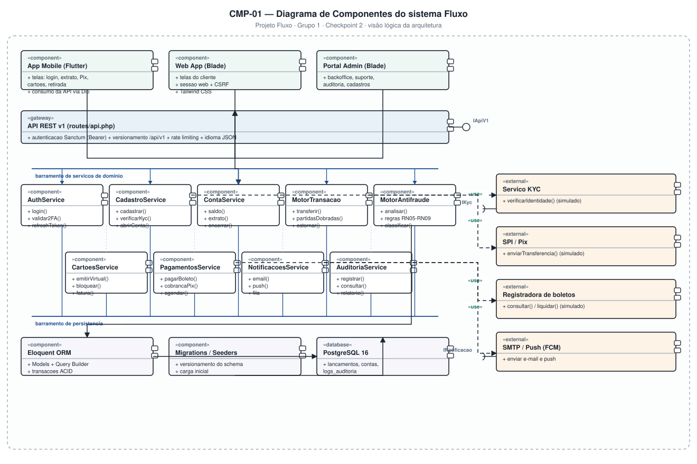

# 4.3 — Diagramas de Componentes e de Implantação (UML)

**Projeto:** Fluxo — Sistema Bancário Digital
**Grupo:** 1 · **Checkpoint 2** — apresentação em 17/09
**Repositório:** https://github.com/AlfredoVentura/Fluxo

---

## 1. CMP-01 — Diagrama de Componentes (visão lógica)



### 1.1 Camadas

| Camada | Componentes | Responsabilidade |
|---|---|---|
| **Apresentação** | App Mobile (Flutter), Web App (Blade), Portal Admin (Blade) | Interface com o usuário; o app consome a API via HTTPS/JSON, a web usa sessão + CSRF |
| **Fronteira** | `API REST v1` (`«gateway»`) | Autenticação Sanctum, versionamento `/api/v1`, rate limiting, validação de requisição |
| **Domínio** | 9 serviços de negócio | Regras do banco; cada serviço é um componente substituível |
| **Persistência** | Eloquent ORM, Migrations/Seeders, PostgreSQL 16 | Mapeamento objeto-relacional, versionamento do esquema e armazenamento |
| **Externa** | Serviço KYC, SPI/Pix, Registradora de boletos, SMTP/Push | Integrações **simuladas** — nenhuma opera dinheiro real |

### 1.2 Componentes de domínio

| Componente | Interfaces principais | Requisitos |
|---|---|---|
| `AuthService` | `login()`, `validar2FA()`, `refreshToken()` | RF06–RF08, RF53–RF58 |
| `CadastroService` | `cadastrar()`, `verificarKyc()`, `abrirConta()` | RF01–RF05 |
| `ContaService` | `saldo()`, `extrato()`, `encerrar()` | RF13–RF15 |
| `MotorTransacao` | `transferir()`, `partidasDobradas()`, `estornar()` | RF18–RF24, RN02, RN03 |
| `MotorAntifraude` | `analisar()`, `regras RN05-RN09`, `classificar()` | RF20, RN05–RN09 |
| `CartoesService` | `emitirVirtual()`, `bloquear()`, `fatura()` | RF27–RF35 |
| `PagamentosService` | `pagarBoleto()`, `cobrancaPix()`, `agendar()` | RF36–RF42 |
| `NotificacoesService` | `email()`, `push()`, `fila` | RF42 |
| `AuditoriaService` | `registrar()`, `consultar()`, `relatorio()` | RF45, RF46, RF48 |

### 1.3 Interfaces oferecidas e requeridas

| Notação | Interface | De | Para |
|---|---|---|---|
| Bola (`I`) | `IApiV1` | API REST v1 | App Mobile, Web App, Portal Admin |
| Soquete (`C`) | `IKyc` | CadastroService | Serviço KYC |
| Soquete (`C`) | `INotificacao` | NotificacoesService | SMTP / Push |

`CadastroService`, `MotorTransacao`, `PagamentosService` e `NotificacoesService` dependem de componentes externos por relacionamentos `«use»` tracejados — a troca do simulador por um serviço real não altera o contrato interno.

### 1.4 Decisões arquiteturais

1. **Uma API para dois clientes.** App mobile e web consomem o mesmo contrato `/api/v1`; a web usa adicionalmente rotas Blade com sessão e CSRF. Isso evita duplicidade de regra de negócio (RNF30).
2. **Serviços de domínio isolados dos controllers.** O controller apenas valida e delega; a regra vive no serviço, o que viabiliza os testes automatizados exigidos por RNF27.
3. **Auditoria como componente transversal.** Todo serviço de domínio depende de `AuditoriaService`, garantindo RF45 sem duplicar código.
4. **Persistência atrás do ORM.** Nenhum serviço escreve SQL direto; migrations versionam o esquema (RNF28).
5. **Notificações por fila.** `email()` e `push()` são assíncronos, preservando RNF02 (resposta de escrita em até 3 s).

---

## 2. CMP-02 — Diagrama de Implantação (deployment)


### 2.1 Nós

| Nó | Estereótipo | Conteúdo |
|---|---|---|
| Dispositivo do cliente | `«device»` | Navegador Chrome/Firefox e app Android (Flutter 3.x, Android 8.0+ / API 26) |
| Estação de desenvolvimento | `«device»` | GitHub Codespaces (backend) e Android Studio (mobile) |
| GitHub | `«repository»` | Repositório `AlfredoVentura/Fluxo`, monorepo `backend/` + `mobile/` |
| Render | `«cloud»` | Web Service PHP 8.2/Laravel 11, Cron Job, PostgreSQL 16 gerenciado |
| Serviços externos simulados | `«external»` | SPI/Pix, registradora de boletos, serviço KYC, SMTP/Push |

### 2.2 Conexões e protocolos

| De | Para | Protocolo | Observação |
|---|---|---|---|
| Dispositivo do cliente | Web Service | `«HTTPS»` 443 | TLS 1.2+ obrigatório (RNF06) |
| Web Service | PostgreSQL | `«TCP»` 5432 | Conexão interna do datacenter do Render |
| Web Service | Cron Job | `«HTTPS»` | O agendador é acionado por requisição, já que o Cron Job gratuito é efêmero |
| Cron Job | PostgreSQL | `«SQL»` | Execução de `schedule:run` e expiração de retiradas/cobranças |
| GitHub | Render | `«webhook»` deploy | Cada push em `main` dispara build e deploy automáticos |
| Estação de desenvolvimento | GitHub | `«git push»` | Commits semanais (item 4.4.3) |
| Web Service | Serviços externos | `«HTTPS»` JSON | Integrações simuladas |

### 2.3 Limites do plano gratuito do Render — e como o grupo contorna cada um

| Limitação | Impacto | Mitigação adotada |
|---|---|---|
| O serviço hiberna após ~15 min sem tráfego | Primeira requisição leva ~50 s | "Aquecer" a URL antes da apresentação; manter vídeo de contingência da demonstração |
| A instância gratuita de PostgreSQL **expira em 30 dias** | Perda do banco | `pg_dump` semanal versionado fora do repositório; `migrations` + `seeders` como fonte de verdade para recriar o banco (RNF19) |
| Cron Job roda em container efêmero | Não mantém estado entre execuções | O agendador de produção é acionado por requisição HTTP agendada externamente; nenhum estado é guardado no container |
| Sem disco persistente | Uploads se perdem | Anexos de chamado são gravados no banco (bytea) ou em storage externo gratuito |
| Build com limite de tempo | Build de Flutter fora do Render | O APK é gerado no Android Studio e publicado como release no GitHub |

---

## 3. Organização do repositório (monorepo)

```
Fluxo/
├── backend/                    # Laravel 11 (PHP 8.2+)
│   ├── app/
│   │   ├── Http/Controllers/   # AuthController, TransacaoController, RetiradaController...
│   │   ├── Models/             # Cliente, Conta, Retirada, Assinatura, LogAuditoria...
│   │   ├── Services/           # MotorTransacao, MotorAntifraude, AuditoriaService...
│   │   └── Policies/           # Controle de acesso por perfil (RF44)
│   ├── database/migrations/    # Versionamento do esquema (RNF28)
│   ├── resources/views/        # Telas Blade + Tailwind
│   ├── routes/api.php          # API REST v1
│   └── tests/                  # PHPUnit — meta de 60% de cobertura (RNF27)
└── mobile/                     # Flutter (Dart)
    ├── lib/screens/            # Login, Dashboard, Extrato, Pix, Retirada, Assinatura
    ├── lib/services/           # Cliente HTTP da API
    └── test/                   # Testes unitários e de widget
```

---

## 4. Rastreabilidade

| Requisito | Evidência no diagrama |
|---|---|
| RNF06 (HTTPS) | CMP-02 — `«HTTPS»` em todas as conexões externas |
| RNF31 (deploy automático a partir do GitHub) | CMP-02 — webhook GitHub → Render |
| RNF33–RNF37 (restrições de stack) | CMP-01 (Laravel, Blade, Flutter) e CMP-02 (Render, PostgreSQL) |
| RNF38 (acesso do professor ao repositório) | CMP-02 — nó GitHub, repositório público |
| RF45 (auditoria transversal) | CMP-01 — `AuditoriaService` dependido por todo o domínio |
| RNF19 (backup semanal) | CMP-02 — nota de mitigação do free tier |

**Registro de alterações**

| Versão | Data | Alteração |
|---|---|---|
| 1.0 | 31/08/2026 | Versão inicial: CMP-01 (componentes) e CMP-02 (implantação) |
