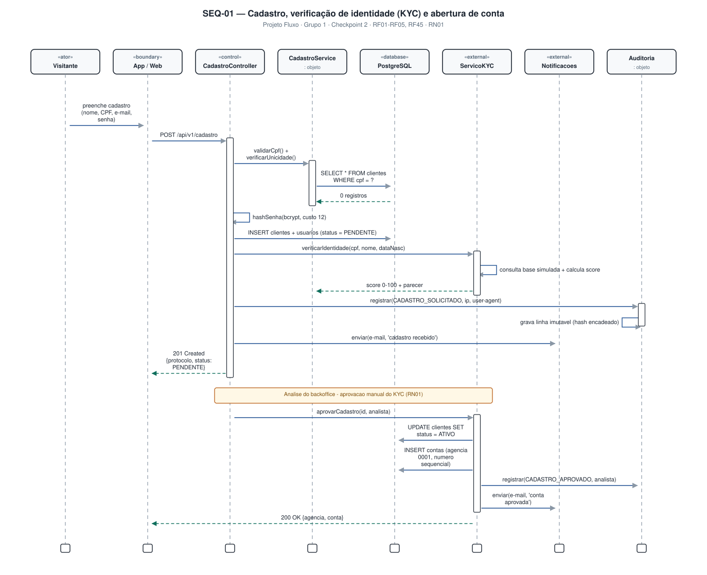
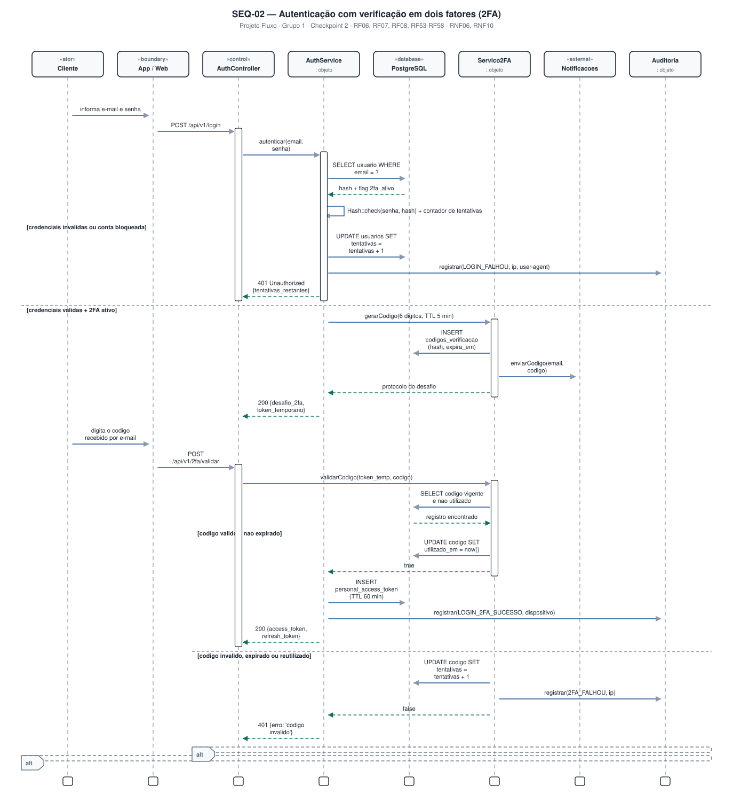
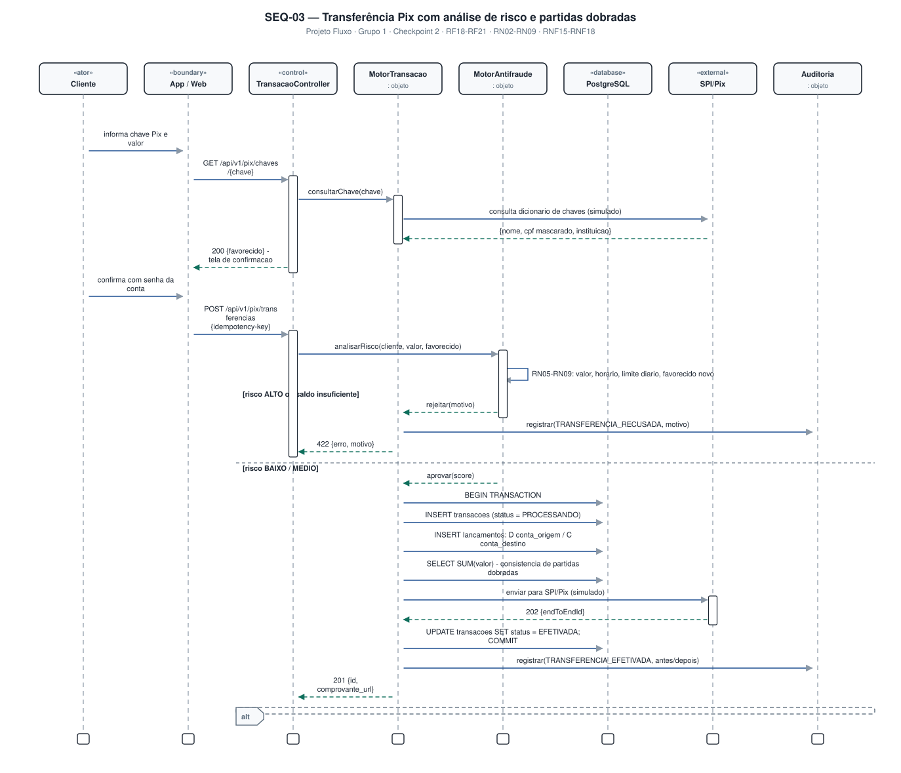
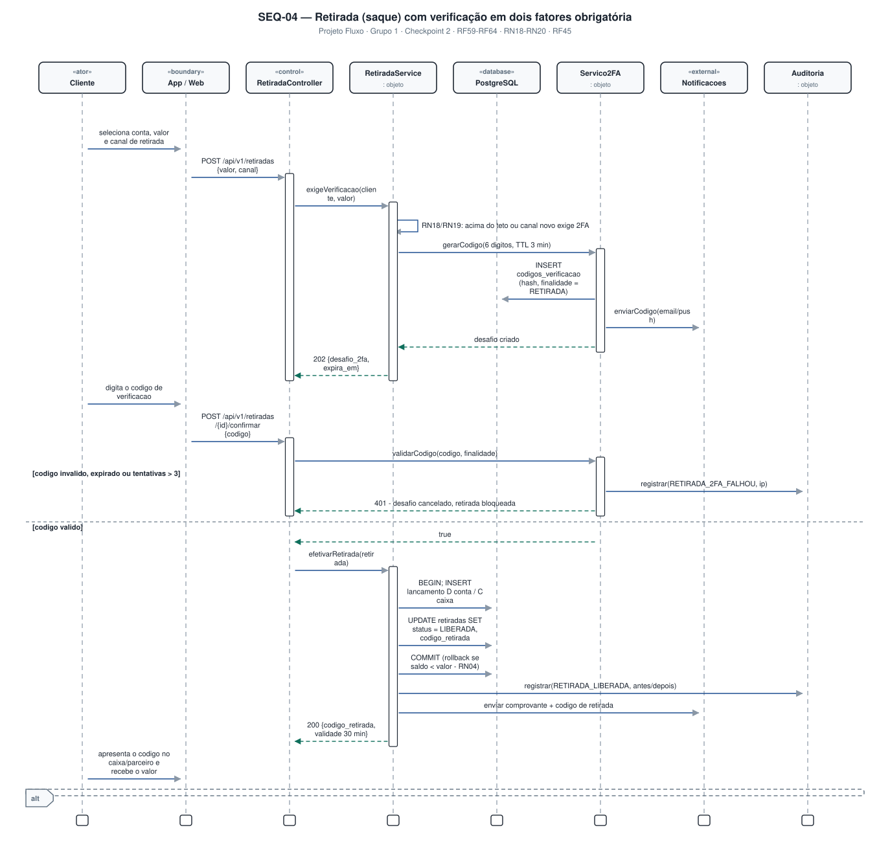

# 4.3 — Diagramas de Sequência (UML)

**Projeto:** Fluxo — Sistema Bancário Digital
**Grupo:** 1 · **Checkpoint 2** — apresentação em 17/09
**Repositório:** https://github.com/AlfredoVentura/Fluxo

---

## 1. Convenções adotadas

| Elemento | Notação usada |
|---|---|
| **Ator** | Caixa com estereótipo `«ator»` (humano) |
| **Boundary** | `«boundary»` — App Mobile (Flutter) ou Web (Blade) |
| **Control** | `«control»` — Controller da API REST |
| **Entidade / serviço** | Caixa sem estereótipo (camada de serviço) |
| **Database** | `«database»` — PostgreSQL |
| **External** | `«external»` — sistemas externos simulados |
| **Mensagem síncrona** | Linha cheia com seta fechada |
| **Retorno** | Linha tracejada com seta aberta |
| **Auto-mensagem** | Laço sobre a própria lifeline |
| **Fragmento** | Retângulo tracejado com rótulo `alt` / `loop` e guardas entre colchetes |
| **Ativação** | Barra estreita sobre a lifeline |

Foram modelados **6 diagramas de sequência**, escolhidos por cobrirem os fluxos de maior risco (dinheiro, identidade e segurança) e por exercitarem os requisitos não funcionais de integridade e auditoria.

| ID | Diagrama | Fluxo | Requisitos |
|---|---|---|---|
| SEQ-01 | Cadastro, KYC e abertura de conta | Visitante → aprovação do backoffice | RF01–RF05, RF45, RN01 |
| SEQ-02 | Autenticação com 2FA | Login → desafio → token | RF06–RF08, RF53–RF58 |
| SEQ-03 | Transferência Pix | Consulta de chave → risco → partidas dobradas | RF18–RF21, RN02–RN09 |
| SEQ-04 | Retirada com 2FA obrigatório | Solicitação → desafio → liberação | RF59–RF64, RN18–RN20 |
| SEQ-05 | Pagamento de boleto | Validação de DV → liquidação simulada | RF36, RF37, RF25 |
| SEQ-06 | Trilha de auditoria | Registro (escrita) → consulta (leitura) | RF45, RF46, RF48, RN17 |

---

## 2. SEQ-01 — Cadastro, verificação de identidade (KYC) e abertura de conta

### Participantes

| Lifeline | Papel |
|---|---|
| Visitante | Pessoa ainda não autenticada |
| App / Web | Boundary — Flutter ou Blade |
| CadastroController | Recebe `POST /api/v1/cadastro`, valida a requisição |
| CadastroService | Regra de negócio: CPF, unicidade, hash de senha, orquestração |
| PostgreSQL | Persistência |
| ServicoKYC | Verificação de identidade simulada |
| Notificacoes | Motor de e-mail e push |
| Auditoria | Trilha imutável |

### Pontos relevantes

1. **Validação em duas etapas:** o dígito verificador do CPF é conferido localmente e a unicidade é verificada no banco antes de qualquer inserção (RF02).
2. **A senha nunca é gravada em texto claro:** `Hash::make` com bcrypt, custo 12 (RNF07).
3. **A conta nasce inativa:** a linha é criada com `status = PENDENTE` e só é ativada pela aprovação do backoffice (RN01).
4. **Abertura é atômica:** a aprovação grava `clientes.status = ATIVO` e cria a conta (agência + número sequencial) na mesma transação.
5. **Auditoria em dois momentos:** `CADASTRO_SOLICITADO` (pelo visitante) e `CADASTRO_APROVADO` (pelo analista, com identificação do autor).

---

## 3. SEQ-02 — Autenticação com verificação em dois fatores (2FA)

### Participantes

Cliente · App/Web · AuthController · AuthService · PostgreSQL · Servico2FA · Notificacoes · Auditoria

### Pontos relevantes

1. **Contador de tentativas:** 5 falhas em 15 minutos bloqueiam o acesso (RF08); cada falha gera `LOGIN_FALHOU` na trilha.
2. **2FA é condicional:** o desafio só é emitido se `dois_fatores_ativo = true`. Caso contrário, o token é emitido diretamente.
3. **O código nunca é gravado:** apenas o hash (SHA-256) com `expira_em` e contador de tentativas (RF55, RNF40).
4. **Token temporário:** a primeira resposta devolve um token de desafio de curta duração que vincula o usuário ao código gerado — impede que um código seja validado fora de contexto.
5. **Uso único:** ao validar, o registro recebe `utilizado_em` e não pode ser reaproveitado (RN26).
6. **Sessão:** token Sanctum com TTL de 60 minutos (RNF10).

### Fragmentos `alt`

- credenciais inválidas ou conta bloqueada → `401` + tentativas restantes + auditoria;
- código válido e não expirado → emissão do token + `LOGIN_2FA_SUCESSO`;
- código inválido, expirado ou reutilizado → incremento de tentativas + `2FA_FALHOU` + `401`.

---

## 4. SEQ-03 — Transferência Pix com análise de risco e partidas dobradas

### Participantes

Cliente · App/Web · TransacaoController · MotorTransacao · MotorAntifraude · PostgreSQL · SPI/Pix (simulado) · Auditoria

### Pontos relevantes

1. **Confirmação obrigatória:** o sistema consulta a chave, devolve os dados do favorecido e só efetiva após nova confirmação com senha (RNF22, RF19).
2. **Idempotência:** o cabeçalho `Idempotency-Key` impede que um reenvio duplique a transferência (RNF17).
3. **Análise de risco antes do débito:** o `MotorAntifraude` aplica RN05 a RN09 (valor por operação, horário noturno, limite diário, favorecido novo, favorecido cadastrado há menos de 24 h).
4. **Transação ACID:** `BEGIN` → `INSERT transacoes` → `INSERT lancamentos` (débito na origem, crédito no destino) → verificação da soma → `COMMIT`. Falha parcial implica `ROLLBACK` total (RNF15, RNF16).
5. **Partidas dobradas:** a soma dos lançamentos de uma transação é sempre zero; o saldo é derivado, nunca editado (RN02, RN03).
6. **Auditoria com antes/depois:** o registro guarda o estado anterior e o novo em `jsonb`.

---

## 5. SEQ-04 — Retirada (saque) com verificação em dois fatores obrigatória

### Participantes

Cliente · App/Web · RetiradaController · RetiradaService · PostgreSQL · Servico2FA · Notificacoes · Auditoria

### Regra central (RN18)

A retirada exige 2FA quando **qualquer** das condições abaixo for verdadeira:

- valor superior a **30% do limite diário** do cliente;
- canal de retirada ainda **não utilizado** por aquele cliente;
- **dispositivo não confiável**;
- operação realizada entre **20h e 6h**.

### Pontos relevantes

1. O desafio é criado com `finalidade = RETIRADA`, o que impede que um código de login seja reaproveitado para sacar.
2. O código da retirada expira em **3 minutos** (mais curto que o de login) e admite no máximo **3 tentativas** (RN26).
3. Após 3 tentativas o desafio é cancelado **e a retirada é bloqueada**, com registro `RETIRADA_2FA_FALHOU`.
4. A efetivação só ocorre dentro de transação: `INSERT` do lançamento de débito na conta e crédito na conta caixa, com `ROLLBACK` automático se o saldo for insuficiente (RN04).
5. Liberada a retirada, o sistema gera um **código de retirada de uso único**, válido por 30 minutos (RN20). Se não for utilizado, um job de expiração estorna o valor automaticamente.
6. Todo o percurso — solicitação, falha de 2FA, liberação e cancelamento — é registrado na trilha de auditoria.

---

## 6. SEQ-05 — Pagamento de boleto com validação e liquidação simulada

### Participantes

Cliente · App/Web · PagamentoController · PagamentoService · PostgreSQL · Registradora (simulada) · Notificacoes · Auditoria

### Pontos relevantes

1. **Validação local antes da consulta:** módulo 10 e módulo 11 sobre a linha digitável evitam requisições inúteis à registradora (RF37).
2. **A registradora é consultada duas vezes:** uma para obter beneficiário, valor, vencimento e situação; outra para registrar a liquidação.
3. O débito só acontece após confirmação explícita e verificação de saldo.
4. A operação é idempotente por chave de idempotência e gera comprovante em PDF (RF25).
5. Evento `BOLETO_PAGO` gravado na trilha com o payload completo (antes/depois).

---

## 7. SEQ-06 — Registro e consulta da trilha de auditoria

### Participantes

Usuário interno · Portal Admin · AdminController · Serviço de domínio · PostgreSQL · AuditoriaService

### Pontos relevantes

1. **Escrita desacoplada:** o serviço de domínio publica o evento e a gravação é feita por um job em fila, para não acrescentar latência à operação de negócio (RNF41).
2. **Hash encadeado:** cada registro carrega o SHA-256 do registro anterior, permitindo detectar remoção ou adulteração (RF76).
3. **Tabela append-only:** um trigger no PostgreSQL bloqueia `UPDATE` e `DELETE` (RF46).
4. **A consulta também é auditada:** o auditor tem acesso somente leitura, mas o ato de consultar gera `AUDITORIA_CONSULTADA` (RN17).
5. **Política de acesso:** a policy do Laravel garante que apenas o perfil `AUDITOR` (e o `ADMINISTRADOR`) alcancem o endpoint `GET /api/v1/auditoria` (RF44, RF48).

---

## 8. Rastreabilidade requisito × diagrama de sequência

| Requisito | SEQ-01 | SEQ-02 | SEQ-03 | SEQ-04 | SEQ-05 | SEQ-06 |
|---|:--:|:--:|:--:|:--:|:--:|:--:|
| RF01–RF05 (cadastro/KYC) | ✅ | | | | | |
| RF06–RF08 (login/bloqueio) | | ✅ | | | | |
| RF13–RF16 (saldo/extrato/chaves) | | | ✅ | | | |
| RF18–RF21 (Pix) | | | ✅ | | | |
| RF25 (comprovante PDF) | | | ✅ | | ✅ | |
| RF36, RF37 (boleto) | | | | | ✅ | |
| RF45, RF46, RF48 (auditoria) | ✅ | ✅ | ✅ | ✅ | ✅ | ✅ |
| RF53–RF58 (2FA) | | ✅ | | ✅ | | |
| RF59–RF64 (retirada) | | | | ✅ | | |
| RN02, RN03 (partidas dobradas) | | | ✅ | ✅ | ✅ | |
| RN17 (acesso a dados de terceiros) | | | | | | ✅ |
| RNF15–RNF17 (ACID e idempotência) | | | ✅ | ✅ | ✅ | |
| RNF41 (latência da auditoria) | | | | | | ✅ |

---

## 9. Como estes diagramas foram produzidos

Os SVGs são gerados por script (`scripts/gen_seq.py`) a partir de uma descrição dos participantes e das mensagens. Isso garante que:

- os diagramas **não quebram** quando um texto muda — o layout é recalculado;
- estilo, cores e tamanhos ficam **consistentes** entre todos os diagramas do projeto;
- qualquer alteração de requisito pode ser refletida no diagrama com um único commit.

**Registro de alterações**

| Versão | Data | Alteração |
|---|---|---|
| 1.0 | 31/08/2026 | Versão inicial com 6 diagramas de sequência |
