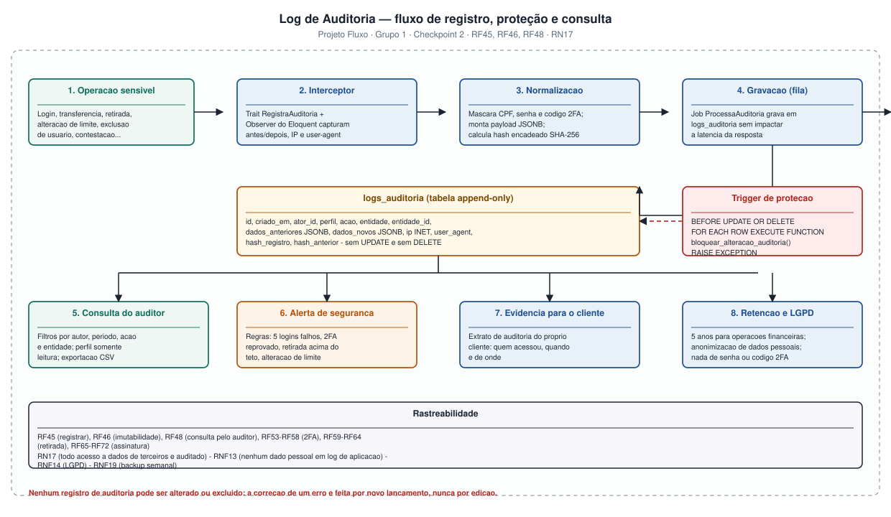

# Log de Auditoria (Trilha de Auditoria Imutável)

**Projeto:** Fluxo — Sistema Bancário Digital
**Grupo:** 1 · **Checkpoint 2** — apresentação em 17/09
**Repositório:** https://github.com/AlfredoVentura/Fluxo
**Versão:** 1.0

---

## 1. Objetivo

Registrar, de forma **imutável, completa e verificável**, todo evento relevante ocorrido no Fluxo — quem fez, o que fez, quando, de onde, sobre qual entidade e qual era o estado antes e depois — de modo que seja possível:

1. **Reconstruir** a história de qualquer conta, transação, assinatura ou usuário;
2. **Detectar** adulteração (hash encadeado);
3. **Atender** o auditor e o administrador com consultas filtradas e exportação;
4. **Provar conformidade** com a LGPD (finalidade, minimização, rastreabilidade de acesso a dados pessoais).

### Requisitos atendidos

| Requisito | Descrição |
|---|---|
| **RF45** | Registrar em trilha de auditoria toda operação sensível, com autor, data/hora, IP e dados alterados |
| **RF46** | Impedir a alteração ou exclusão de registros da trilha |
| **RF48** | Permitir ao auditor consultar a trilha com filtros por autor, período e tipo de operação |
| **RF73** | Registrar toda tentativa de autenticação, bem-sucedida ou não, com IP e dispositivo |
| **RF74** | Registrar inclusão, alteração e retirada de itens da assinatura |
| **RF75** | Permitir ao auditor exportar o resultado da consulta em CSV |
| **RF76** | Encadear os registros por hash SHA-256, permitindo detectar adulteração |
| **RN17** | Todo acesso ou alteração a dados de terceiros por usuário interno é registrado |
| **RN27** | Nenhum registro da trilha pode ser alterado ou excluído |
| **RNF13** | Nenhum dado pessoal em log de aplicação |
| **RNF41** | A gravação da trilha não acrescenta mais de 100 ms à resposta |
| **RNF42** | Detecção de adulteração por verificação diária do hash encadeado |
| **RNF43** | Nenhum dado sensível (senha, código 2FA, CVV, token) no payload |
| **RNF44** | Retenção de 5 anos |

---

## 2. Fluxo do log de auditoria



| Etapa | Onde acontece | Observação |
|---|---|---|
| 1. Operação sensível | Controllers e serviços de domínio | Listada na seção 3 |
| 2. Interceptor | Trait `RegistraAuditoria` + Observer do Eloquent | Captura `antes` e `depois` automaticamente |
| 3. Normalização | `AuditoriaPayload` | Mascara dados sensíveis, monta JSONB, calcula hash |
| 4. Gravacao | Job `ProcessaAuditoria` (fila) | Fora da requisição — não impacta a latência (RNF41) |
| 5–8. Consumo | Consulta do auditor, alertas, evidência do cliente, retenção | Somente leitura + exportação |

---

## 3. Matriz de eventos auditáveis

Legenda de nível: `INFO` (informativo) · `ATENCAO` (merece revisão) · `CRITICO` (exige ação).

### 3.1 Acesso e segurança

| Ação | Nível | Quando | Requisito |
|---|---|---|---|
| `LOGIN_SUCESSO` | INFO | Autenticação concluída | RF73 |
| `LOGIN_FALHOU` | ATENCAO | Senha incorreta ou conta bloqueada | RF08, RF73 |
| `LOGIN_2FA_SUCESSO` | INFO | Código validado | RF54 |
| `2FA_FALHOU` | ATENCAO | Código inválido, expirado ou reutilizado | RF56 |
| `2FA_ATIVADO` / `2FA_DESATIVADO` | ATENCAO | Cliente liga/desliga o segundo fator | RF53 |
| `LOGOUT` | INFO | Encerramento de sessão | — |
| `SENHA_ALTERADA` / `SENHA_RECUPERADA` | ATENCAO | Troca e recuperação de senha | RF09 |
| `DISPOSITIVO_CONFIAVEL_REVOGADO` | ATENCAO | Revogação de dispositivo | RF58 |

### 3.2 Conta e cadastro

| Ação | Nível | Quando |
|---|---|---|
| `CADASTRO_SOLICITADO` | INFO | Cliente submete o cadastro (RF01) |
| `CADASTRO_APROVADO` / `CADASTRO_REPROVADO` | ATENCAO | Decisão do backoffice (RF04) |
| `CONTA_ABERTA` / `CONTA_ENCERRADA` | ATENCAO | Criação e encerramento (RF05, RF12) |
| `CONTA_BLOQUEADA` / `CONTA_DESBLOQUEADA` | CRITICO | Bloqueio por suspeita de fraude (RF47) |
| `DADOS_CADASTRAS_ALTERADOS` | ATENCAO | Alteração de telefone, e-mail ou endereço (RF10) |

### 3.3 Movimentações e retirada

| Ação | Nível | Quando |
|---|---|---|
| `TRANSFERENCIA_SOLICITADA` | INFO | Requisição recebida |
| `TRANSFERENCIA_EFETIVADA` | INFO | Após `COMMIT` |
| `TRANSFERENCIA_RECUSADA` | ATENCAO | Risco alto, saldo insuficiente ou limite excedido |
| `CHAVE_PIX_CRIADA` / `CHAVE_PIX_REMOVIDA` | ATENCAO | Gestão de chaves (RF16) |
| `RETIRADA_SOLICITADA` | INFO | RF59 |
| `RETIRADA_LIBERADA` | ATENCAO | Após 2FA válido (RF62) |
| `RETIRADA_2FA_FALHOU` | CRITICO | 3 tentativas esgotadas |
| `RETIRADA_CANCELADA` / `RETIRADA_ESTORNADA` | ATENCAO | RF63 |
| `ESTORNO_REALIZADO` | ATENCAO | RN10 |

### 3.4 Cartões e pagamentos

`CARTAO_EMITIDO`, `CARTAO_BLOQUEADO`, `CARTAO_DESBLOQUEADO`, `LIMITE_ALTERADO`, `FATURA_CONTESTADA`, `CONTESTACAO_DEFERIDA`, `CONTESTACAO_INDEFERIDA`, `BOLETO_PAGO`, `COBRANCA_PIX_EMITIDA`, `COBRANCA_PIX_LIQUIDADA`, `PAGAMENTO_AGENDADO`.

### 3.5 Assinatura

| Ação | Nível | Quando |
|---|---|---|
| `ASSINATURA_CONTRATADA` | INFO | RF65 |
| `PLANO_ALTERADO` | ATENCAO | Upgrade ou downgrade (RF67) |
| `ITEM_INCLUIDO` | INFO | RF68 |
| `ITEM_RETIRADO` | ATENCAO | **Retirada de item — registra data e motivo (RN22, RF69)** |
| `COBRANCA_GERADA` / `COBRANCA_PAGA` / `COBRANCA_ESTORNADA` | INFO | RF66 |
| `ASSINATURA_SUSPENSA` | ATENCAO | Atraso > 5 dias (RN25) |
| `ASSINATURA_CANCELADA` | ATENCAO | RF72 |

### 3.6 Administração

| Ação | Nível | Quando |
|---|---|---|
| `USUARIO_INTERNO_CRIADO` / `EDITADO` / `DESATIVADO` | ATENCAO | RF43 |
| `PERFIL_ALTERADO` | CRITICO | RF44 |
| `PARAMETRO_ALTERADO` | CRITICO | Tarifas, limites e tetos (RF49) |
| `RELATORIO_GERADO` | INFO | RF50 |
| `AUDITORIA_CONSULTADA` | INFO | A consulta do auditor também é auditada (RN17) |
| `AUDITORIA_EXPORTADA` | ATENCAO | RF75 |

---

## 4. Modelo de dados

### 4.1 Tabela `logs_auditoria` (PostgreSQL)

| Coluna | Tipo | Nulo | Descrição |
|---|---|:--:|---|
| `id` | `bigserial` | não | Chave primária sequencial (append-only) |
| `criado_em` | `timestamptz` | não | Data/hora do evento (default `now()`) |
| `nivel` | `varchar(10)` | não | `INFO`, `ATENCAO`, `CRITICO` |
| `acao` | `varchar(60)` | não | Código do evento (seção 3) |
| `entidade` | `varchar(60)` | sim | Tabela/classe afetada (`contas`, `retiradas`, `assinaturas`…) |
| `entidade_id` | `uuid` | sim | Identificador do registro afetado |
| `ator_id` | `uuid` | sim | Usuário que executou (`null` = sistema/anonimo) |
| `ator_perfil` | `varchar(20)` | sim | Perfil no momento do evento |
| `ator_nome` | `varchar(120)` | sim | Nome congelado no momento do evento |
| `dados_anteriores` | `jsonb` | sim | Estado antes da operação |
| `dados_novos` | `jsonb` | sim | Estado depois da operação |
| `metadados` | `jsonb` | sim | Valor, canal, motivo, resultado da análise de risco |
| `ip` | `inet` | sim | Endereço IP de origem |
| `user_agent` | `text` | sim | Navegador/aplicativo |
| `dispositivo_id` | `uuid` | sim | Dispositivo confiável, quando houver |
| `hash_registro` | `char(64)` | não | SHA-256 do conteúdo do registro |
| `hash_anterior` | `char(64)` | sim | SHA-256 do registro anterior (encadeamento) |

**Índices**

```sql
CREATE INDEX idx_auditoria_acao      ON logs_auditoria (acao);
CREATE INDEX idx_auditoria_ator      ON logs_auditoria (ator_id);
CREATE INDEX idx_auditoria_entidade  ON logs_auditoria (entidade, entidade_id);
CREATE INDEX idx_auditoria_periodo   ON logs_auditoria (criado_em DESC);
CREATE INDEX idx_auditoria_nivel     ON logs_auditoria (nivel) WHERE nivel <> 'INFO';
```

### 4.2 Migration (Laravel)

```php
<?php
// database/migrations/2026_08_31_000001_create_logs_auditoria_table.php

use Illuminate\Database\Migrations\Migration;
use Illuminate\Database\Schema\Blueprint;
use Illuminate\Support\Facades\Schema;

return new class extends Migration
{
    public function up(): void
    {
        Schema::create('logs_auditoria', function (Blueprint $table) {
            $table->id();
            $table->timestampsTz(null, null)->useCurrent()->nullable(false);
            $table->string('nivel', 10);
            $table->string('acao', 60);
            $table->string('entidade', 60)->nullable();
            $table->uuid('entidade_id')->nullable();
            $table->uuid('ator_id')->nullable();
            $table->string('ator_perfil', 20)->nullable();
            $table->string('ator_nome', 120)->nullable();
            $table->jsonb('dados_anteriores')->nullable();
            $table->jsonb('dados_novos')->nullable();
            $table->jsonb('metadados')->nullable();
            $table->string('ip', 45)->nullable();
            $table->text('user_agent')->nullable();
            $table->uuid('dispositivo_id')->nullable();
            $table->char('hash_registro', 64);
            $table->char('hash_anterior', 64)->nullable();
        });

        // RF46 / RN27 — a trilha não admite UPDATE nem DELETE.
        DB::unprepared(<<<'SQL'
            CREATE OR REPLACE FUNCTION bloquear_alteracao_auditoria()
            RETURNS trigger LANGUAGE plpgsql AS $$
            BEGIN
                RAISE EXCEPTION
                    'RF46: registros de auditoria sao imutaveis (operacao % negada)',
                    TG_OP
                    USING ERRCODE = 'restrict_violation';
            END;
            $$;

            CREATE TRIGGER trg_logs_auditoria_imutavel
            BEFORE UPDATE OR DELETE ON logs_auditoria
            FOR EACH ROW EXECUTE FUNCTION bloquear_alteracao_auditoria();
        SQL);
    }

    public function down(): void
    {
        DB::unprepared('DROP TRIGGER IF EXISTS trg_logs_auditoria_imutavel ON logs_auditoria');
        DB::unprepared('DROP FUNCTION IF EXISTS bloquear_alteracao_auditoria()');
        Schema::dropIfExists('logs_auditoria');
    }
};
```

---

## 5. Registro do evento (código da aplicação)

### 5.1 Trait `RegistraAuditoria`

```php
<?php
// app/Services/Auditoria/RegistraAuditoria.php
namespace App\Services\Auditoria;

use Illuminate\Support\Arr;
use Illuminate\Support\Facades\{Auth, Request};

trait RegistraAuditoria
{
    protected function registrarAuditoria(
        string $acao,
        ?object $entidade = null,
        array $antes = [],
        array $depois = [],
        array $metadados = [],
        string $nivel = 'INFO',
    ): void {
        $ator = Auth::user();

        // RNF43 — nunca registrar senha, codigo 2FA, token ou CVV.
        $antes  = $this->mascarar($antes);
        $depois = $this->mascarar($depois);

        ProcessaAuditoria::dispatch([
            'nivel'             => $nivel,
            'acao'              => $acao,
            'entidade'          => $entidade?->getTable(),
            'entidade_id'       => $entidade?->getKey(),
            'ator_id'           => $ator?->id,
            'ator_perfil'       => $ator?->perfil,
            'ator_nome'         => $ator?->nome,
            'dados_anteriores'  => $antes,
            'dados_novos'       => $depois,
            'metadados'         => $metadados,
            'ip'                => Request::ip(),
            'user_agent'        => Str::limit(Request::userAgent(), 250),
            'dispositivo_id'    => Request::header('X-Device-Id'),
        ])->onQueue('auditoria');   // RNF41 — fora do caminho critico
    }

    private function mascarar(array $dados): array
    {
        return Arr::map($dados, fn ($v, $k) => match (true) {
            in_array($k, ['senha','senha_hash','codigo','codigo_hash','token','cvv'], true)
                => '***',                                     // RNF43
            in_array($k, ['cpf','cnpj'], true)
                => Mascarador::cpf((string) $v),              // RNF08 / RNF13
            default => $v,
        });
    }
}
```

### 5.2 Job de gravação com hash encadeado

```php
<?php
// app/Jobs/ProcessaAuditoria.php
namespace App\Jobs;

use Illuminate\Support\Facades\DB;
use Illuminate\Support\Str;

class ProcessaAuditoria implements ShouldQueue
{
    use Queueable, InteractsWithQueue;

    public function handle(): void
    {
        DB::transaction(function () {
            // Encadeamento: pega o hash do ultimo registro (lock para concorrencia).
            $hashAnterior = DB::table('logs_auditoria')
                ->lockForUpdate()
                ->orderByDesc('id')
                ->value('hash_registro');

            $linha = [...$this->dados, 'hash_anterior' => $hashAnterior];
            $linha['hash_registro'] = $this->hash($linha);

            DB::table('logs_auditoria')->insert($linha);
        });
    }

    private function hash(array $linha): string
    {
        $canonico = json_encode(
            Arr::except($linha, ['hash_registro']),
            JSON_UNESCAPED_UNICODE | JSON_UNESCAPED_SLASHES | JSON_PRESERVE_ZERO_FRACTION
        );

        return hash('sha256', $canonico);
    }
}
```

### 5.3 Verificação de integridade (RNF42)

```php
// app/Console/Commands/VerificarAuditoria.php
// Execucao diaria (schedule): php artisan auditoria:verificar
$anterior = null; $violacoes = 0;

DB::table('logs_auditoria')->orderBy('id')->chunk(500, function ($lote) use (&$anterior, &$violacoes) {
    foreach ($lote as $r) {
        $esperado = hash('sha256', json_encode(Arr::except((array) $r, ['hash_registro'])));
        if ($esperado !== $r->hash_registro || $r->hash_anterior !== $anterior) {
            $violacoes++;
            Log::critical('TRILHA_ADULTERADA', ['id' => $r->id]);
        }
        $anterior = $r->hash_registro;
    }
});
```

---

## 6. Exemplo de registro

### 6.1 Retirada liberada com 2FA

```json
{
  "id": 10482,
  "criado_em": "2026-08-31T21:14:07-03:00",
  "nivel": "ATENCAO",
  "acao": "RETIRADA_LIBERADA",
  "entidade": "retiradas",
  "entidade_id": "9f1c2a44-7d3e-4b0a-9c51-2f8b6de1a0c3",
  "ator_id": "c3f9a1d2-5b0e-4c8a-8d71-6e2f9a4b1c55",
  "ator_perfil": "CLIENTE",
  "ator_nome": "Maria Silva",
  "dados_anteriores": {
    "status": "AGUARDANDO_2FA",
    "codigo_retirada": null,
    "liberada_em": null
  },
  "dados_novos": {
    "status": "LIBERADA",
    "codigo_retirada": "4 8 1 9 0 7",
    "liberada_em": "2026-08-31T21:14:07-03:00"
  },
  "metadados": {
    "valor": "850.00",
    "canal": "CAIXA_PARCEIRO",
    "exigiu_2fa": true,
    "motivo_2fa": ["valor_acima_30pct_limite", "periodo_noturno"],
    "tentativas_2fa": 1,
    "transacao_id": "b7d0e3f1-2a4c-4f8b-9e13-5c7a2d8f6b10",
    "lancamentos": [
      { "conta": "0001-00045782-1", "natureza": "D", "valor": "850.00" },
      { "conta": "0001-00000001-9", "natureza": "C", "valor": "850.00" }
    ]
  },
  "ip": "177.67.82.14",
  "user_agent": "Fluxo/1.0 (Android 13; SM-A145M)",
  "dispositivo_id": "e7b2c9a0-3f1d-4e6a-9b82-1c5d7f3a8e24",
  "hash_anterior": "3f9a1c...",
  "hash_registro": "a71c0e..."
}
```

### 6.2 Retirada de item da assinatura (o caso da "retirada de coisas")

```json
{
  "acao": "ITEM_RETIRADO",
  "entidade": "itens_assinatura",
  "nivel": "ATENCAO",
  "dados_anteriores": { "quantidade": 2, "data_exclusao": null },
  "dados_novos": {
    "quantidade": 2,
    "data_exclusao": "2026-08-31",
    "motivo_exclusao": "Cliente reduziu o plano - nao utiliza mais o relatorio gerencial"
  },
  "metadados": {
    "item": "Relatorio gerencial mensal",
    "valor_unitario": "29.90",
    "impacto_cobranca": "-59.80",
    "cobranca_recalculada": "competencia 2026-08"
  }
}
```

> Note que **não há `DELETE`**: o registro continua existindo com `data_exclusao` preenchida, e a trilha guarda o antes, o depois e o motivo (RN22).

---

## 7. Consulta pelo auditor

### 7.1 Endpoint

```
GET /api/v1/auditoria?ator_id=&acao=&entidade=&entidade_id=&nivel=&de=&ate=&q=&page=
```

Permissão: **Policy** — apenas perfis `AUDITOR` e `ADMINISTRADOR` (RF44, RF48). O acesso é somente leitura e a própria consulta gera `AUDITORIA_CONSULTADA` (RN17).

### 7.2 Tela (Portal Admin)

| Elemento | Comportamento |
|---|---|
| Filtros | Autor, ação, entidade, nível, período e texto livre |
| Ordenação | Mais recentes primeiro, paginação de 50 (RNF05) |
| Detalhe | Modal com antes/depois em diff e os metadados completos |
| Exportação | CSV com os mesmos filtros aplicados (RF75) |
| Selo de integridade | Exibe o resultado da última verificação de hash encadeado |

### 7.3 Consulta SQL de referência

```sql
SELECT criado_em, acao, entidade, entidade_id, ator_nome, ator_perfil, ip, nivel
FROM logs_auditoria
WHERE criado_em >= '2026-08-01' AND criado_em < '2026-09-01'
  AND acao IN ('RETIRADA_LIBERADA', 'RETIRADA_2FA_FALHOU')
ORDER BY criado_em DESC
LIMIT 50;
```

---

## 8. Retenção, LGPD e segurança

| Tema | Política |
|---|---|
| **Retenção** | 5 anos para operações financeiras (RNF44); 1 ano para eventos de nível `INFO` de navegação |
| **Minimização** | Somente campos necessários; CPF e dados de cartão mascarados |
| **Proibição absoluta** | Senha, hash de senha, código 2FA, token de sessão e CVV nunca entram no payload (RNF43) |
| **Direito de exclusão (LGPD)** | Dados pessoais do titular são anonimizados; os **registros de auditoria são mantidos**, pois a finalidade é jurídica e de segurança — o titular é informado dessa base legal no termo de uso |
| **Acesso** | Somente leitura para auditor; gravação apenas pelo job, nunca por usuário |
| **Backup** | `pg_dump` semanal (RNF19); a trilha é recriada a partir do dump, preservando o encadeamento de hash |

---

## 9. Testes previstos

| # | Teste | Resultado esperado |
|---|---|---|
| T1 | Registrar um evento e consultar | Registro presente com todos os campos |
| T2 | Tentar `UPDATE` na trilha | Exceção do trigger (`restrict_violation`) |
| T3 | Tentar `DELETE` na trilha | Exceção do trigger |
| T4 | Alterar um registro diretamente no banco e rodar `auditoria:verificar` | Violação detectada e registrada |
| T5 | Realizar login, Pix e retirada | 100% dos eventos esperados presentes |
| T6 | Auditor consulta a trilha | `AUDITORIA_CONSULTADA` gerado |
| T7 | Cliente tenta acessar `/api/v1/auditoria` | `403 Forbidden` |
| T8 | Medir latência da transferência com e sem auditoria | Diferença < 100 ms (RNF41) |
| T9 | Verificar payload de uma retirada | Nenhum campo sensível presente |
| T10 | Exportar CSV com filtros | Arquivo com o mesmo total da consulta |

---

## 10. Rastreabilidade

| Diagrama | Relação com o log de auditoria |
|---|---|
| SEQ-01 | `CADASTRO_SOLICITADO` e `CADASTRO_APROVADO` |
| SEQ-02 | `LOGIN_FALHOU`, `LOGIN_2FA_SUCESSO`, `2FA_FALHOU` |
| SEQ-03 | `TRANSFERENCIA_EFETIVADA` / `TRANSFERENCIA_RECUSADA` |
| SEQ-04 | `RETIRADA_SOLICITADA`, `RETIRADA_2FA_FALHOU`, `RETIRADA_LIBERADA` |
| SEQ-05 | `BOLETO_PAGO` |
| SEQ-06 | Registro e consulta da própria trilha |
| CLS-01 / CLS-02 | Classe `LogAuditoria` (`«append-only»`) |
| ATV-02 / ATV-03 / ATV-05 | Pontos do fluxo em que cada evento é disparado |

**Registro de alterações**

| Versão | Data | Alteração |
|---|---|---|
| 1.0 | 31/08/2026 | Versão inicial: matriz de eventos, modelo de dados, migration, job com hash encadeado, consulta e políticas |
