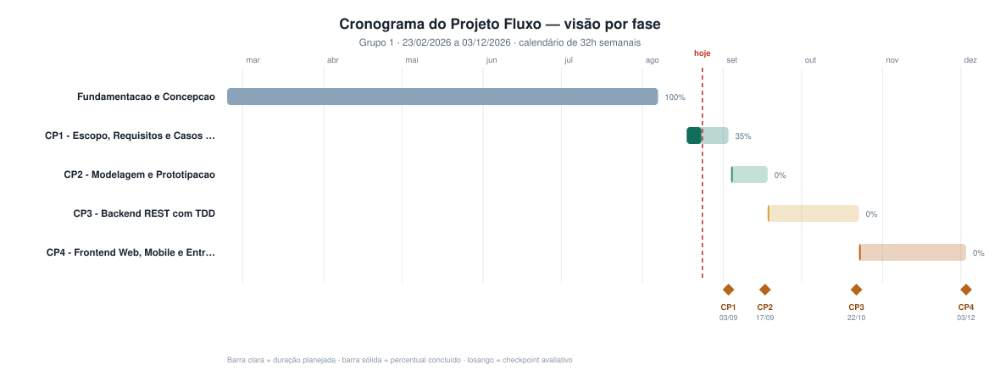

# 4.4 — Quadro de Gestão das Atividades

**Projeto:** Fluxo — Sistema Bancário Digital
**Disciplina:** Projetos de Software II — UNIUBE · Prof. Marcus Colantoni
**Grupo:** 1 · **Checkpoint 1** — apresentação em 03/09/2026

---

## Sumário

- [Equipe e responsabilidades](#equipe-e-responsabilidades)
- [Distribuição de carga](#distribuição-de-carga-de-trabalho)
- [Cerimônias e rituais](#cerimônias-e-rituais)
- [Definition of Done](#definition-of-done-dod)
- [Quadro Kanban](#quadro-kanban--status-em-0309)
- [Cronograma no LibreProject](#cronograma-no-libreproject-442)
- [Cronograma semanal](#cronograma-semanal-resumido)
- [Política de commits](#política-de-commits-semanais-443)
- [Métricas](#métricas-de-acompanhamento)
- [Gestão de riscos](#gestão-de-riscos)
- [Evidências](#evidências-para-o-checkpoint-1)

---

## Equipe e responsabilidades

| Iniciais | Integrante | Função | Responsabilidades |
|:---:|---|---|---|
| **GH** | **Gabriel Henrique** | Líder / Gerente de projeto | Cronograma no LibreProject, comunicação com o professor, condução das reuniões, consolidação das entregas e documentação. |
| **JA** | **João Alfredo** | Arquiteto / Backend | Arquitetura em camadas, regras de negócio, API Laravel, motor transacional, autenticação e diagramas de interação. |
| **HP** | **Harttur Oliveira Pimenta** | BDA — Banco de Dados | Modelo de dados, DER, diagrama de classes, migrations, PostgreSQL, trilha de auditoria e relatórios. |
| **EH** | **Eduardo Henrique** | Infraestrutura | Deploy no Render, provisionamento do banco, aplicativo Flutter, build do APK e testes de integração. |
| **MV** | **Marcus Vinicius** | Frontend / UX UI | Protótipos no Figma, layout Blade + Tailwind, portal do cliente e portal administrativo. |

**Contas no GitHub:** João Alfredo ([@AlfredoVentura](https://github.com/AlfredoVentura)) · Harttur Oliveira Pimenta ([@Harttur-Pimenta](https://github.com/Harttur-Pimenta))

---

## Distribuição de carga de trabalho

Extraída do cronograma no LibreProject (95 tarefas, 23/02 a 03/12/2026):

| Integrante | Função | Tarefas | Horas | % do total |
|---|---|:---:|---:|---:|
| Gabriel Henrique | Líder / Gerente | 15 | 140 h | 7,6% |
| João Alfredo | Arquiteto / Backend | 13 | 456 h | 24,9% |
| Harttur Oliveira Pimenta | BDA | 12 | 256 h | 14,0% |
| Eduardo Henrique | Infraestrutura | 14 | 354 h | 19,3% |
| Marcus Vinicius | Frontend / UX UI | 9 | 274 h | 14,9% |
| *Equipe (coletivo)* | Todos | 25 | 354 h | 19,3% |
| **TOTAL** | | **95** | **1.834 h** | **100%** |

> As 25 tarefas de **Equipe** são as atividades feitas em conjunto: aulas, definição do escopo, levantamento de requisitos, diagramas de casos de uso e as apresentações dos checkpoints. O total de 1.834 h representa o esforço somado dos cinco integrantes ao longo dos 284 dias do projeto.

**Nota sobre o app mobile:** o desenvolvimento em Flutter ficou com Eduardo (Infraestrutura) porque, no Checkpoint 4, as telas web e o aplicativo são construídos **em paralelo** — se a mesma pessoa acumulasse as duas frentes, haveria sobreposição inviável na agenda. Marcus entrega o design das telas no Figma, que o aplicativo segue.

---

## Cerimônias e rituais

| Cerimônia | Quando | Duração | Objetivo | Conduz |
|---|---|:---:|---|---|
| Reunião de planejamento | Segunda-feira | 30 min | Definir as tarefas da semana e os responsáveis. | Gabriel |
| Acompanhamento rápido | Quarta-feira (remoto) | 15 min | Levantar impedimentos e status. | Gabriel |
| Revisão e fechamento | Sábado | 45 min | Integrar o trabalho, revisar PRs e atualizar o LibreProject. | Todos |

**Canais de comunicação:** WhatsApp/Discord para o dia a dia · Pull Requests no GitHub para revisão técnica · Diário de bordo para entregas oficiais.

---

## Definition of Done (DoD)

Uma tarefa só é movida para **Concluído** quando cumpre todos os critérios:

- [x] Código na branch `main` via Pull Request revisado por outro integrante
- [x] Não quebra os testes existentes
- [x] Possui teste automatizado, quando envolve regra de negócio
- [x] Documentação afetada foi atualizada
- [x] Cartão movido no quadro e LibreProject atualizado

---

## Quadro Kanban — status em 03/09

### ✅ Concluído

| ID | Atividade | Responsável | Entrega |
|:---:|---|---|---|
| T01 | Definição do tema e do nome do projeto | Equipe | Fluxo — banco digital |
| T02 | Criação do repositório no GitHub | Eduardo | `AlfredoVentura/Fluxo` |
| T03 | Concessão de acesso ao professor | Gabriel | marcus.colantoni@uniube.br |
| T04 | Definição da stack tecnológica | Equipe | Laravel · Blade+Tailwind · Flutter · PostgreSQL · Render |
| T05 | **4.1** Definição do escopo do projeto | Equipe | `01-escopo-do-projeto.md` |
| T06 | **4.2** Levantamento inicial de requisitos | Equipe | 52 RF · 39 RNF · 17 RN |
| T07 | Identificação e análise de stakeholders | Gabriel | `05-stakeholders.md` — 15 stakeholders |
| T08 | **4.3** Diagramas de casos de uso (1,3,4,5,7) | Equipe | 38 casos de uso · 13 atores |
| T09 | Modelo de dados preliminar | Harttur | 16 entidades previstas |
| T10 | Definição da estrutura monorepo | Harttur | `backend/` + `mobile/` |
| T11 | Configuração do `.gitignore` | Harttur | Monorepo Laravel + Flutter |
| T12 | **4.4** Quadro de gestão das atividades | Gabriel | Este documento |
| T13 | **4.4.2** Criação do projeto no LibreProject | Gabriel | 95 tarefas · 86 vínculos |
| T14 | Consolidação do PDF único | Gabriel | `Fluxo-Checkpoint1-Grupo1.pdf` |

### 🔄 Em andamento

| ID | Atividade | Responsável | Previsão |
|:---:|---|---|:---:|
| T15 | Setup do projeto Laravel no monorepo | João Alfredo | 06/09 |
| T16 | Configuração do PostgreSQL local (Docker) | Harttur | 05/09 |
| T17 | Setup do projeto Flutter no monorepo | Eduardo | 07/09 |
| T18 | Estudo de Tailwind e componentes base | Marcus | 08/09 |

### 📋 A fazer — Checkpoint 2 (17/09)

| ID | Atividade | Responsável | Prazo |
|:---:|---|---|:---:|
| T19 | **4.2** Consolidação dos requisitos finais | Equipe | 09/09 |
| T20 | **4.5** Prototipação no Figma — cliente | Marcus | 12/09 |
| T21 | **4.5** Prototipação no Figma — administrativo | Marcus | 16/09 |
| T22 | **4.6** Documentos detalhados dos casos de uso | Gabriel | 12/09 |
| T23 | **4.7** Diagrama de dados (DER) | Harttur | 12/09 |
| T24 | **4.8** Diagrama de classes do modelo de dados | Harttur | 18/09 |
| T25 | Migrations iniciais | Harttur | 14/09 |
| T26 | Autenticação com Laravel Sanctum | João Alfredo | 16/09 |
| T27 | Layout base Blade + Tailwind | Marcus | 16/09 |
| T28 | Atualização do LibreProject e PDF do CP2 | Gabriel | 16/09 |

### 🔮 Backlog — Checkpoints 3 e 4

| Atividade | Responsável | Checkpoint |
|---|---|:---:|
| Motor transacional com partidas dobradas (TDD) | João Alfredo | CP3 |
| API REST — contas, saldo e extrato (TDD) | João Alfredo | CP3 |
| API REST — chaves Pix e transferências (TDD) | João Alfredo | CP3 |
| API REST — pagamentos, boletos e QR Code (TDD) | Harttur | CP3 |
| Motor antifraude por regras de risco | Eduardo | CP3 |
| Trilha de auditoria imutável | Harttur | CP3 |
| Deploy do backend e do PostgreSQL no Render | Eduardo | CP3 |
| Documentação OpenAPI/Swagger | Gabriel | CP3 |
| **4.9** Diagramas de classes das interações | João Alfredo | CP3 |
| Portal do cliente web (3 etapas) | Marcus | CP4 |
| Portal administrativo web (2 etapas) | Marcus | CP4 |
| App Flutter — login, dashboard, Pix e cartões | Eduardo | CP4 |
| Módulo de cartões e faturas | João Alfredo | CP4 |
| Relatórios gerenciais | Harttur | CP4 |
| Testes de integração ponta a ponta | Eduardo | CP4 |
| **5.3** Manual do usuário | Gabriel | CP4 |
| Build do APK para download | Eduardo | CP4 |

---

## Cronograma no LibreProject (4.4.2)



**Configuração conforme especificação do professor:**

| Item | Valor |
|---|---|
| Data de início | **23/02/2026** — primeiro dia de aula, preenchido retroativamente |
| Data de término | **03/12/2026** — Checkpoint 4 |
| Calendário | Seg–sex 4 h/dia · Sáb–dom 6 h/dia · **32 h semanais** |
| Dias do mês | 31 (todos úteis) |
| Total de tarefas | 95, organizadas em 5 fases |
| Dependências | 86 vínculos (51 FS + 35 SS com defasagem) |
| Marcos | 4 apresentações de checkpoint |
| Recursos | 5 integrantes + recurso coletivo |

**Distribuição por fase:**

| Fase | Período | Tarefas | Status em 24/08 |
|---|---|:---:|:---:|
| Fase 0 — Fundamentação e Concepção | 23/02 a 07/08 | 19 | ✅ 100% |
| Checkpoint 1 — Escopo, Requisitos e Casos de Uso | 18/08 a 03/09 | 18 | 🔄 em andamento |
| Checkpoint 2 — Modelagem e Prototipação | 04/09 a 17/09 | 15 | ⏳ 0% |
| Checkpoint 3 — Backend REST com TDD | 18/09 a 22/10 | 15 | ⏳ 0% |
| Checkpoint 4 — Frontend, Mobile e Entrega Final | 23/10 a 03/12 | 21 | ⏳ 0% |

> A **Fase 0** documenta retroativamente o semestre desde o primeiro dia de aula: aulas 01 e 02, estudos dirigidos de cada tecnologia, avaliações institucionais N1 e N2, prova de conceito da integração Laravel + Flutter e o recesso acadêmico. Sem ela o cronograma começaria em agosto, contrariando a instrução do professor.

**Arquivos:** [`Fluxo-ProjectLibre.xml`](../libreproject/Fluxo-ProjectLibre.xml) (importar no ProjectLibre) · [`cronograma-fluxo.csv`](../libreproject/cronograma-fluxo.csv) · [`COMO-IMPORTAR.md`](../libreproject/COMO-IMPORTAR.md)

---

## Cronograma semanal resumido

| Semana | Período | Foco | Marco |
|:---:|---|---|:---:|
| S1 | 18–24/08 | Definição do tema, stack e repositório | — |
| S2 | 25–31/08 | Escopo, requisitos e casos de uso | — |
| S3 | 01–07/09 | Revisão dos artefatos e apresentação | **CP1 — 03/09** |
| S4 | 08–14/09 | Requisitos finais, Figma, DER, classes | — |
| S5 | 15–21/09 | Autenticação e layout base | **CP2 — 17/09** |
| S6–S7 | 22/09–05/10 | Motor transacional e API de contas (TDD) | — |
| S8–S9 | 06–19/10 | Módulos Pix e pagamentos; deploy no Render | — |
| S10 | 20–26/10 | Diagramas de interação e revisão | **CP3 — 22/10** |
| S11–S13 | 27/10–16/11 | Frontend web (cliente e administrativo) | — |
| S14–S16 | 17/11–07/12 | App Flutter, cartões, auditoria e manual | **CP4 — 03/12** |

---

## Política de commits semanais (4.4.3)

**Convenção adotada:** [Conventional Commits](https://www.conventionalcommits.org)

```
feat:     nova funcionalidade
fix:      correção de defeito
docs:     documentação
refactor: refatoração sem mudança de comportamento
test:     testes automatizados
chore:    configuração, build, dependências
```

**Exemplos aplicados ao projeto:**

```
feat(pix): implementa registro de chave Pix aleatória
fix(extrato): corrige ordenação por data decrescente
docs(cp1): adiciona diagramas de casos de uso
test(transacao): cobre regra de saldo insuficiente
chore: configura .gitignore do monorepo
```

**Fluxo de branches:**

```
main            ← protegida; só recebe PR revisado
 └── develop    ← integração contínua do time
      ├── feature/pix-transferencia
      ├── feature/cartao-virtual
      └── fix/extrato-ordenacao
```

**Regras acordadas pelo grupo:**

1. Commit obrigatório toda semana, mesmo em semanas de documentação (contam commits em `docs/`).
2. Nenhum commit direto em `main`.
3. Todo PR precisa da revisão de ao menos um outro integrante.
4. O `.env` nunca é versionado — apenas o `.env.example`.
5. Sábado é o dia de fechamento: integração, revisão e atualização do LibreProject.

---

## Métricas de acompanhamento

| Métrica | Meta | Como medir |
|---|:---:|---|
| Commits por semana | ≥ 5 no grupo | Insights do GitHub |
| Integrantes com commit na semana | 5 de 5 | Aba Contributors |
| Tarefas concluídas por sprint | ≥ 80% do planejado | Quadro Kanban |
| Cobertura de testes (backend) | ≥ 60% | Relatório do PHPUnit |
| PRs revisados | 100% | Histórico de Pull Requests |
| Atualização do LibreProject | Semanal | Data do arquivo `.pod` |

---

## Gestão de riscos

| ID | Risco | Prob. | Impacto | Mitigação | Responsável |
|:---:|---|:---:|:---:|---|---|
| R1 | Expiração do PostgreSQL gratuito no Render (30 dias) | Alta | Alto | Dump semanal + migrations/seeders versionados | Eduardo |
| R2 | Curva de aprendizado do Flutter | Média | Alto | Começar pelo login, saldo e extrato; telas simples primeiro | Eduardo |
| R3 | Hibernação do serviço gratuito na apresentação | Alta | Médio | "Aquecer" a aplicação 5 min antes; vídeo de backup | Eduardo |
| R4 | Erros de arredondamento em valores monetários | Média | Alto | `numeric(18,2)` no banco, centavos na aplicação, testes | Harttur |
| R5 | Commits concentrados no fim da semana | Alta | Médio | Dia de commit fixo e revisão por PR | Gabriel |
| R6 | Desbalanceamento de carga entre integrantes | Média | Médio | Kanban com responsável por tarefa e revisão semanal | Gabriel |
| R7 | Escopo crescer além do prazo | Média | Alto | Escopo congelado após o CP2; ideias novas vão ao backlog | Gabriel |

---

## Evidências para o Checkpoint 1

Checklist do que o grupo apresenta em 03/09:

- [x] **4.1** Escopo do projeto definido e documentado
- [x] **4.2** Requisitos funcionais e não funcionais levantados
- [x] **4.3** Diagramas de casos de uso 1, 3, 4, 5 e 7 construídos
- [x] **4.4** Quadro de gestão das atividades montado
- [x] **4.4.2** Projeto criado no LibreProject com 95 tarefas
- [x] **4.4.3** Repositório no GitHub com commits e convenção definida
- [ ] Acesso do professor confirmado no repositório
- [ ] `.gitignore` preenchido no repositório *(está vazio — 0 bytes)*
- [ ] Pastas `backend/` e `mobile/` com conteúdo no repositório
- [ ] Commits de todos os 5 integrantes no histórico
- [ ] PDF único enviado pelo diário de bordo
- [ ] Ensaio cronometrado da apresentação

---

## Roteiro da apresentação (~10 min)

| Tempo | Conteúdo | Quem |
|:---:|---|---|
| 1 min | Abertura: o que é o Fluxo e por que um banco digital | Gabriel |
| 2 min | Escopo: o que está dentro e **o que ficou de fora** | Gabriel |
| 2 min | Requisitos: 52 RF, 39 RNF, 17 RN e os requisitos críticos | Harttur |
| 3 min | Diagramas de casos de uso: atores e relações include/extend | João Alfredo |
| 1 min | Arquitetura e stack: Laravel, Blade+Tailwind, Flutter, PostgreSQL | Marcus |
| 1 min | Gestão: Kanban, LibreProject e commits no GitHub | Eduardo |

---

## Documentos relacionados

| Documento | Conteúdo |
|---|---|
| [`01-escopo-do-projeto.md`](Escopo.md) | 4.1 — Escopo, objetivos e arquitetura |
| [`requisitos-funcionais.md`](Requisitos.md) | 4.2 — Requisitos funcionais por módulo |
| [`casos-de-uso.md`](DiagramaCasosDeUso.md) | 4.3 — Diagramas de casos de uso |
| [`05-stakeholders.md`](Stakeholders.md) | Análise de stakeholders |
| [`04-guia-libreproject-github.md`](GuiaLibreProjectGitHub.md) | Guia prático de LibreProject e GitHub |
