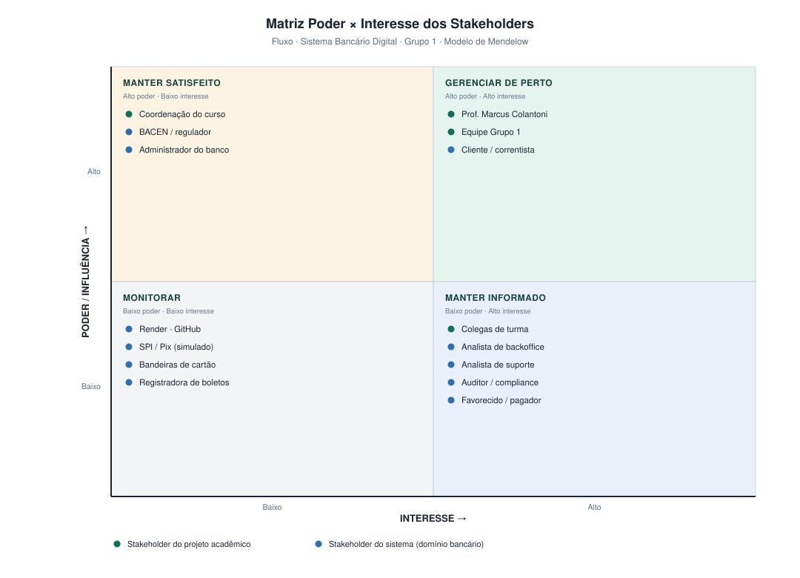

# Análise de Stakeholders

**Projeto:** Fluxo — Sistema Bancário Digital
**Grupo:** 1 · **Checkpoint 1** — apresentação em 03/09

---

## 1. O que são stakeholders neste projeto

Stakeholder é toda pessoa, grupo ou organização que **afeta ou é afetada** pelo projeto. No Fluxo eles se dividem em duas naturezas distintas, e confundir as duas é um erro comum em trabalhos acadêmicos:

| Natureza | Quem é | Exemplo |
|---|---|---|
| **Stakeholders do projeto acadêmico** | Quem influencia a execução, avaliação e entrega do trabalho na disciplina. | Professor, equipe, coordenação. |
| **Stakeholders do sistema** | Quem usaria ou seria impactado pelo Fluxo caso ele operasse de verdade. | Correntista, backoffice, auditor, regulador. |

Um mesmo papel pode aparecer nas duas naturezas: os integrantes do grupo são, ao mesmo tempo, executores do projeto e desenvolvedores do sistema.

> **Nem todo stakeholder é ator do sistema.** Ator (UML) é quem interage diretamente com o software. O professor é stakeholder de altíssima influência, mas não é ator. O BACEN é stakeholder regulatório, mas não opera telas. Já o cliente é as duas coisas.

---

## 2. Stakeholders do projeto acadêmico

| # | Stakeholder | Papel / Interesse | Influência | Expectativa | Estratégia de engajamento |
|---|---|---|---|---|---|
| P1 | **Prof. Marcus Colantoni** (marcus.colantoni@uniube.br) | Cliente e avaliador do projeto; define requisitos da disciplina e atribui as notas dos 4 checkpoints. | **Muito alta** | Artefatos entregues no prazo, evolução real do código, commits semanais e LibreProject atualizado. | Acesso de colaborador no GitHub, entrega do PDF único pelo diário de bordo antes de cada checkpoint, apresentações ensaiadas. |
| P2 | **Equipe do Grupo 1** | Executores: analisam, modelam, desenvolvem, testam e apresentam. | **Muito alta** | Aprendizado prático, nota máxima, divisão justa de tarefas. | Reuniões semanais, quadro Kanban com responsável por tarefa, revisão por Pull Request. |
| P3 | **Coordenação do curso / UNIUBE** | Institucional: garante que o projeto cumpra os objetivos pedagógicos do curso. | Média | Aderência à ementa e evidência de aprendizagem. | Documentação formal e artefatos arquivados no repositório. |
| P4 | **Colegas de turma (outros grupos)** | Audiência das apresentações; comparam soluções e trocam experiências. | Baixa | Apresentações claras e reaproveitáveis como referência. | Repositório público e apresentação didática. |

---

## 3. Stakeholders do sistema (domínio bancário)

### 3.1 Stakeholders internos — usuários diretos

| # | Stakeholder | Necessidades principais | Requisitos relacionados | É ator UML? |
|---|---|---|---|---|
| S1 | **Cliente / Correntista** — usuário final, foco do produto | Abrir conta rápido, ver saldo e extrato, transferir por Pix, pagar boletos, usar cartões, ter segurança e disponibilidade. | RF01–RF42 · RNF01–RNF14 · RNF21–RNF25 | Sim (Cliente) |
| S2 | **Analista de Backoffice** | Aprovar aberturas de conta, tratar contestações, ter fila de trabalho organizada e histórico das decisões. | RF04, RF35 · RN01 | Sim |
| S3 | **Analista de Suporte** | Consultar o contexto do cliente, responder chamados, alterar status e registrar atendimento. | RF51, RF52 | Sim |
| S4 | **Administrador do sistema** | Gerenciar usuários e perfis, bloquear contas suspeitas, parametrizar tarifas e limites, emitir relatórios. | RF43, RF44, RF47, RF49, RF50 | Sim |
| S5 | **Auditor / Compliance** | Consultar trilha imutável de operações, rastrear quem fez o quê e quando, gerar relatórios de conformidade. | RF45, RF46, RF48 · RN17 | Sim |

### 3.2 Stakeholders externos — pessoas

| # | Stakeholder | Necessidades principais | Requisitos relacionados | É ator UML? |
|---|---|---|---|---|
| S6 | **Favorecido** — recebe transferências | Receber o valor corretamente e ter comprovante. | RF18, RF21, RF25 | Sim |
| S7 | **Pagador externo** — liquida cobranças emitidas por clientes | Pagar uma cobrança Pix sem precisar ser cliente do Fluxo. | RF39, RF41 | Sim |
| S8 | **Visitante** — ainda não é cliente | Entender o produto e conseguir se cadastrar sem fricção. | RF01, RF02, RF09 | Sim |

### 3.3 Stakeholders externos — organizações e sistemas

| # | Stakeholder | Relação com o projeto | Observação |
|---|---|---|---|
| S9 | **BACEN / regulador** | Define as regras que um banco digital real deveria seguir (Pix, LGPD, prevenção à lavagem). | **Simulado.** Serve de referência para requisitos de auditoria e segurança, mas não há homologação real. |
| S10 | **SPI / Arranjo Pix** | Liquidaria as transferências instantâneas. | Simulado por serviço interno (UC11). |
| S11 | **Bandeiras e adquirentes** (Visa/Mastercard) | Autorizariam compras no cartão. | Simulado (UC21). |
| S12 | **Registradora de boletos** | Consultaria e liquidaria boletos. | Simulado (UC25). |
| S13 | **Serviço de KYC** | Validaria identidade e documentos na abertura de conta. | Simulado, com aprovação manual pelo backoffice (UC02). |
| S14 | **Render** (hospedagem) | Fornece o ambiente de produção na nuvem. | Plano gratuito — limitações mapeadas nos riscos R1 e R3. |
| S15 | **GitHub** | Hospeda o código, controla versão e dá acesso ao professor. | Codespaces também é usado como ambiente de desenvolvimento. |

---

## 4. Matriz Poder × Interesse

| Quadrante | Estratégia | Quem está aqui |
|---|---|---|
| **Gerenciar de perto** (alto poder, alto interesse) | Envolver nas decisões, comunicar com frequência, validar entregas. | Professor, equipe, cliente/correntista. |
| **Manter satisfeito** (alto poder, baixo interesse) | Comunicar o essencial, garantir conformidade, evitar surpresas. | Coordenação, BACEN/regulador, administrador do banco. |
| **Manter informado** (baixo poder, alto interesse) | Atualizar sobre progresso e mudanças relevantes. | Colegas de turma, backoffice, suporte, auditor, favorecidos. |
| **Monitorar** (baixo poder, baixo interesse) | Acompanhar sem esforço dedicado; reagir se o cenário mudar. | Render, GitHub, SPI/Pix, bandeiras, registradora. |

---

## 5. Plano de comunicação

| Público | O quê | Canal | Frequência | Responsável |
|---|---|---|---|---|
| Professor | Artefatos do checkpoint (PDF único) | Diário de bordo | A cada checkpoint | Líder |
| Professor | Evolução do código | GitHub (colaborador) | Semanal | Todos |
| Professor | Cronograma atualizado | LibreProject (`.pod` no repo) | Semanal | Líder |
| Equipe | Planejamento da semana | Reunião presencial (segunda) | Semanal | Líder |
| Equipe | Impedimentos | WhatsApp / Discord | Contínuo | Todos |
| Equipe | Revisão de código | Pull Requests no GitHub | A cada entrega | Revisor designado |
| Turma | Resultados do checkpoint | Apresentação em sala | A cada checkpoint | Grupo |

---

## 6. Requisitos originados por stakeholder

Rastreabilidade que mostra que os requisitos não saíram do nada:

| Stakeholder | Requisitos que originou |
|---|---|
| Professor / disciplina | RNF33–RNF39 (stack obrigatória, duas interfaces, nuvem, mínimo 8 entidades, sem código legado), RNF27 (TDD) |
| Cliente / correntista | RF01–RF42 (praticamente todo o núcleo funcional), RNF01–RNF05 (desempenho), RNF21–RNF25 (usabilidade) |
| Backoffice | RF04, RF35, RN01 |
| Suporte | RF51, RF52 |
| Administrador | RF43, RF44, RF47, RF49, RF50 |
| Auditor / compliance | RF45, RF46, RF48, RN17 |
| Regulador (LGPD/BACEN) | RNF08, RNF09, RNF13, RNF14 |
| Equipe técnica | RNF26, RNF28, RNF29, RNF30 (manutenibilidade) |
| Render / infraestrutura | RNF19, RNF20, RNF31 |

---

## 7. Como responder se o professor perguntar

**"Quem são os stakeholders do projeto?"**
Comece separando as duas naturezas — projeto acadêmico e sistema. Cite o professor como stakeholder de maior influência (é ele quem define os requisitos e avalia), a equipe como executora e o cliente/correntista como usuário-foco do produto. Depois mencione backoffice, suporte, administrador e auditor como usuários internos, e os sistemas externos simulados.

**"Qual a diferença entre stakeholder e ator?"**
Ator é quem interage diretamente com o software e aparece no diagrama de casos de uso. Stakeholder é um conjunto maior: inclui quem tem interesse no projeto mesmo sem usar o sistema — o professor e o regulador, por exemplo.

**"Por que o BACEN está na lista se o sistema é simulado?"**
Porque ele define o marco regulatório que um banco digital real precisa seguir, e usamos essa referência para justificar requisitos de auditoria, segurança e LGPD. Está registrado como stakeholder simulado, sem homologação real — coerente com a seção de escopo negativo.
